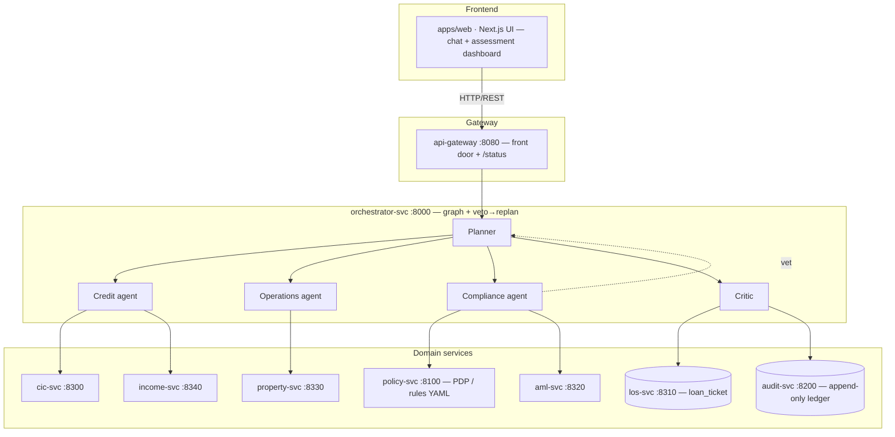
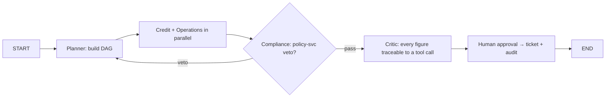
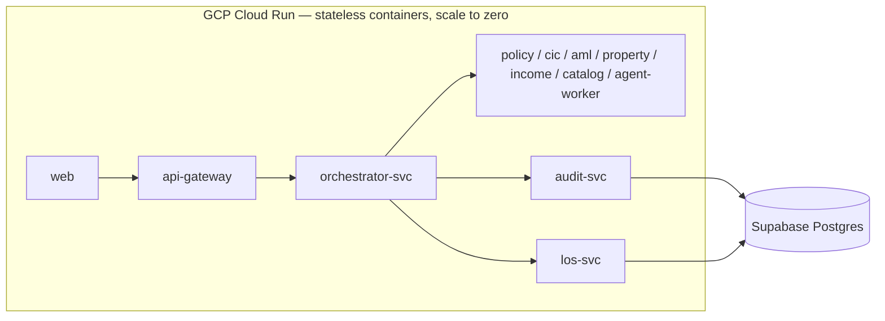

# Architecture Document

> Short overview for reviewers. The **canonical, always-current** sources are
> [`docs/SYSTEM-ARCHITECTURE.md`](./docs/SYSTEM-ARCHITECTURE.md) (current split),
> [`docs/ARCHITECTURE-services.md`](./docs/ARCHITECTURE-services.md) (target topology),
> and [`AGENTS.md`](./AGENTS.md) (rules). If this file disagrees with those, they win.

## System Overview

`aulacys` — **Digital Expert Agents for SHB**. A multi-agent system that assesses retail
mortgage loan applications the way a bank's second line of defense does: specialist
agents plan, call deterministic tools, and **execute real actions** (write a ticket,
append an audit record) instead of only returning text. The load-bearing part is the
**Compliance veto → replan** loop — an agent that can block on a hard legal limit encoded
as policy-as-code (YAML), not as a prompt.

## Architecture Diagram

> Every service call is env-gated: if the service URL is unset or down, the orchestrator
> runs that piece **in-process (fallback)**, so the demo degrades instead of crashing.

## Components

### 1. Frontend (Next.js)
- **Purpose:** chat UI + assessment dashboard showing the run trace, veto/replan, ticket.
- **Contract:** mirrors the backend schema in `apps/web/lib/api.ts`.
- **State Management:** React (App Router); no external state library.

### 2. Backend (FastAPI)
- **Purpose:** orchestration + domain services. App lives in `services/orchestrator-svc/app`;
  shared domain (schemas, config, agents, tools, policy) in `packages/shared/aulacys`.
- **API Design:** RESTful, versioned under `/api/v1` (`/health`, `/chat`, `/assess`,
  `/assess/application`, `/approvals`, `/status`).
- **Authentication:** none for the demo; MCP role mechanism is demoed, not a production RBAC.

### 3. AI Agents (multi-agent orchestration)
- **Agents:** Planner · Credit · Operations · Compliance · Critic.
- **Flow:**

- **Determinism rule:** an LLM never produces a number. DTI, LTV, risk weight are computed
  by deterministic tools; the Critic rejects any figure that can't be traced to a tool call.
- **Replan:** veto → Planner replans, bounded by a cap → escalate to a human.

### 4. Database
- **Type:** Supabase (managed **PostgreSQL**), **database-per-service**.
- **Owners:** `orchestrator-svc`, `application-svc`, `los-svc`, `audit-svc` own persistence;
  agent/tool services stay stateless or seed-backed. Empty `DATABASE_URL` ⇒ in-memory fallback.
- **Migrations:** Alembic (per DB-owning service). See `docs/GCP-DATABASES.md`, `docs/DATABASE.md`.

### 5. Knowledge / RAG — **planned, not built for the demo**
- Regulatory RAG is tracked as `knowledge-svc` in `docs/CONTROL-AND-KNOWLEDGE-PLANE.md`.
- **Not implemented yet.** Do not present RAG as a live capability.

## Data Flow

1. `apps/web` → `api-gateway` → orchestrator `POST /assess`.
2. Planner builds a DAG; **Credit** (cic-svc, income-svc) and **Operations** (property-svc)
   run in parallel.
3. **Compliance** calls policy-svc (veto?) + aml-svc.
4. Veto → orchestrator replans and re-runs, up to the cap → escalate to human.
5. Critic verifies every figure/claim is traceable, then the ticket is written to
   **los-svc** and the decision appended to **audit-svc** (best-effort).
6. Response returns `run_trace` + `trace[]` + `compliance` + `ticket` + `audit`.

## Deployment Architecture

- **Compute:** each service = one Cloud Run service. **DB:** Supabase (per-service).
- **Secrets:** GCP Secret Manager · **Images:** Artifact Registry.
- Full steps: [`docs/DEPLOY-GCP.md`](./docs/DEPLOY-GCP.md). (Legacy Render/Vercel single-service
  path in `docs/DEPLOY.md` is superseded.)

## Security

- Secrets via env / GCP Secret Manager — never committed.
- Input validation via Pydantic; deterministic tools bound every number.
- Compliance agent has **no approval authority** — it proposes; a human approves.
- CORS configured for the frontend origin.
- See `docs/SECURITY.md`.

## Design Decisions

| Decision | Choice | Reason |
|----------|--------|--------|
| Framework | FastAPI | Async, auto-docs, type-safe |
| Orchestration | Custom graph + veto→replan | Encodes the bank's 2nd-line-of-defense as code |
| LLM | Google Gemini (`gemini-3.1-flash-lite`), OpenAI fallback | Team decision, `AGENTS.md` §3 / TEAM_RULES 2026-07-18 |
| Compliance | Policy-as-code (YAML, `verified` + `effective_from`) | Deterministic, auditable — not a prompt |
| Database | Supabase Postgres, per-service | Managed, service isolation |
| Frontend | Next.js | App Router, TS, Tailwind — matches locked stack |
| Deploy | GCP Cloud Run + Supabase | Serverless containers, scale to zero |
