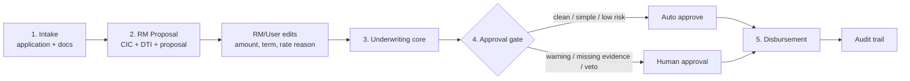
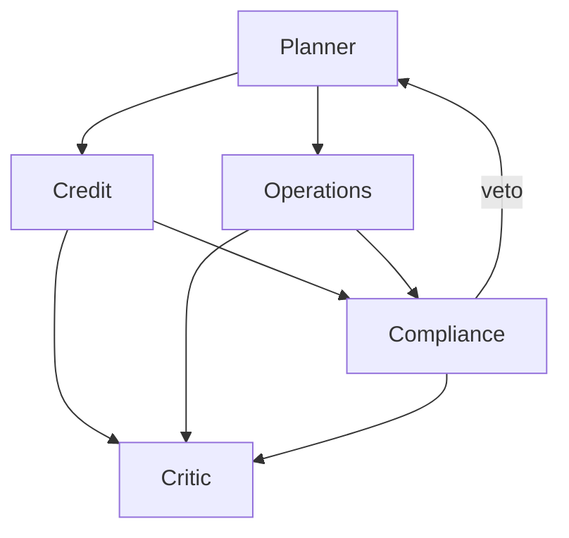

# AGENT-SPEC - Lifecycle Multi-Agent Contract

> This file is binding for agent roles, model tiers, responsibilities, tool permissions,
> KB access, and stage ownership. It follows `AGENTS.md`, `LOAN-SOP.md`, and the current
> shared package layout under `packages/shared/aulacys`.

## 0. Positioning

The product is no longer described as only a "5-agent underwriting demo".

It is a **lifecycle multi-agent loan workflow**:

1. Intake - receive the application and seeded/structured documents.
2. RM Proposal - produce the first loan proposal from customer facts.
3. Underwriting - run the specialist multi-agent appraisal core.
4. Approval - route to auto approval or human approval.
5. Disbursement - auto-book eligible unsecured consumer loans.

The current code already implements the strongest part: **Stage 3 underwriting core**
with Planner, Credit, Operations, Compliance, and Critic. Stage 2 is partially present
inside Credit (`price_loan`), Stage 4 exists as outcome/HITL ticketing, and Stage 5 is
still a target stage.

## 1. Non-Negotiable Invariants

| Rule | Meaning |
|---|---|
| LLM never produces numbers | DTI, LTV, payment, limit, rate, risk metrics come from deterministic tools. |
| LLM never produces veto | Blocking decisions come from policy-as-code and graph edges. |
| Planner coordinates, not underwrites | Planner creates DAG, routes work, receives veto, and replans. |
| Tool whitelist is enforced by harness | Permission lives in code (`dispatch` / facade map), not prompt text. |
| Flow lives in config | Product differences are YAML/config, not `if product == ...` branches. |
| Critic verifies, not mutates | Critic checks evidence and writes memo/remediation; it does not edit agent outputs. |

## 2. Target Lifecycle Agents

| Stage | Agent / component | Model tier | Responsibility | Tool permissions | KB |
|---|---|---|---|---|---|
| 1. Intake | Intake component / future Intake Agent | deterministic or mini | Validate received application and document completeness. OCR is out of scope. | `application_read`, `document_read`, `core_banking_read` | Ops KB |
| 2. RM Proposal | RM Proposal Agent | mini | Check CIC, compute DTI, create editable loan proposal: amount, term, rate, monthly payment, risk premium. | `core_banking_read`, `loan_calculator` | Credit KB |
| 3. Underwriting | Planner | strong | Decompose request into DAG, route agents, receive veto, replan. | none | none |
| 3. Underwriting | Credit | mini | Validate repayment capacity and proposal reasonableness; confirm/revise limit and rate. | `core_banking_read`, `loan_calculator` | Credit KB |
| 3. Underwriting | Operations | mini | Check documents, schedule valuation, check collateral/registry, create workflow ticket. | `core_banking_read`, `workflow_write` | Ops KB |
| 3. Underwriting | Compliance | mini | KYC/UBO, AML screening, legal/policy limit checks. Has veto power. | `core_banking_read`, `aml_screening` | Compliance KB |
| 3. Underwriting | Critic | strong | Verify every finding has evidence; synthesize credit memo and remediation plan. | none | read-all KB |
| 4. Approval | Approval Gate / future Approval Agent | deterministic or mini | Decide STP auto approval vs HITL based on product gate, risk, missing evidence, and veto state. | `policy_read`, `workflow_write` | Policy/Ops KB |
| 5. Disbursement | Disbursement Agent / service | deterministic or mini | Re-check final conditions and book disbursement for eligible unsecured consumer loans. | `core_banking_read`, `disbursement_write`, `audit_write` | Ops KB |

## 3. Current Implemented Agent Core

The code currently implements the Stage 3 underwriting core in `packages/shared/aulacys/agents`.

| Agent | Status | Notes |
|---|---|---|
| Planner | implemented | Strong-tier prose, DAG from product config, replan on veto. |
| Credit | implemented | Mini tier, CIC/income/payment/DTI/pricing via deterministic tools. Also carries part of Stage 2 RM proposal today. |
| Operations | implemented | Mini tier, checklist, valuation scheduling, property checks, ticket write ownership. |
| Compliance | implemented | Mini tier, KYC/UBO, AML, LTV/policy metrics, blocking veto. |
| Critic | implemented | Strong-tier prose, evidence verification, memo/remediation fields. |
| RM Proposal Agent | not separate yet | Required for lifecycle architecture; current behavior is folded into Credit. |
| Approval Agent/Gate | partially implemented | `stp_approved`, `ready_for_human_approval`, `vetoed`, and `/approvals` exist. Needs richer risk routing. |
| Disbursement Agent | not implemented yet | Application schema has disbursement concepts, but no lifecycle agent/action yet. |

## 4. Runtime Flow

Stage 3 expands as:

## 5. Permission Facades

Agent specs expose **logical permission facades**, not raw physical tools. The harness
expands facades at dispatch time while trace records the physical tool calls for audit.

| Facade | Physical tools / services |
|---|---|
| `core_banking_read` | `cic_lookup`, `income_verify`, `salary_verify`, `sao_ke_parse`, `kyc_check`, `ubo_check`, `compute_ltv`, `doc_checklist`, `property_valuation`, `land_registry` |
| `loan_calculator` | `compute_annual_debt_service`, `compute_dti`, `price_loan` |
| `aml_screening` | `aml_screen`, `related_party` |
| `workflow_write` | `schedule_valuation`, `write_approval_ticket` |
| `policy_read` | future approval/policy lookup facade |
| `disbursement_write` | future booking/core-banking write facade |
| `audit_write` | future explicit audit event facade |

Current implementation file:

`packages/shared/aulacys/agents/harness/permissions.py`

## 6. Model Tier Policy

The locked stack now says the primary LLM is Gemini:

| Tier | Intended agents | Default |
|---|---|---|
| strong | Planner, Critic | Gemini strong/prose model when configured |
| mini | RM Proposal, Credit, Operations, Compliance, Approval, Disbursement | `gemini-3.1-flash-lite` default |
| deterministic | tools, policy, graph decisions | no LLM |

OpenAI remains a fallback provider through `packages/shared/aulacys/services/llm.py` /
orchestrator service config. Model tier never changes the deterministic source of numbers
or veto.

## 7. What To Build Next

Keep the existing Stage 3 core stable. Add lifecycle stages around it in this order:

| Priority | Work | Why |
|---|---|---|
| P1 | Add `LoanProposal` / RM Proposal stage | Separates "RM proposes" from "Credit underwrites"; fixes role clarity. |
| P2 | Add proposal edit/override fields and reason | Lets RM/user tune amount, term, rate assumptions before underwriting. |
| P3 | Add Approval Gate model/config | Makes auto approval vs HITL explicit and product-config driven. |
| P4 | Add Disbursement Agent/service action | Completes unsecured STP: approved -> auto disburse. |
| P5 | Add Knowledge service namespaces | Credit/Compliance/Ops/Critic can cite KB without moving thresholds out of policy. |

## 8. Current vs Target Summary

| Area | Current | Target |
|---|---|---|
| Intake | Seed/application-svc data exists | Intake stage with completeness/accuracy status |
| RM Proposal | Folded into Credit | Separate RM Proposal Agent and editable `LoanProposal` |
| Underwriting | Implemented multi-agent core | Keep and harden |
| Approval | Outcome + HITL ticket | Explicit Approval Gate/Agent with risk routing |
| Disbursement | Not implemented as agent | Auto disbursement for clean unsecured consumer loans |
| KB/RAG | Planned, not real | `knowledge-svc` with vector/graph retrieval and citations |

## 9. Boundary Notes

- Real core-banking integration remains out of scope for the hackathon; use mock/read facades.
- OCR remains out of scope; structured sample data or `application-svc` payloads are accepted input.
- Production RBAC is out of scope, but lifecycle docs should leave room for `identity-svc` and
  `authz-svc`.
- Do not split the veto/replan core if that risks the demo branch.
