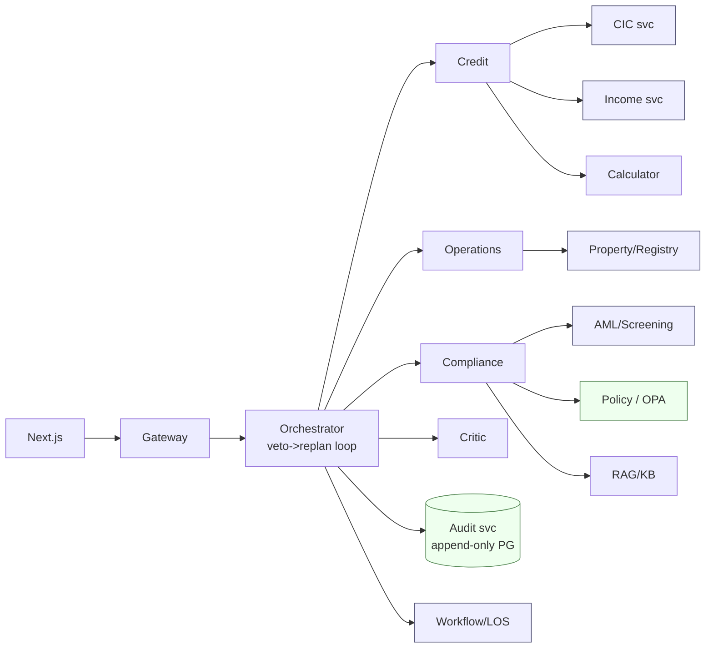
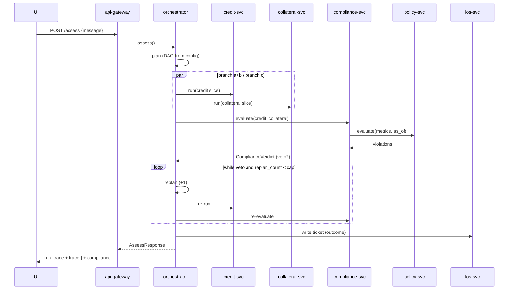

# Service decomposition — analysis of this project

> Grounded in the actual code (`apps/api/src/…`), not a generic template.
> Companion to `BUILD-GUIDE.md` §5.5 (seams) and the microservice note in the
> 2026-07-17 handoffs. **Read the verdict (§7) before extracting anything.**

## 1. What exists today (module map + who owns state)

Single FastAPI app, one LangGraph node (`process_application`) that runs the whole
flow in-process. Coupling is by **Python import**, not network.

| Layer        | Files                                                             | Stateful?                                       | Owns data?                               |
| ------------ | ----------------------------------------------------------------- | ----------------------------------------------- | ---------------------------------------- |
| Orchestrator | `agents/graph.py` (`process_application`)                     | per-request run state (`replan_count`, trace) | no (composes others)                     |
| Harness      | `agents/harness/{context,dispatch,runner,meter,trace}.py`       | no                                              | no                                       |
| Specs        | `agents/specs/base.py`, `agents/nodes/*` (spec objects)       | no (pure config)                                | no                                       |
| Agent logic  | `agents/nodes/{planner,credit,operations,compliance,critic}.py` | no (recompute each call)                        | no                                       |
| Tools        | `agents/tools/*` (13 tools, all deterministic mocks)            | no                                              | each mocks an external system            |
| Policy       | `policy/loader.py` `evaluate(metrics, as_of)`                 | no (pure)                                       | **rule YAML** (`policy/rules/*`) |
| Audit        | `db/models/audit.py` + migration                                | yes (DB)                                        | **audit tables** (append-only)     |
| Config       | `config.py`, `agents/products/*.yaml`                         | no                                              | product/gate config                      |

Two things already true that make decomposition cheap:

- **Whitelist + tool calls funnel through one place** — `harness/dispatch.py`. That is
  the natural gateway/broker seam.
- **Config drives the graph** — `products/*.yaml` lists `agents`, `tools`, `depends`,
  `gate`. Adding a product is a file, not code. Service wiring can read the same config.

## 2. How we cut (principles, not vibes)

1. **Data ownership** — a service owns its data; nobody else touches that store. Policy owns rules, Audit owns the ledger.
2. **Statelessness first** — pure functions (policy, calculators) split with near-zero risk.
3. **Real-world boundary** — prefer seams that mirror a boundary that already exists in the bank. These are defensible to a banking judge, not arbitrary.
4. **Change frequency** — things that change on a different clock (regulations vs code) want to be separate deployables.
5. **Keep the stateful loop in ONE place** — the veto→replan loop must not become chatty cross-network RPC.

## 3. The key insight — tools already map to real bank systems

The 13 tools are not arbitrary functions. Each mocks a **distinct external system a
real bank integrates with**. That is why they are the strongest decomposition story:

| Tool(s)                                 | Real-world system                                           | In a real bank                |
| --------------------------------------- | ----------------------------------------------------------- | ----------------------------- |
| `cic_lookup`                          | **CIC** — Trung tâm Thông tin Tín dụng Quốc gia | separate national API         |
| `aml_screen`, `related_party`       | Sanctions / PEP / related-party screening                   | 3rd-party (World-Check style) |
| `property_valuation`                  | Đơn vị định giá độc lập                            | external appraiser            |
| `land_registry`                       | Văn phòng Đăng ký Đất đai                           | government registry           |
| `income_verify`, `sao_ke_parse`     | Payroll / open-banking statement                            | internal or bank-linkage      |
| `compute_dti/ltv/annual_debt_service` | Deterministic calc engine                                   | internal service              |
| `write_approval_ticket`               | **LOS / core-banking** (Loan Origination System)      | the system of record          |

**Pitch:** *"Our service boundaries are not invented for the demo — they are the exact
integration points a bank already has. Each tool service is where a real external
system plugs in."* That sentence is the point-scorer.

## 4. Candidate services (full catalogue)

Difficulty 1 (trivial) → 5 (hard). Demo value = how much it strengthens the pitch.

| #   | Service                               | From                    | State                  | Interface                                           | Difficulty         | Demo value                                                        |
| --- | ------------------------------------- | ----------------------- | ---------------------- | --------------------------------------------------- | ------------------ | ----------------------------------------------------------------- |
| S0  | **Orchestrator**                | `graph.py`            | per-run                | drives all workers; holds veto loop                 | — (stays central) | core                                                              |
| S1  | **Policy Decision** (OPA-style) | `policy/loader.py`    | stateless              | `evaluate(metrics, as_of) → violations`          | ⭐ 1               | **high** — policy-as-code as its own service; matches §12 |
| S2  | **Calculator**                  | `loan_calculator.py`  | stateless              | `compute_dti/ltv/…`                              | ⭐ 1               | med — clean but low drama                                        |
| S3  | **Audit**                       | `db/models/audit.py`  | DB (owns ledger)       | append-only`write(record)`                        | ⭐⭐ 2             | **high** — immutable ledger = "cái mình bán"            |
| S4  | **CIC service**                 | `tools/cic.py`        | stateless mock         | `lookup(customer)`                                | ⭐⭐ 2             | **high** — real external boundary                          |
| S5  | **AML/Screening**               | `tools/aml.py`        | stateless mock         | `screen(...)`, `related_party(...)`             | ⭐⭐ 2             | **high** — real external boundary                          |
| S6  | **Property/Registry**           | `tools/property.py`   | stateless mock         | `valuation`, `land_registry`, `doc_checklist` | ⭐⭐ 2             | high                                                              |
| S7  | **Income/Statement**            | `tools/income.py`     | stateless mock         | `income_verify`, `sao_ke_parse`                 | ⭐⭐ 2             | med                                                               |
| S8  | **Workflow / LOS**              | `tools/workflow.py`   | mock (real = stateful) | `write_approval_ticket`                           | ⭐⭐ 2             | med — the "action"                                               |
| S9  | **Gateway / Tool broker**       | `harness/dispatch.py` | stateless              | routes + whitelist                                  | ⭐⭐⭐ 3           | med                                                               |
| S10 | **Credit worker**               | `nodes/credit.py`     | per-call               | `run(state slice) → CreditAssessment`            | ⭐⭐⭐⭐ 4         | med — per-agent model/scale (§8)                                |
| S11 | **Operations worker**           | `nodes/operations.py` | per-call               | `run → OperationsReport`                         | ⭐⭐⭐⭐ 4         | med                                                               |
| S12 | **Compliance worker**           | `nodes/compliance.py` | per-call               | `run → ComplianceVerdict`                        | ⭐⭐⭐⭐ 4         | med (in the veto loop — chatty risk)                             |
| S13 | **Critic worker**               | `nodes/critic.py`     | per-call               | read-only audit                                     | ⭐⭐⭐⭐ 4         | low                                                               |
| S14 | **RAG / KB**                    | not built               | vector store           | `retrieve(namespace, query)`                      | ⭐⭐⭐ 3           | med — blocked on §12 real rule_ids                              |

## 5. Grouped into tiers (deploy units)

- **Tier 0 — Composition root:** S0 Orchestrator. Holds the veto→replan loop. Never a leaf.
- **Tier 1 — Stateless brains:** S1 Policy (OPA), S2 Calculator, S14 RAG. Pure in→out.
- **Tier 2 — Data owners:** S3 Audit (Postgres, append-only). One store, one owner.
- **Tier 3 — External-system mirrors:** S4 CIC, S5 AML, S6 Property/Registry, S7 Income, S8 LOS. These are where real bank systems plug in.
- **Tier 4 — LLM workers:** S10–S13. Scale/model per agent, but in the loop → keep last.

## 6. Target topology



Cross-cutting (infra, not code): **OpenTelemetry** (trace) · **Consul / K8s DNS**
(discovery) · **service mesh** (retry, mTLS) — these replace Spring's
Eureka + Resilience4j + Sleuth without writing them.

## 7. Verdict + ranked cut order

**For the hackathon: do NOT split the graph.** The veto→replan loop is the demo
(`AGENTS.md`:43); turning its edges into network hops makes the thing you are selling
(speed) slower and burns hours on ops.

**Score the microservice points without paying the tax:**

1. Ship this analysis + the topology diagram (§6). "Seams are interfaces; splitting = changing transport."
2. Extract **exactly one** service as proof — **S1 Policy (OPA)**: compliance calls it over HTTP. Difficulty 1, highest-value story (policy-as-code, language-agnostic, matches §12). One `docker-compose` block.
3. If time remains, **S3 Audit** as a second proof (append-only service = the immutable-ledger pitch).

**If you productionise later**, cut in this order (least coupling first):
`S1 Policy → S3 Audit → S4–S8 tool/external services → S9 Gateway → S10–S13 agents`.
Tools and policy are stateless and map to real boundaries; agents are last because
they live inside the loop.

## 8. Anti-patterns to avoid

- **Distributed monolith** — splitting agents but sharing one DB / one deploy cadence. Worse than a monolith. Each service owns its store (Audit owns audit tables; nobody else reads them directly).
- **Chatty veto loop** — S10–S13 across the network re-invoked every replan = N× latency mid-demo. Keep the loop in S0; workers stay stateless request/response.
- **Rebuilding Spring's IoC** — Python is explicit-imports. Do not port a heavy DI container; use FastAPI `Depends` + module imports.
- **Shared models as a shared library that couples deploys** — version the contracts (OpenAPI/proto), don't import each other's internals.

---

## 9. Concrete target — HOW MANY services

The 15 candidates consolidate. Do **not** ship 15 (distributed monolith). Two fixed targets:

- **Hackathon-provable = 3 deployables:** `orchestrator` (monolith: gateway + graph +
  all agents + tools), `policy-svc` (OPA), `audit-svc`. Enough to prove the pattern.
- **Production target = 8 services:**

| # | Service                | Owns DB?                      | Consolidates (from §4)            | Stateless?  |
| - | ---------------------- | ----------------------------- | ---------------------------------- | ----------- |
| 1 | `api-gateway` (BFF)  | no                            | S9                                 | yes         |
| 2 | `orchestrator`       | **yes** — run ledger   | S0 (+ S13 Critic folded in)        | per-run     |
| 3 | `policy-svc` (OPA)   | rules store                   | S1                                 | yes         |
| 4 | `credit-svc`         | no                            | S10 + S4 CIC + S7 Income + S2 Calc | per-call    |
| 5 | `collateral-svc`     | no                            | S11 + S6 Property/Registry         | per-call    |
| 6 | `compliance-svc`     | no                            | S12 + S5 AML (calls policy-svc)    | per-call    |
| 7 | `audit-svc`          | **yes** — audit ledger | S3                                 | append-only |
| 8 | `los-svc` (workflow) | **yes** — ticket store | S8                                 | stateful    |

RAG/KB (S14) is a 9th once real rule_ids exist (§12). Tools fold into the agent
service that uses them (credit-svc owns its CIC/income calls) — a tool is only its own
service when >1 agent needs it or it maps to a heavily-regulated external boundary.

**3 services own data → 3 databases (never shared): orchestrator, audit, los.**

## 10. How to deploy

- **Each service:** own repo/folder + `Dockerfile` + FastAPI app + own `pyproject`. Contract published as **OpenAPI** (or proto for gRPC); consumers generate clients — no importing each other's code.
- **Dev:** `docker-compose.yml` — one block per service + Postgres per data-owner + one OPA container + (optional) NATS/RabbitMQ. `docker compose up` boots the mesh. You already run `docker compose up` today — each service = one more block.
- **Prod:** Kubernetes — one Deployment + Service per box. Discovery via K8s DNS. Retry/mTLS/timeout via **service mesh** (Linkerd is lightest) — infra, not code.
- **Config:** `pydantic-settings` per service (already the pattern in `config.py`); secrets via env / Vault.
- **Migrations:** each data-owner runs its **own** Alembic (audit-svc migrates only audit tables). No cross-service DDL.

## 11. Flow + events

**Sync where a decision waits; async where it does not.** The veto→replan loop is
SYNC inside the orchestrator (a decision cannot proceed without the verdict). Audit,
notifications, and trace are ASYNC events (fire-and-forget).

### Sync call path (one assessment)



### Async events (published by orchestrator, bus = NATS/Kafka)

| Event                                       | Publisher    | Consumer            | Why async                                      |
| ------------------------------------------- | ------------ | ------------------- | ---------------------------------------------- |
| `AssessmentRequested`                     | gateway      | orchestrator        | entry                                          |
| `CreditAssessed` / `CollateralAssessed` | orchestrator | dashboard/trace     | live UI                                        |
| `VetoFired`                               | orchestrator | dashboard           | the money-shot event                           |
| `ReplanTriggered`                         | orchestrator | dashboard           | shows the loop                                 |
| `DecisionRecorded`                        | orchestrator | **audit-svc** | append-only write; must not block the response |
| `Escalated` / `AutoApproved`            | orchestrator | notify/LOS          | side-effect                                    |
| `TicketWritten`                           | los-svc      | orchestrator        | confirm                                        |

Rule: the **decision** is synchronous and consistent; the **audit write** is an event so
a slow ledger never delays (or fails) the user response. Audit-svc is idempotent on
`(application_id, decided_at)`.

## 12. Per-service DB schema — data ownership

Only **3** services own storage. Design status:

| Service      | Store              | Tables                                | Status                                                    |
| ------------ | ------------------ | ------------------------------------- | --------------------------------------------------------- |
| audit-svc    | Postgres           | `audit_record`, `audit_violation` | ✅**done** — `db/schema.sql`, migration `0001` |
| los-svc      | Postgres           | `loan_ticket`                       | ❌ designed below, not built                              |
| orchestrator | Postgres           | `loan_run`                          | ❌ designed below, not built                              |
| policy-svc   | OPA bundle (rules) | not SQL — Rego/YAML rules            | rules exist as YAML; OPA packaging not done               |

Others (gateway, credit, collateral, compliance) own **no** persistent data — they call
external systems and return; add only a cache (Redis) if latency needs it.

### `los-svc` → `loan_ticket` (system-of-record shape)

```sql
CREATE TABLE loan_ticket (
    ticket_id      text        PRIMARY KEY,     -- e.g. DEMO-<app>
    application_id text        NOT NULL,
    status         text        NOT NULL,        -- vetoed | ready_for_human_approval | stp_approved
    product        text        NOT NULL,
    summary        text        NOT NULL,
    assigned_to    text,                         -- human queue (HITL)
    created_at     timestamptz NOT NULL DEFAULT now(),
    updated_at     timestamptz NOT NULL DEFAULT now()
);
CREATE INDEX ix_loan_ticket_application_id ON loan_ticket (application_id);
CREATE INDEX ix_loan_ticket_status ON loan_ticket (status);
```

### `orchestrator` → `loan_run` (run tracking / idempotency / trace snapshot)

```sql
CREATE TABLE loan_run (
    run_id         uuid        PRIMARY KEY,
    application_id text        NOT NULL,
    product        text        NOT NULL,
    lane           integer     NOT NULL,
    outcome        text        NOT NULL,
    veto_fired     boolean     NOT NULL DEFAULT false,
    replan_count   integer     NOT NULL DEFAULT 0,
    as_of          date        NOT NULL,
    total_cost     double precision NOT NULL DEFAULT 0,
    trace          jsonb       NOT NULL DEFAULT '[]',   -- NodeTrace[] snapshot (disposable)
    started_at     timestamptz NOT NULL DEFAULT now(),
    finished_at    timestamptz
);
CREATE INDEX ix_loan_run_application_id ON loan_run (application_id);
```

> `loan_run.trace` is disposable observability (mutable) — the opposite of `audit_*`
> (immutable). Keeping them in **different services / stores** is the §8.1
> "trace ≠ audit" rule made physical.
