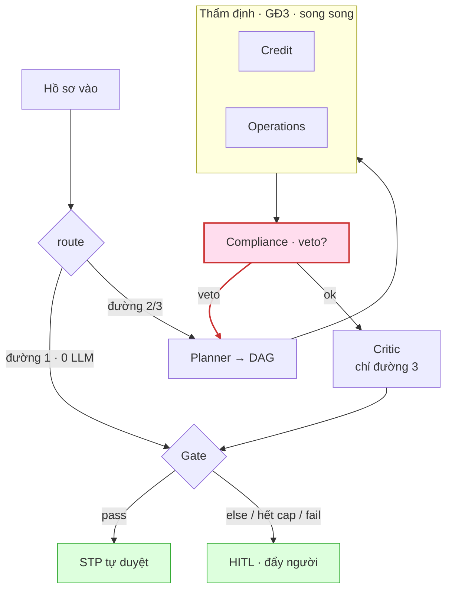

# BUILD GUIDE — dựng bộ khung agent

> **Đọc trước khi gõ dòng đầu tiên.** Cho người **và** cho agent của đồng đội.
> Nền: [`SHB-Digital-Expert-Agents-Solution-Design-v2.md`](./SHB-Digital-Expert-Agents-Solution-Design-v2.md) (**vì sao**) · [`AGENTS.md`](../AGENTS.md) (luật repo) · file này (**làm thế nào**).
> Mâu thuẫn thì: `AGENTS.md` > v2 > file này.

⚠️ **`AGENTS.md` §0 vẫn khoá kịch bản DN 20 tỷ và tự tuyên bố "§0 wins".** Chưa sửa thì mọi agent đọc §0 sẽ build sai kịch bản. **Sửa §0 trước giờ 0.**

---

## 1. Năm luật — vi phạm là hỏng bài, không phải hỏng code

| # | Luật                                                                                     | Vi phạm thì                                                                                   |
| - | ----------------------------------------------------------------------------------------- | ----------------------------------------------------------------------------------------------- |
| 1 | **LLM không bao giờ đẻ ra số.** DTI, LTV, hệ số rủi ro → tool tất định  | Critic không truy ngược được → đứt chuỗi audit →**mất thứ mình đang bán** |
| 2 | **Ngưỡng ở `policy/*.yaml`, không ở prompt**                                 | Model nhớ luật cũ → chặn sai trên sân khấu                                              |
| 3 | **Veto là cạnh trong graph**, không phải câu trong prompt                      | Model bỏ qua → không còn veto →**không còn bài**                                  |
| 4 | **Whitelist tool do harness chặn**, không do prompt dặn                          | Agent gọi tool ngoài spec → whitelist thành trang trí                                      |
| 5 | **Ràng buộc quan trọng = cấu trúc/code. Prompt chỉ chứa phán đoán + vai** | Prompt gánh việc code. Nó gánh**im lặng** — không throw, không log, chỉ sai      |

Luật 5 bao luật 1–4. Test khi phân vân:

> **"Model phớt lờ dòng này thì có ai chết không?"** Có → code/config/policy. Không → prompt.

---

## 2. Cây file

```
apps/api/src/agents/
  harness/
    __init__.py
    runner.py        # vòng lặp: assemble → call → parse → dispatch → lặp
    context.py       # ★ ráp context từ spec.reads — CHỐT CHẶN TOKEN
    dispatch.py      # ★ chặn whitelist (luật 4)
    meter.py         # ★ đếm token/cost/latency mỗi node
    trace.py         # SSE ra dashboard
  specs/
    __init__.py
    base.py          # AgentSpec
    planner.py  credit.py  operations.py  compliance.py  critic.py
  tools/
    loan_calculator.py   # ✅ đã có — xem §7
    cic.py  income.py  property.py  aml.py  workflow.py   # mới
  products/
    retail_unsecured_salary.yaml
    retail_mortgage.yaml
  graph.py           # cạnh, veto edge
  state.py
src/policy/
  loader.py          # ✅ đã có — ⚠️ xem §7, phải sửa
  rules/
    credit_limits.yaml     # ⚠️ của kịch bản DN — xem §7
    retail_lending.yaml    # mới
```

Ba chỗ `★` là chỗ chi phí sống hoặc chết. Xem §8.

---

## 3. Contract — giờ 0–2, cả đội chờ cái này

Ba thứ dưới đây xong thì **5 người build 5 agent song song, không đụng nhau**. Chưa xong thì cả đội chặn.

### 3.1 `specs/base.py`

```python
class AgentSpec(BaseModel):
    name: str
    line: int | None              # tuyến phòng thủ 1/2/3 · None = hạ tầng
    reads: list[str]              # ★ lát cắt state con này được đọc — đòn bẩy token
    tools: list[str]              # whitelist. dispatch.py ép, KHÔNG phải prompt
    kb: str | None                # RAG namespace
    policy: str | None            # file policy con này đọc
    output: type[BaseModel]       # ép schema — không văn xuôi
    model: str                    # theo đường (§8 v2)
    max_tool_calls: int           # ★ chống loop
    prompt: str                   # NGẮN — chỉ phán đoán + vai
```

`reads` là trường quan trọng nhất trong file này. Xem §8.

### 3.2 `state.py`

```python
class Document(BaseModel):
    kind: str                     # sao_ke | cccd | so_do | hop_dong_mua_ban | cic
    tier: Literal[1, 2, 3]        # 1=có cấu trúc · 2=text máy đọc · 3=scan
    extracted: dict | None        # tier 3 → seed sẵn
    confirmed_by: str | None      # tier 3 BẮT BUỘC có người xác nhận

class LoanApplication(BaseModel):
    product: str                  # → chọn file products/*.yaml
    declared: DeclaredForm        # ★ khách KHAI
    documents: list[Document]     # ★ BẰNG CHỨNG

class AgentState(TypedDict):
    application: LoanApplication
    plan: DAG | None
    credit: CreditAssessment | None
    operations: OperationsReport | None
    compliance: ComplianceVerdict | None
    critic: CriticVerdict | None
    replan_count: int             # ★ cap — xem §5.1
    trace: list[NodeTrace]
```

> ★ **`declared` tách khỏi `documents` trong schema, không chỉ trong đầu.**
> Tách rồi thì Critic hỏi được: *"kết luận này dựa vào tờ khai hay dựa vào chứng từ?"* — và đó chính là nhánh veto (§6).

### 3.3 Output schema — không con nào trả văn xuôi

```python
CreditAssessment    { dti, income, recommendation, evidence: list[Citation] }
OperationsReport    { valuation, doc_status, missing: list[str], legal_flags: list[str] }
ComplianceVerdict   { violations: list[PolicyViolation], veto: bool,
                      rule_ids: list[str], citations: list[Citation] }
CriticVerdict       { passed: bool, rejections: list[str] }
DAG                 { nodes: list[str], edges: list[tuple[str, str]] }
```

`PolicyViolation` **đã có** trong `src/policy/loader.py` — dùng lại, đừng định nghĩa lần hai.

### 3.4 Tool interface

Mẫu đã đúng, copy từ `tools/loan_calculator.py`:

```python
@tool
def compute_dti(...) -> dict | CalcError:
    """Mọi tool trả về:
       inputs   — ★ Critic truy ngược bằng cái này
       formula  — ★ hiện trên dashboard
       computed_at
       Lỗi → _fail() trả typed error. KHÔNG raise (AGENTS.md §6)."""
```

---

## 4. Harness — giờ 2–6. Sai ở đây thì cả 5 agent sai theo

Build **một lần**, dùng chung 5 agent. Mỗi agent có harness riêng = 5 codebase, giờ 30 sửa retry phải sửa 5 chỗ.

| Module          | Việc                                                  | Chữ ký                              |
| --------------- | ------------------------------------------------------ | ------------------------------------- |
| `context.py`  | Ráp context**chỉ từ `spec.reads`**          | `assemble(spec, state) -> Messages` |
| `dispatch.py` | Gọi tool.**Ngoài `spec.tools` → từ chối** | `dispatch(spec, call) -> dict`      |
| `runner.py`   | Vòng lặp + parse → Pydantic → retry + fallback     | `run(spec, state) -> BaseModel`     |
| `meter.py`    | Đếm token/cost/latency/cache                         | `meter.record(node, usage)`         |
| `trace.py`    | Emit SSE                                               | `trace.emit(NodeTrace)`             |

### 4.1 Thứ tự context — đừng đảo

```
[system prompt] [tool defs]   ← ỔN ĐỊNH, đứng đầu → prompt cache ăn
[state slice theo reads]      ← BIẾN THIÊN, đứng cuối
```

Đảo thứ tự = mất cache. **Không ai nhận ra**, chỉ thấy hoá đơn.

### 4.2 `runner.py` bắt buộc có

- Parse thất bại → retry **có cap**, đếm vào `schema_retries`
- LLM lỗi/timeout → **fallback**, không 500 (`AGENTS.md` §6)
- Vượt `spec.max_tool_calls` → dừng, trả typed error
- Mỗi vòng → `meter.record()` + `trace.emit()`

---

## 5. Năm agent

### 5.0 Quy trình tham chiếu — 9 giai đoạn, ta chỉ làm 3 và 4

Vai trong bài **không phải ta nghĩ ra**. Ảnh tham chiếu ghi quy trình tín dụng bán lẻ theo giai đoạn, actor, việc cụ thể và SLA. Dùng như quy trình chung của NHTM Việt Nam; **không gọi đây là quy trình nội bộ SHB**.

| #           | Giai đoạn                               | Actor chính                               | Việc                                                                                                                                                                                                                                                        | SLA tham chiếu      |
| ----------- | ----------------------------------------- | ------------------------------------------ | ------------------------------------------------------------------------------------------------------------------------------------------------------------------------------------------------------------------------------------------------------------ | -------------------- |
| 1           | Tiếp thị & tư vấn sơ bộ             | CV QHKH (RM)                               | Làm rõ mục đích vay, số tiền, kỳ hạn, hình thức (tín chấp/thế chấp), sàng lọc sơ bộ thu nhập & TSBĐ                                                                                                                                     | 0–1 ngày           |
| 2           | Tiếp nhận hồ sơ                       | RM                                         | Nhận hồ sơ pháp lý (CCCD, hộ khẩu), chứng minh thu nhập (HĐLĐ, sao kê 3 tháng), hồ sơ TSBĐ, đơn đề nghị vay. Check tính đầy đủ/hợp lệ                                                                                            | 1 ngày              |
| **3** | **Thẩm định**                    | CV Thẩm định + đơn vị định giá    | **3 nhánh song song**: (a) thẩm định khách hàng — CIC, xác minh thu nhập, thực địa nơi ở/nơi làm; (b) thẩm định phương án vay & khả năng trả nợ; (c) định giá + kiểm tra pháp lý TSBĐ. Output: Báo cáo thẩm định | **2–7 ngày** |
| **4** | **Phê duyệt**                     | Cấp thẩm quyền / Hội đồng tín dụng | Ra quyết định theo hạn mức phân quyền; vượt thẩm quyền → trình cấp cao hơn. Output: Thông báo cho vay (hạn mức, lãi suất, kỳ hạn, điều kiện trước giải ngân)                                                                   | **1–3 ngày** |
| 5           | Ký kết hợp đồng & hoàn thiện TSBĐ | RM + HTTD + Công chứng/VPĐK             | Ký HĐ tín dụng + HĐ thế chấp → công chứng → đăng ký giao dịch bảo đảm → nhập kho TSBĐ                                                                                                                                                   | 1–3 ngày           |
| 6           | Giải ngân                               | HTTD + Kế toán                           | Kiểm soát điều kiện giải ngân, ký Giấy nhận nợ, hạch toán chuyển tiền (1 lần hoặc nhiều đợt)                                                                                                                                             | 1–2 ngày           |
| 7           | Kiểm tra sau vay & giám sát            | RM                                         | Kiểm tra mục đích sử dụng vốn, tình hình tài chính KH, tình trạng TSBĐ định kỳ                                                                                                                                                              | Định kỳ           |
| 8           | Thu nợ & xử lý phát sinh              | RM + Kế toán + Xử lý nợ               | Thu gốc/lãi theo lịch; xử lý cơ cấu nợ, trả trước hạn, nợ có vấn đề                                                                                                                                                                         | Suốt vòng đời    |
| 9           | Thanh lý & lưu hồ sơ                  | HTTD                                       | Biên bản thanh lý, giải chấp TSBĐ, xóa đăng ký GĐBĐ, lưu hồ sơ                                                                                                                                                                                | 1–2 ngày           |

**Ba điều rút ra — không phải trang trí:**

1. **Giai đoạn 3 vốn đã là 3 nhánh song song do 3 vai khác nhau làm.** Đây là **lý do Planner tồn tại** trong demo, và nó bám vào quy trình nghiệp vụ tham chiếu — không phải ta bịa ra để có DAG. `Credit` = nhánh (a)+(b). `Operations` = nhánh (c).
2. **Veto và duyệt là hai giai đoạn khác nhau, hai vai khác nhau.** Thẩm định (3) đề xuất, cấp thẩm quyền (4) mới quyết. Vai đề xuất **không** được tự duyệt. Đây chính là cạnh veto (§6) — nó bám vào phân tách vai trò nghiệp vụ, không phải mẹo kiến trúc.
3. **SLA tham chiếu 2–7 ngày ở giai đoạn 3 là con số ta đang tấn công.** Demo nén 3+4 (**3–10 ngày**) xuống phút. Khi pitch, nói đây là SLA tham chiếu/quy trình chung, không nói là SLA nội bộ SHB.

**Lát cắt của ta = giai đoạn 3 + 4.** 1–2 = seed data. 5–9 = ngoài phạm vi, đừng đụng (`AGENTS.md` §0).

### 5.1 Năm agent

|                | Vai thật                              | Nhiệm vụ (một câu)                                            | Tuyến      | Tools                                                             | KB                                             | Policy                       | Model                                |
| -------------- | -------------------------------------- | ----------------------------------------------------------------- | ----------- | ----------------------------------------------------------------- | ---------------------------------------------- | ---------------------------- | ------------------------------------ |
| `Planner`    | quy trình GĐ3 (không phải người) | Config → DAG. Veto → replan                                     | —          | không                                                            | không                                         | không                       | **mạnh nhất**                |
| `Credit`     | CV Thẩm định — nhánh (a)+(b)      | Người này trả được nợ không?                             | 1           | `cic_lookup` `income_verify` `compute_dti` `sao_ke_parse` | quy định cho vay                             | chỉ đọc`warning`        | rẻ→vừa                            |
| `Operations` | Đơn vị định giá — nhánh (c)    | Hồ sơ đủ chưa · TSBĐ đáng bao nhiêu · có sạch không | 1           | `property_valuation` `land_registry` `doc_checklist`        | quy định TSBĐ                               | —                           | rẻ                                  |
| `Compliance` | Cấp thẩm quyền / HĐTD (GĐ4)       | Có**được phép** cho vay không?                        | **2** | `aml_screen` `related_party` `policy.evaluate`              | thông tư, luật (**namespace riêng**) | **blocking + warning** | **mạnh**                      |
| `Critic`     | Kiểm toán nội bộ (tuyến 3)        | Số nào không có tool? Claim nào không có điều khoản?    | —          | **read-only**                                               | —                                             | —                           | mạnh,**chỉ bật đường 3** |

### 5.2 Guardrail — phần này quan trọng hơn prompt

**`Planner`**

- ⚠️ **Cap `replan_count`.** Veto → replan → veto → replan vô tận **giữa demo là chết**. Hết cap → đẩy lên người.
- Không quyết nghiệp vụ.
- *Fallback: DAG tĩnh đọc thẳng từ config.* Planner hỏng thì hệ vẫn chạy.

**`Credit`** — không đẻ số · **không kết luận pháp lý** (việc của tuyến 2) · không đọc trần luật.

**`Operations`** — **không định giá bằng LLM**, tool only.
⚠️ Canh: nếu nó teo thành wrapper của **một** tool thì **nó không còn là agent** — và Planner mất lý do tồn tại theo (v2 §5 ng.tắc 4). Nó phải **phán đoán**: sổ đỏ có tranh chấp/quy hoạch không, hợp đồng còn hạn không.

**`Compliance`**

- Ngưỡng **chỉ** từ policy YAML. **KHÔNG từ RAG** — RAG trả *văn bản*, YAML giữ *con số*. Hỏi RAG "trần bao nhiêu" là mời ảo giác vào đúng chỗ chí mạng.
- Veto **phải** mang `rule_id + version + effective_from`. Thiếu → harness loại.
- `verified: false` → **không quyết**, nói thẳng là chưa ai xác nhận ngưỡng.

**`Critic`**

- ⚠️ **KHÔNG được sửa nội dung.** Chỉ `passed` / `rejections[]`.
  Critic sửa được là Critic thành **ý kiến thứ sáu** — lúc đó **ai kiểm Critic?** Chuỗi audit đứt.
  Đây là guardrail dễ vi phạm nhất, vì *"để nó sửa luôn cho nhanh"* rất cám dỗ.
- **Không có tool ghi.** Read-only, cứng.

---

### 5.3 Diễn giải luồng — một hồ sơ đi qua hệ thế nào

Đọc mục này **trước khi đọc code §5.4.** Đây là bản đồ: quy trình vay thật (§5.0, GĐ3+4) → hình dạng chạy trong máy.



> `Compliance --veto--> Planner` (đỏ) = vòng replan, xương sống (§5.5). Cap replan / Critic fail / gate fail đều rơi về HITL. Một `LoanApplication` vào, đi qua 8 bước:

| Bước | Việc trong hệ                                                                                                                                                                                                                                                              | Ứng với GĐ thật (§5.0)                                         | Chạm gì                                |
| ------ | ---------------------------------------------------------------------------------------------------------------------------------------------------------------------------------------------------------------------------------------------------------------------------- | ------------------------------------------------------------------- | ---------------------------------------- |
| 0      | **Seed hồ sơ.** `declared` + `documents` vào state. Mỗi doc gắn `tier` 1/2/3.                                                                                                                                                                               | GĐ1–2 (ngoài lát cắt, seed)                                    | `state.py`                             |
| 1      | **Định tuyến đường.** Product config + `amount` + tier chứng từ + pre-check policy → đường 1/2/3.                                                                                                                                                        | — (định tuyến, không có ngoài đời)                         | `route()` → `RunTrace.lane` (§8.1) |
| 2      | **Đường 1 dừng sớm.** Chuẩn + trong ngưỡng → tool tất định tính metric → `policy.evaluate` → gate. **0 LLM.**                                                                                                                                   | GĐ3+4 rút gọn (STP)                                              | tool +`loader.py`                      |
| 3      | **Planner → DAG.** Đường 2/3: Planner đọc `products/*.yaml` → nodes + edges + **veto edge.**                                                                                                                                                            | GĐ3 "3 nhánh song song"                                           | `PlannerSpec` → `plan`              |
| 4      | **Chạy DAG.** Node theo thứ tự topo. `Credit`=nhánh (a)+(b), `Operations`=nhánh (c) — **song song.** Mỗi node: `context.assemble` (chỉ `reads`) → LLM → `dispatch` (whitelist) → tool tất định → parse Pydantic → `meter`+`trace`. | GĐ3 thẩm định                                                   | `runner` + specs + tools               |
| 5      | **Compliance.** Đọc output Credit+Operations + policy YAML → `policy.evaluate(metrics, as_of)` → `violations`. `veto=true` → **veto edge nổ.**                                                                                                       | GĐ4 phê duyệt (tuyến 2)                                         | `ComplianceSpec` + `loader.py`       |
| 6      | **Veto → replan.** Edge quay về Planner. `replan_count++`. **Quá cap → đẩy người (HITL)** (§5.2). Dưới cap → DAG mới → lặp bước 4.                                                                                                            | GĐ4: đề xuất ≠ tự duyệt                                      | `graph.py` + `PlannerSpec`           |
| 7      | **Critic (chỉ đường 3).** Read-only audit: số nào không có tool trace? claim nào thiếu `rule_id`? → `passed`/`rejections[]`. Không sửa.                                                                                                             | Tuyến 3 —**không có trong 9 GĐ**, là lớp phủ nội bộ | `CriticSpec`                           |
| 8      | **Gate.** Config `stp_when`: `all_rules_pass AND amount <= stp_ceiling` → STP, else HITL. Output = *Thông báo cho vay*.                                                                                                                                       | GĐ4 output                                                         | config §6                               |

> ★ **Xương sống = bước 3→4→5→6.** Planner sinh DAG, DAG chạy node, Compliance veto, veto replan. Đường 1 (bước 2) và Critic (bước 7) là **nhánh rẽ**, không phải xương sống. Build xương trước (§5.5).

### 5.4 Luồng code chuẩn — call sequence

Hai hàm. `graph.run` điều phối luồng, `runner.run` chạy một node. Tên file/hàm khớp §2 + §3 + §4 — **code theo đúng đây.**

```python
# graph.py — điều phối. KHÔNG có if product == ... ở đây (§11)
def run(application: LoanApplication) -> AgentState:
    state = init_state(application)                 # state.py — bước 0
    config = load_product(application.product)      # products/*.yaml
    lane   = route(application, config)             # bước 1 → RunTrace.lane

    # đường 1: rule-only, 0 LLM (§8 đường 1) — bước 2
    if lane == 1:
        metrics = run_tools(state, config.tools)    # tool tất định
        violations = policy.evaluate(metrics, as_of=today())
        return gate(state, violations, config)

    # đường 2/3: Planner → DAG — bước 3
    state.plan = runner.run(PlannerSpec, state)

    while True:                                     # bước 4 + 6
        for node in state.plan.ready_nodes():       # topo, song song được
            spec = SPECS[node]                      # specs/*.py
            state[node] = runner.run(spec, state)   # bước 4/5

        v = state.compliance                        # veto edge — bước 6
        if v and v.veto:
            state.replan_count += 1
            if state.replan_count > REPLAN_CAP:     # §5.2 cap
                return escalate_hitl(state)
            state.plan = runner.run(PlannerSpec, state)  # replan
            continue
        break

    if lane == 3:                                   # Critic — bước 7
        state.critic = runner.run(CriticSpec, state)
        if not state.critic.passed:
            return escalate_hitl(state)

    return gate(state, state.compliance.violations, config)  # bước 8
```

```python
# harness/runner.py — một node. Dùng chung 5 agent (§4)
def run(spec: AgentSpec, state: AgentState) -> BaseModel:
    msgs = context.assemble(spec, state)            # ★ CHỈ spec.reads (§4.1)
    for attempt in range(SCHEMA_RETRY_CAP):
        resp = llm.call(spec.model, msgs, tools=spec.tools)
        for call in resp.tool_calls:                # ≤ spec.max_tool_calls
            msgs.append(dispatch.dispatch(spec, call))   # ★ whitelist (§4)
        if resp.is_final:
            obj, ok = parse(resp, spec.output)      # ép Pydantic
            if ok:
                meter.record(spec.name, resp.usage) # §8.1
                trace.emit(NodeTrace(...))          # §8.1
                return obj
            state.schema_retries += 1
    return fallback(spec, state)                    # LLM lỗi → không 500 (§4.2)
```

> ⚠️ **Ba bất biến khi code hai hàm này:**
>
> 1. `context.assemble` **chỉ** lấy `spec.reads` — không bao giờ cả state (§8 mục 1).
> 2. `dispatch` là **nơi duy nhất** chặn tool — prompt không dặn (luật 4).
> 3. Veto/replan là **cạnh trong `graph.run`** — không phải câu trong prompt (luật 3).

### 5.5 Plan build theo luồng — xương sống trước, node sau

Thứ tự build **bám luồng §5.3**, không bám danh sách agent. Xong xương sống (bước 3→6) thì đã có bài; node đắp sau. Ánh xạ sang giờ ở §9.

| Thứ tự | Build gì (theo luồng)                                                            | File                                                        | Giờ §9 | Xong =                                         |
| -------- | ---------------------------------------------------------------------------------- | ----------------------------------------------------------- | -------- | ---------------------------------------------- |
| 1        | **Xương ráp:** `graph.run` khung + `runner.run` + `route()` stub    | `graph.py` `harness/*`                                  | 0–6     | Luồng gọi được, 1 node giả chạy hết    |
| 2        | **Một node thật end-to-end:** `Credit` + `compute_dti` + config case 1 | `credit.py` `tools/` `retail_unsecured_salary.yaml`   | 6–10    | ★ Config điều khiển graph (đường 1 STP) |
| 3        | **Nở DAG:** `Operations` + `Compliance` + cạnh `depends` + policy    | `operations.py` `compliance.py` `retail_lending.yaml` | 10–20   | Nhánh (a)+(b)+(c) chạy song song             |
| 4        | **Veto edge + replan + cap** — bước 6                                     | `graph.py` `PlannerSpec`                                | 20–28   | ⚠️**Đây là bài**                   |
| 5        | **Critic + audit chain** — bước 7, chỉ đường 3                        | `critic.py` `trace.py`                                  | 28–34   | Cái mình bán                                |
| 6        | **Config case 2 chạy, 0 code mới** — chứng minh flow-as-config           | `retail_mortgage.yaml`                                    | 34–40   | Ng.tắc 1 thật                                |
| 7        | **`evaluate(as_of)` (§7.1) + đo `meter` → cắt**                      | `loader.py`                                               | 40–44   | Đột phá B, có số                          |

> ★ **Bước 1–4 là xương sống — đừng làm 5–7 khi 4 chưa chạy.** Veto (bước 4) chưa xanh mà đã đi Critic là **đảo thứ tự luồng** — §9 chốt chặn giờ 36 nói y hệt.

---

## 6. Config — chỗ hai sản phẩm khác nhau

```yaml
# products/retail_unsecured_salary.yaml — case 1, STP
agents: [credit]
tools:  [cic_lookup, salary_verify, compute_dti]
policy: retail_lending.yaml
documents:
  required: [cccd, sao_ke_luong, cic]
gate:
  stp_when: all_rules_pass AND amount <= stp_ceiling
  else: hitl
```

```yaml
# products/retail_mortgage.yaml — case 2, HITL + veto
agents: [credit, operations, compliance]
depends:
  compliance: [operations]        # ★ cạnh sinh ra DAG — lý do Planner tồn tại
tools:  [cic_lookup, income_verify, compute_dti, sao_ke_parse,
         property_valuation, land_registry, compute_ltv]
policy: retail_lending.yaml
documents:
  required: [cccd, sao_ke_tai_khoan, so_do, hop_dong_mua_ban, cic]
  optional: [dang_ky_ket_hon]
gate:
  stp_when: never                 # thế chấp luôn qua người
```

> 🚫 **Không có `if product == ...` ở bất kỳ đâu trong graph.** Thấy một cái là ng.tắc 1 đã vỡ.
> Sản phẩm thứ ba = thêm một file. Không thêm code.

Thiếu chứng từ → `Operations` báo (`missing[]`).

---

## 7. Code đã có — dùng gì, sửa gì

| File                                                         | Trạng thái                     | Việc                                                                                                                                            |
| ------------------------------------------------------------ | -------------------------------- | ------------------------------------------------------------------------------------------------------------------------------------------------ |
| `policy/loader.py`                                         | ✅ Chạy, 27 test xanh           | ⚠️**`evaluate()` bỏ qua `effective_from`** — rule đề 2099 vẫn nổ. Xem dưới                                                         |
| `policy/rules/credit_limits.yaml`                          | ⚠️**Của kịch bản DN** | `single_customer_credit_limit`, `related_party` là bài DN. Bán lẻ cần `retail_lending.yaml` mới                                      |
| `tools/loan_calculator.py`                                 | ✅ Mẫu đúng                   | `compute_ltv` **dùng lại được**. `compute_dscr`/`compute_exposure_ratio` là **của DN** — bán lẻ cần `compute_dti` |
| `agents/graph.py`, `state.py`, `nodes/example_node.py` | Khung rỗng                      | Viết đè                                                                                                                                       |

### 7.1 ★ Sửa `evaluate()` — bug này là **đột phá B**

```python
def evaluate(metrics: dict[str, float], as_of: date) -> list[PolicyViolation]:
    for rule in load_rules():
        if date.fromisoformat(rule.effective_from) > as_of:
            continue                     # rule chưa hiệu lực → không xét
        ...
```

Không phải dọn nợ. Đây là **tính năng đắt nhất của bài**: cùng hồ sơ, `as_of=2023` → duyệt; `as_of=hôm nay` → chặn. Chứng minh policy-as-code không phải slide, và giết câu *"scorecard làm rồi"*.

Thêm `effective_to` cho rule đã hết hiệu lực.

⚠️ `load_rules()` có `lru_cache` — **đừng** cache theo `as_of`, lọc ở `evaluate()`.

---

## 8. Chi phí — ba quyết định giờ 0, không phải tối ưu

> **Đừng tối ưu token từ đầu. Hãy *đo* token từ đầu.** Tối ưu trước khi đo = đoán, và ăn mất giờ của nhánh veto.

Ba cái dưới là **kiến trúc** — giờ 40 gắn không vào:

**1. `reads` trong spec.** Nhét cả hồ sơ vào context của cả 5 agent = trả tiền hồ sơ **5 lần**. Compliance không cần bảng lương. Critic không cần sổ đỏ. Kiểm soát chi phí ở **spec**, không ở việc cắt gọt prompt sau.

**2. Trích xuất một lần, đọc nhiều lần.** Sao kê 6 tháng rất dài. Tool trích **một lần** → structured vào state → mọi agent đọc bản structured. **Không agent nào chạm text thô.**

**3. Ba đường phải nằm trong graph từ đầu.** Hồ sơ chuẩn dừng ở rule, **0 gọi LLM**. Định tuyến không bolt-on được — nó là hình dạng graph.

| Đường | Hồ sơ nào                             | Model            | Critic        |
| -------- | ---------------------------------------- | ---------------- | ------------- |
| 1        | Chuẩn, trong ngưỡng                   | **không** | không        |
| 2        | Cần đọc/tổng hợp, rủi ro thấp     | rẻ              | không        |
| 3        | Thế chấp, chạm trần, mục đích mờ | mạnh            | **có** |

Critic gấp đôi chi phí → chỉ bật đường 3.

### 8.1 Monitor — nó **là sản phẩm**

Chi phí từng node **hiện trên dashboard trước giám khảo**. Không phải đồ ops.

```python
NodeTrace { node, model, tokens_in, tokens_out, cost, latency_ms,
            cache_hit, tool_calls, schema_retries, fallback_fired }
RunTrace  { total_cost, lane, replan_count, veto_fired }
```

⚠️ **Đừng lẫn trace với audit:**

|             | Trace                 | Audit                                       |
| ----------- | --------------------- | ------------------------------------------- |
| Cho ai      | Dev + dashboard       | Thanh tra                                   |
| Tính chất | Mất được          | **Bất biến**                        |
| Chứa       | Token, latency, cache | Điều khoản,`rule_id` + version, ai ký |

Cùng phát từ harness, **lưu hai chỗ**. Gộp làm một là hỏng cả hai.

⚠️ **LangSmith** = dependency mới + dịch vụ ngoài → `AGENTS.md` §1 luật 2, quyết định team. Và nó phục vụ **dev**, không phục vụ **giám khảo** — dashboard vẫn phải tự làm. Nghiêng: tự emit, bỏ LangSmith.

---

## 9. Thứ tự

| Giờ           | Việc                                                                                               | Ai                                 | Xong nghĩa là                                |
| -------------- | --------------------------------------------------------------------------------------------------- | ---------------------------------- | ---------------------------------------------- |
| **0–2** | `AgentSpec` · `state.py` · tool interface · `meter` · `trace` · sửa `AGENTS.md` §0 | 1 người,**cả đội chờ** | 5 người build song song được              |
| 2–6           | `runner` `context` `dispatch`                                                                 | 1                                  | Harness chạy                                  |
| 6–10          | `Credit` + 1 tool + config tối thiểu → **end-to-end**                                    | 2                                  | ★**Config điều khiển được graph** |
| 10–20         | `Operations` `Compliance` + cạnh DAG + tool tất định + `retail_lending.yaml`              | 3                                  | Ng.tắc 4 thành thật                         |
| 20–28         | **Veto + replan + cap**                                                                       | 2                                  | ⚠️**Đây là bài**                   |
| 28–34         | `Critic` + audit chain                                                                            | 2                                  | Cái mình bán                                |
| 34–40         | Config case 2 → chạy,**không code mới**                                                   | 1                                  | Ng.tắc 1 chứng minh được                  |
| 40–44         | Sửa`evaluate(as_of)` → **đột phá B** · nhìn `meter` → cắt · eval 30 case        | cả đội                          | Giờ mới tối ưu,**có số**           |
| 44–48         | Demo, video backup, deploy                                                                          | cả đội                          | Không sửa code                               |

> ★ **Đừng quá giờ 10 mà chưa có một hồ sơ chạy hết đường bằng config.** Tool đẹp mà config chưa chạy = giờ 30 phát hiện flow-as-config không diễn đạt nổi → **lập luận chính thành lời nói dối trên sân khấu**.
>
> ⚠️ **Chốt chặn giờ 36:** veto chưa chạy → **cắt hết**, dồn vào veto. Không có veto thì không có bài, và đột phá A/B dựng trên veto.

---

## 10. Definition of Done — mỗi phần

- [ ] `cd apps/api && make check` xanh
- [ ] Có test cho cái vừa đổi
- [ ] Tool → trả `inputs` + `formula`; lỗi → `_fail()`, **không raise**
- [ ] Agent → trả Pydantic schema, **không văn xuôi**
- [ ] External call → có fallback
- [ ] Node → emit `meter` + `trace`
- [ ] Đổi contract → sửa `apps/web/lib/api.ts` + báo team
- [ ] Handoff `docs/handoffs/` (`AGENTS.md` §2)

---

## 11. Cấm

| 🚫                                              | Vì                                                                                       |
| ----------------------------------------------- | ----------------------------------------------------------------------------------------- |
| `if product == "mortgage"` trong graph        | Ng.tắc 1 vỡ. Sản phẩm 3 phải sửa code                                               |
| Ngưỡng/con số trong prompt                   | Luật 2. Model nhớ luật cũ                                                             |
| *"Chỉ dùng các tool sau"* trong prompt     | Luật 4. Harness chặn, không phải prompt                                               |
| *"Hãy từ chối nếu vi phạm"* trong prompt | Luật 3. Veto là**cạnh**                                                          |
| Critic sửa nội dung                           | Ai kiểm Critic? Audit đứt                                                              |
| Critic có tool ghi                             | Read-only, cứng                                                                          |
| Nhét cả hồ sơ vào mọi agent               | §8 mục 1 — trả tiền 5 lần                                                           |
| Agent đọc text thô sao kê                   | §8 mục 2 — trích một lần                                                            |
| `eval()` trong policy                         | `loader.py` table-driven. Giữ vậy                                                     |
| Nút upload giả (kéo-thả nhưng chạy seed)  | Giám khảo hỏi một câu là lộ, mất niềm tin phần còn lại                        |
| Tối ưu prompt/model trước giờ 40           | Đoán. Chi phí lớn nhất không phải token — là**8 giờ tối ưu nhầm chỗ** |

---

## 12. ⚠️ Chặn — không ai bịa

| Việc                                                                                                                           | Ai                                   | Vì sao chặn                                                                                                      |
| ------------------------------------------------------------------------------------------------------------------------------- | ------------------------------------ | ------------------------------------------------------------------------------------------------------------------ |
| **Điều khoản cấm cho vay** (nhu cầu vốn không được cho vay). Nghi TT39/2016 Đ.8, **TT06/2023 đã sửa** | Chủ compliance                      | **Đây là nhánh veto**, phút 2:00. Số này do LLM viết từ trí nhớ → **không dùng được** |
| **Số hiệu văn bản ba tuyến** — nghi TT13/2018, không chắc                                                         | Chủ compliance                      | Lập luận mạnh nhất của bài                                                                                   |
| **Vay cá nhân thật có mấy vai?**                                                                                     | Ai hỏi được người trong ngành | Chỉ 2 vai → Compliance-veto-Credit yếu → viết lại v2 §4.2 + §12                                            |
| **Model** — `AGENTS.md` §3 khoá `gpt-4o-mini`                                                                      | Cả team,**giờ 0**            | `gpt-4o-mini` làm Planner là yếu: phải phân rã DAG **và** nuốt veto rồi lập lại kế hoạch      |
| `stp_ceiling` · NIM · giá token                                                                                            | Chủ compliance + đội              | Để trống còn hơn bịa. Giám khảo là dân ngân hàng                                                       |

**Luật 2 áp lên chính tài liệu này.** Mọi số hiệu điều khoản ở trên là **do LLM viết ra**. Hoặc một người mở luật xác nhận, hoặc gỡ khỏi slide. Không có lối thứ ba.
