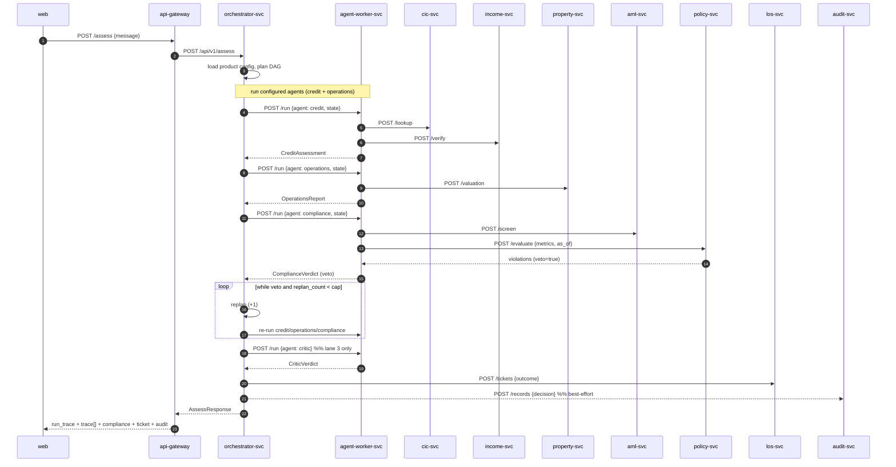

# Flow & calls — how a request moves through the services

> orchestrator-svc (`apps/api`) **is a service** — the composition-root service that
> holds the graph + veto→replan loop and calls every other service. This doc traces a
> request end to end and lists who calls whom. Diagram: `SYSTEM-ARCHITECTURE.md`.

## 1. Services in a call

| Service | Port | Role in a call |
| ------- | ---- | -------------- |
| api-gateway | 8080 | front door — proxies `/assess`, aggregates `/status` |
| **orchestrator-svc** | 8000 | runs the whole flow + veto loop; calls all others |
| agent-worker-svc | 8400 | executes a node (credit/operations/compliance/critic) |
| policy-svc | 8100 | `POST /evaluate` → violations, veto |
| cic-svc | 8300 | `POST /lookup` → credit-bureau record |
| income-svc | 8340 | `POST /verify` → verified income |
| property-svc | 8330 | `POST /valuation` → collateral value |
| aml-svc | 8320 | `POST /screen` → sanctions/PEP |
| los-svc | 8310 | `POST /tickets` → write the decision ticket |
| audit-svc | 8200 | `POST /records` → append to the ledger |

**Every call is env-gated with an in-process fallback:** URL set ⇒ HTTP; unset/failed ⇒
orchestrator runs that piece in-process. Unset everything ⇒ orchestrator alone runs the
full demo.

## 2. End-to-end — `POST /assess` (mortgage veto flow)



**Read the loop:** compliance keeps firing on a hard veto, so the orchestrator replans and
re-runs up to the cap, then escalates — that repeated block is the demo's money shot, and
it shows up as multiple `compliance` entries in `trace[]`.

## 3. Call table (caller → callee)

| Caller | Callee | Endpoint | Sync? | Fallback if callee down |
| ------ | ------ | -------- | ----- | ----------------------- |
| web | api-gateway | `POST /assess`, `GET /status` | sync | gateway returns degraded |
| api-gateway | orchestrator-svc | `POST /api/v1/assess` | sync | gateway returns `outcome: gateway_unavailable` |
| orchestrator | agent-worker | `POST /run {agent}` | sync | run the node in-process |
| agent-worker (credit) | cic-svc, income-svc | `POST /lookup`, `/verify` | sync | seeded value in the tool |
| agent-worker (operations) | property-svc | `POST /valuation` | sync | seeded value |
| agent-worker (compliance) | aml-svc, policy-svc | `POST /screen`, `/evaluate` | sync | in-process AML + `loader.evaluate` |
| orchestrator | los-svc | `POST /tickets` | sync | local ticket dict |
| orchestrator | audit-svc | `POST /records` | **best-effort** | skip (write is fire-and-forget) |
| api-gateway | every service | `GET /health` | sync | mark that service `down`, status `degraded` |

**Two call kinds:**
- **Decision path = synchronous.** The verdict must be consistent before the response.
- **Audit = best-effort** (should be an async event in production so a slow ledger never
  blocks the user). Everything else is request/response.

## 4. Other flows

### `POST /assess/application` — real application (not seed)
Same as §2, but the orchestrator uses the `LoanApplication` from the request body instead
of `seed_application(message)`. All downstream calls are identical.

### `POST /approvals` — HITL tail
After a run ends `ready_for_human_approval`, a human approves/rejects:
```
web → orchestrator POST /api/v1/approvals {application_id, decision, signed_by}
orchestrator → los-svc POST /tickets {status: human_approved|human_rejected}
```
This is the "concrete action + human gate" — the approver's id lands in the ticket (and,
in production, `audit_record.signed_by`).

### `GET /status` — service monitor
```
web → api-gateway GET /status
api-gateway → GET /health on all services (parallel)
→ {status: ok|degraded, summary{up,down}, services[]}
```
Never fails: a down service is reported `down`, not thrown.

## 5. Request correlation
The orchestrator mints `metadata.request_id` (a uuid) per run and sends it to workers as
`X-Request-ID`; workers echo it back. In production this becomes the OpenTelemetry trace id
so one request is followable across all services.

## 6. Deploy note
Because of the fallback, the **only service that must be up is orchestrator-svc** (+ web).
Every other service is an optional offload: bring them up to show the real distributed
calls (and the `/status` board), drop them and the same flow runs in-process.
