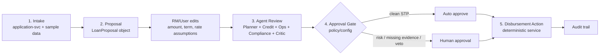
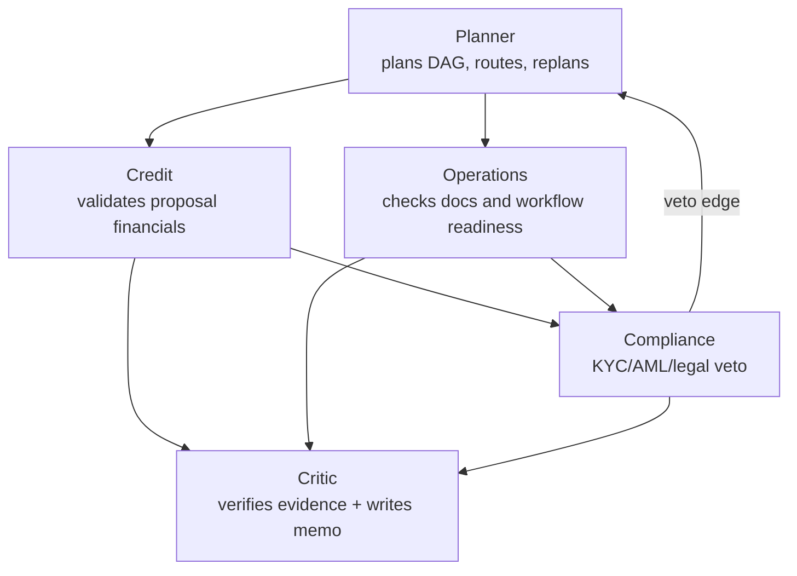
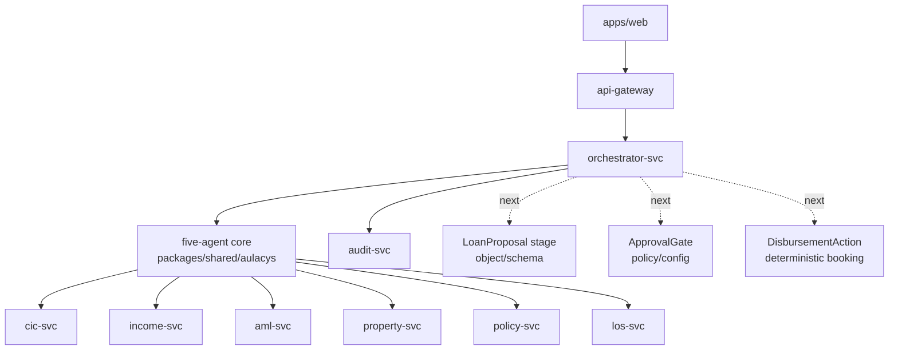

# Lifecycle Architecture With A Five-Agent Core

`docs/AGENT-SPEC.md` is the binding role contract. This file explains how the same
five agents support the broader loan lifecycle without adding unnecessary agents.

## Core Idea

The system should not be:

```text
5 lifecycle stages = 5 more agents
```

It should be:

```text
5 lifecycle stages = one orchestrated workflow
                 + five specialist agents where judgement/evidence is needed
                 + deterministic services for numbers, gates, and money movement
```

The five agents remain:

- Planner
- Credit
- Operations
- Compliance
- Critic

## Lifecycle View



## What Each Stage Means

| Stage | What happens | Agent involvement | Main output |
|---|---|---|---|
| Intake | Receive structured application and documents. | Usually no agent; Operations later checks completeness. | `LoanApplication`, documents |
| Proposal | Build/edit proposed amount, term, rate, monthly payment, DTI basis. | Credit owns financial validation; do not create a separate agent yet. | `LoanProposal` |
| Agent Review | Evaluate proposal, documents, compliance, and evidence. | All five current agents. | assessment result, veto/replan trace, memo |
| Approval | Decide STP vs HITL. | Deterministic gate; humans approve risky cases. | approval outcome |
| Disbursement | Re-check final conditions and book disbursement. | Deterministic action/service, not an LLM decision. | disbursement record or blocked reason |

## Five-Agent Core



## Agent Outputs

| Agent | Output | Purpose |
|---|---|---|
| Planner | `DAG(nodes, edges, rationale)` | Shows who must run and why. |
| Credit | `CreditAssessment(dti, income, proposed_limit, proposed_rate, recommendation, rationale, evidence, tool_results)` | Says whether the proposed loan plan is financially reasonable. |
| Operations | `OperationsReport(valuation, valuation_task, doc_status, missing, legal_flags, evidence, tool_results)` | Says whether the file can move operationally. |
| Compliance | `ComplianceVerdict(violations, veto, rule_ids, kyc_status, ubo_status, citations, tool_results)` | Says whether there is a hard legal/compliance stop. |
| Critic | `CriticVerdict(passed, rejections, memo, remediation_plan)` | Says whether the result is evidence-backed and what to fix/read. |

## Credit's Role In The Lifecycle

Credit should be described as the owner of **proposal reasonableness**.

Credit receives the proposed plan or declared loan request and checks:

- CIC group/score
- verified income
- proposed monthly payment
- DTI
- proposed amount/limit
- proposed annual rate
- term months
- risk premium from CIC, DTI, and term
- whether the proposal should be supported or sent to manual review

Credit output is not an approval. It is a financial recommendation backed by tool
evidence.

## Services And Deterministic Stages



## What Not To Add Yet

| Do not add yet | Why |
|---|---|
| `RM Proposal Agent` | Proposal is mostly deterministic calculation plus editable UI. Use `LoanProposal` first. |
| `Approval Agent` | Approval is a high-risk decision; use policy/config gate plus HITL. |
| `Disbursement Agent` | Money movement must be deterministic, idempotent, audited service logic. |

## Better Next Build Order

1. Add `LoanProposal` schema/object.
2. Wire Credit to validate proposal reasonableness explicitly.
3. Add editable proposal fields in UI/API.
4. Add deterministic `ApprovalGate` config.
5. Add deterministic `DisbursementAction` for unsecured STP.
6. Add `knowledge-svc` citations for explanation, without moving numbers/veto into RAG.

## Guardrails

- Keep only five agents unless there is a clear new judgement role.
- Use services/tools for calculations and actions.
- Use policy/config for approval routing and veto thresholds.
- Keep human approval for risky or imperfect profiles.
- Preserve the veto -> replan demo branch.
