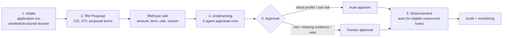
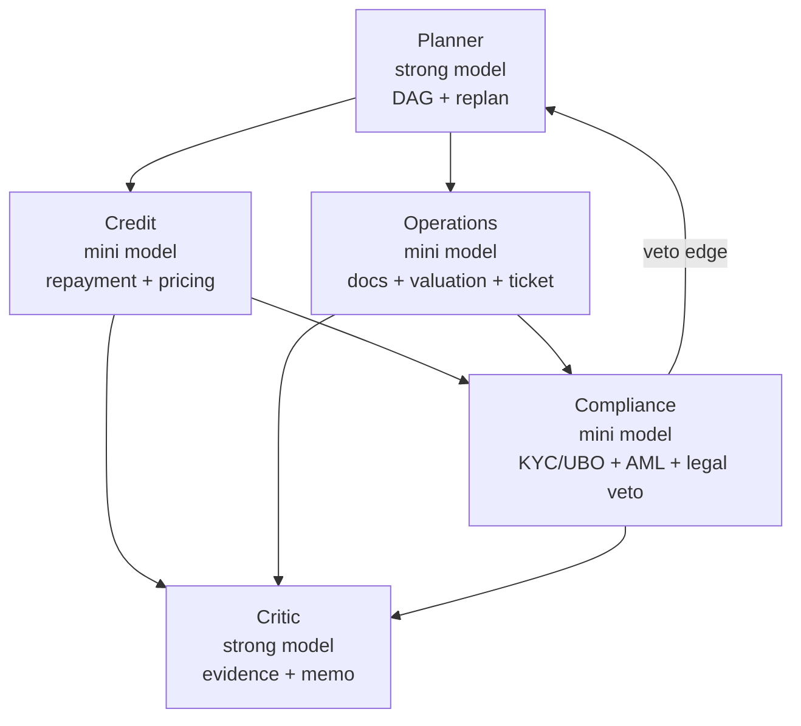
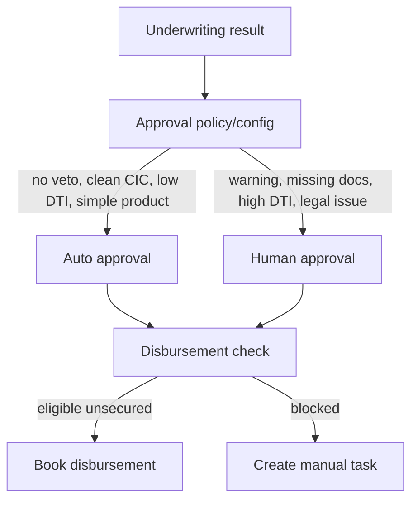
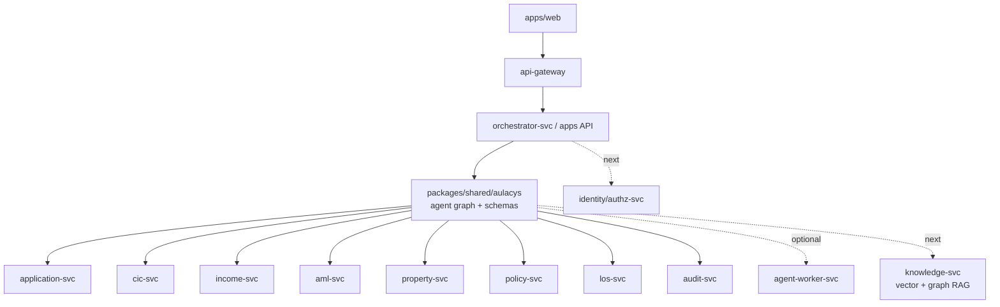

# Lifecycle Multi-Agent Architecture

This document is the shareable architecture note for the upgraded loan lifecycle.
`docs/AGENT-SPEC.md` remains the binding role contract.

## Executive Summary

The system should be explained as a **loan lifecycle multi-agent platform**, not only
as an underwriting bot. The current production-grade core is the underwriting stage:
Planner, Credit, Operations, Compliance, and Critic coordinate through a deterministic
graph with veto and replan. The next layer is to wrap that core with RM Proposal,
Approval, and Disbursement stages.

## Lifecycle View

## Stage Ownership

| Stage | Owner agent/component | Main output |
|---|---|---|
| Intake | `application-svc` plus future Intake Agent | validated dossier, document checklist baseline |
| RM Proposal | future RM Proposal Agent | editable `LoanProposal` with amount, term, rate, DTI, CIC basis |
| Underwriting | Planner + Credit + Operations + Compliance + Critic | assessment, veto/replan trace, evidence memo |
| Approval | Approval Gate / future Approval Agent | `stp_approved`, `ready_for_human_approval`, `vetoed`, `approved`, `rejected` |
| Disbursement | future Disbursement Agent/service | booked disbursement or blocked reason |

## Underwriting Core

Planner does not calculate DTI, approve, or write tickets. It decides which specialist
must run and in what order. This prevents a new monolith-in-a-prompt.

## RM Proposal Stage

RM Proposal should be separate from Credit underwriting:

| Concern | RM Proposal | Credit Underwriting |
|---|---|---|
| Purpose | Create first loan plan | Validate whether the plan is reasonable |
| Inputs | application, CIC, income, product pricing config | proposal, CIC, verified income, policy/risk context |
| Output | editable `LoanProposal` | `CreditAssessment` and recommendation |
| Human interaction | RM/user may adjust assumptions | reviewer sees evidence and result |

Proposal fields should include:

- requested amount
- proposed amount/limit
- term months
- annual rate
- monthly payment
- DTI
- CIC group/score
- risk premium breakdown
- override reason when RM/user edits

## Approval And Disbursement

Approval should be a configurable gate:

For the retail unsecured salary product, the target happy path is:

`Intake -> RM Proposal -> Underwriting pass -> Auto approval -> Auto disbursement`

For the retail mortgage demo, the protected path is:

`Intake -> RM Proposal -> Underwriting -> Compliance veto -> Planner replan -> Critic -> HITL/ticket`

## Service View

## Data Ownership

| Service | Data owner | Status |
|---|---|---|
| `application-svc` | application, applicants, documents, lifecycle snapshots | exists |
| `orchestrator-svc` | run, node run, event trace | scaffolded |
| `los-svc` | ticket, ticket history | exists |
| `audit-svc` | append-only decision ledger | exists |
| `identity/authz-svc` | users, roles, permissions, approval scopes | target |
| `knowledge-svc` | documents, chunks, embeddings, graph relationships | target |

## Build Order

1. Add `LoanProposal` schema and RM Proposal stage.
2. Add proposal override/edit reason to UI and API.
3. Add explicit Approval Gate config and risk routing.
4. Add Disbursement request/action for unsecured STP.
5. Add `knowledge-svc` retrieval for citations, without moving numeric thresholds out of policy.

## Guardrails

- Do not move DTI/rate/limit calculation into an LLM.
- Do not move veto thresholds into prompts or RAG.
- Do not let Planner become a super-agent.
- Keep the current veto/replan branch green before adding lifecycle stages.
