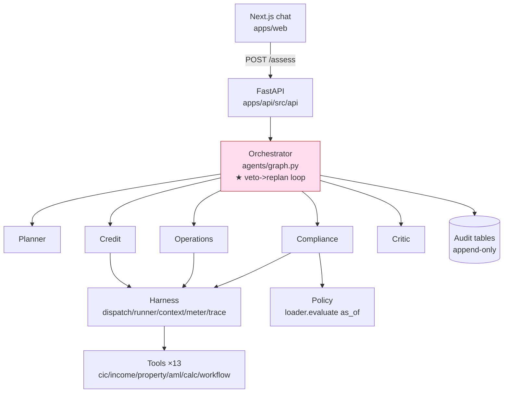

# System overview & current state

> One-screen map of what we are building and where the build is right now.
> If you are lost, start here. For the *why* (pitch/scope) read `00-START-HERE.md`;
> for the *how* (build steps) read `BUILD-GUIDE.md`.

## What we are building (2 sentences)

A multi-agent loan-assessment system for **retail / individual** lending where a
**Compliance agent can veto a Credit recommendation**, sending it back to a Planner to
replan — the second line of defence, as code. The veto → replan loop is the whole point;
everything else supports it.

⚠️ **Scenario is RETAIL, not the old corporate 20bn.** `AGENTS.md` §0 killed the 20bn
case; the code runs retail mortgage (veto = *prohibited purpose*) and unsecured salary.
`00-START-HERE.md` still shows the old scenario — it is stale until fixed.

## Component map

## Where the code is + status

| Piece | Folder | Status |
| ----- | ------ | ------ |
| Frontend chat | `apps/web/app`, `components/ui`, `lib/api.ts` | ✅ chat works; ❌ no dashboard |
| API | `apps/api/src/api/routes.py` | ✅ `/chat`, `/assess`, `/status`, `/health` |
| Orchestrator + veto loop | `apps/api/src/agents/graph.py` | ✅ real loop + cap + escalate |
| Harness | `apps/api/src/agents/harness/*` | ✅ context/dispatch/runner/meter/trace (LLM slot stubbed) |
| Agents | `apps/api/src/agents/nodes/*` | ✅ deterministic fallbacks; ❌ real LLM not wired |
| Tools | `apps/api/src/agents/tools/*` | ✅ 13 deterministic mocks |
| Policy-as-code | `apps/api/src/policy/loader.py` + `rules/*.yaml` | ✅ `evaluate(as_of)` (breakthrough-B) |
| Audit chain | `apps/api/src/db/models/audit.py` + migration `0001` | ✅ tables; ❌ nothing writes yet |
| Config | `agents/products/*.yaml`, `config.py` | ✅ config drives the graph |

## Roles & access (what "user management" means here)

Full RBAC / login / admin panel = **out of scope** (`AGENTS.md` §0). Two role layers instead:

- **Agent roles (MCP least-privilege) — ✅ built.** Each agent may call only its
  whitelisted tools (`spec.tools`, enforced in `dispatch.py`) and read only its KB
  namespace (`spec.kb`). This *is* the role mechanism the brief asks us to demo.
- **Human roles — minimal.** Only what the HITL gate + audit need: an **approver** signs
  off at the gate (recorded in `audit_record.signed_by`), an **auditor** reads the
  immutable log. No user CRUD.

## What's next (priority order)

1. 🟠 **Dashboard** — render `/assess` (`run_trace`, `trace[]`, veto banner, replan counter). The trace already shows the loop (`compliance` ×3).
2. **`write_audit()`** — persist the decision into the audit tables (they exist, unused). Needs `PolicyViolation.version`.
3. **DAG drives execution** — Planner's DAG should order/parallelize nodes; today config does.
4. **HITL approver gate** — a real human approve/reject step feeding `signed_by`.
5. Later: real LLM wired, RAG/KB, microservice split (proof: 1 Policy-OPA service).

## Doc index — which file for what

| File | Answers |
| ---- | ------- |
| `OVERVIEW.md` (this) | Where are we? How do the pieces fit? |
| `00-START-HERE.md` | Why this scenario? Pitch, scope, what-not-to-build |
| `BUILD-GUIDE.md` | How to build an agent, the 5 laws, hour-by-hour |
| `API.md` | Endpoints + shapes for the frontend |
| `ARCHITECTURE-services.md` | Microservice decomposition, flow, events, per-service DB |
| `handoffs/*` | What changed in each finished slice |
