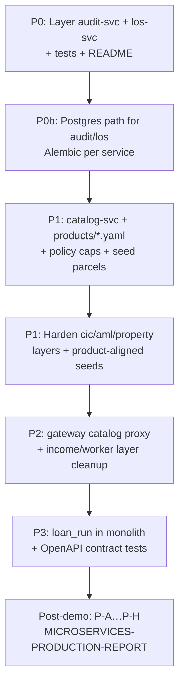

# Per-service coding plan — DB · API · files · steps

> **Canonical roadmap for coding each microservice.**  
> Structure template: [`SERVICE-STRUCTURE-GUIDE.md`](./SERVICE-STRUCTURE-GUIDE.md)  
> Design rationale: [`ARCHITECTURE-services.md`](./ARCHITECTURE-services.md)  
> Live inventory: [`DATA-INTEGRITY-AND-STORAGE.md`](./DATA-INTEGRITY-AND-STORAGE.md)  
> Run/status: [`MICROSERVICES-STATUS.md`](./MICROSERVICES-STATUS.md)  
> Prod maturity: [`MICROSERVICES-PRODUCTION-REPORT.md`](./MICROSERVICES-PRODUCTION-REPORT.md)

**Scope:** retail / individual (`AGENTS.md` §0). Veto → replan stays in the monolith orchestrator.  
**Rule:** every HTTP seam keeps an in-process fallback — unset env URL ⇒ demo still runs.

---

## 0. Snapshot — what exists vs what to code

| # | Service | Port | Storage now | Owns DB? | Maturity | Priority |
|---|---------|------|-------------|----------|----------|----------|
| 0 | **monolith** `apps/api` | 8000 | Supabase PG (optional) + in-memory | run ledger TBD | primary orchestrator | protect |
| 1 | **api-gateway** | 8080 | none | no | thin `main.py` | P2 |
| 2 | **policy-svc** | 8100 | YAML rules | no (config) | thin + engine | P1 |
| 3 | **audit-svc** | 8200 | SQLite + hash chain | **yes** | thin + `db.py` | **P0** |
| 4 | **los-svc** | 8310 | SQLite tickets | **yes** | thin + `db.py` | **P0** |
| 5 | **cic-svc** | 8300 | JSON seed | seed only | thin | P1 |
| 6 | **aml-svc** | 8320 | JSON seed | seed only | thin | P1 |
| 7 | **property-svc** | 8330 | JSON seed | seed only | thin | P1 |
| 8 | **income-svc** | 8340 | none | no | thin | P2 |
| 9 | **agent-worker-svc** (all agents, §12) | 8400 | none | no | one runtime service | P2 |
| 13 | **catalog-svc** | 8350 | JSON seed | seed only | **NOT BUILT** | P1 (product demo) |
| 14 | **application-svc** | 8360 | Postgres schema `application` | **yes** | Phase 1–2 ✅ | P1 (intake) |
| 15 | **orchestrator DB** | — | none | `loan_run` designed | **NOT BUILT** | P3 |

**Data-ownership rule (never violate):**
- Only **audit-svc**, **los-svc**, **application-svc**, and (later) **orchestrator** own mutable SQL.
- No shared database, no cross-service FK.
- Seed/reference services ship data in the image (git-versioned).

**Decision already recommended** ([`DATA-INTEGRITY` §2](./DATA-INTEGRITY-AND-STORAGE.md)):  
**(A)** audit-svc is authoritative → migrate SQLite → Postgres using monolith `schema.sql` / migration `0001` as the prod target; park unused monolith audit writers.

---

## 1. Standard work package (every service PR)

Apply in this order when hardening a service:

1. Split `app/main.py` → `api/routes.py` + `schemas/` + `services/` + `repositories/` (+ `clients/` if outbound).
2. Add `core/config.py` (`pydantic-settings`) — no bare `os.getenv` in logic.
3. Add `GET /health` (liveness) + readiness if it has deps.
4. Add `tests/` (unit logic + one route smoke).
5. Add `README.md` (purpose, run, endpoints, env).
6. If data-owner: Alembic `migrations/`, switch SQLite → Postgres behind env.
7. Export OpenAPI (`/openapi.json`); keep request/response shapes stable or version `/v1`.

Skeleton detail: [`SERVICE-STRUCTURE-GUIDE.md`](./SERVICE-STRUCTURE-GUIDE.md).

---

## 2. Monolith / Orchestrator (`apps/api` :8000)

### Role
Composition root. Holds the **veto → replan loop**. Calls every seam over HTTP when env URL is set; otherwise in-process fallback.

### API (contract = `src/models/schemas.py` → mirror `apps/web/lib/api.ts`)

| Method | Path | Status | Notes |
|--------|------|--------|-------|
| `GET` | `/health` | ✅ | `{status, env, db}` — never 500 |
| `GET` | `/api/v1/status` | ✅ | ready |
| `POST` | `/api/v1/chat` | ✅ | summary string only |
| `POST` | `/api/v1/assess` | ✅ | structured `AssessResponse` (dashboard) |
| `POST` | `/api/v1/assess/application` | 🔧 code if missing | real `LoanApplication` body (not seed-from-message) |

### Database — target `loan_run` (orchestrator owns)

```sql
CREATE TABLE loan_run (
    run_id         uuid PRIMARY KEY,
    application_id text NOT NULL,
    product        text NOT NULL,
    lane           integer NOT NULL,
    outcome        text NOT NULL,          -- stp_approved | vetoed | ready_for_human_approval
    veto_fired     boolean NOT NULL DEFAULT false,
    replan_count   integer NOT NULL DEFAULT 0,
    as_of          date NOT NULL,
    total_cost     double precision NOT NULL DEFAULT 0,
    trace          jsonb NOT NULL DEFAULT '[]',  -- disposable NodeTrace[]
    started_at     timestamptz NOT NULL DEFAULT now(),
    finished_at    timestamptz
);
CREATE INDEX ix_loan_run_application_id ON loan_run (application_id);
```

| Now | Target |
|-----|--------|
| No run persistence | Alembic in `apps/api`; write at end of `process_application` (best-effort; never block demo) |
| Supabase via `DATABASE_URL` / `DIRECT_URL` | keep dual-URL pattern ([`DATABASE.md`](./DATABASE.md)) |
| Orphaned `audit_*` in monolith PG | **do not write**; audit-svc owns ledger |

### Seams (caller → service)

| Caller | File | Env | Service |
|--------|------|-----|---------|
| Compliance | `policy/client.py` | `POLICY_SVC_URL` | policy-svc |
| Orchestrator | `agents/audit_client.py` | `AUDIT_SVC_URL` | audit-svc |
| Credit | `tools/cic.py` | `CIC_SVC_URL` | cic-svc |
| Orchestrator | `tools/workflow.py` | `LOS_SVC_URL` | los-svc |
| Compliance | `tools/aml.py` | `AML_SVC_URL` | aml-svc |
| Operations | `tools/property.py` | `PROPERTY_SVC_URL` | property-svc |
| Credit | `tools/income.py` | `INCOME_SVC_URL` | income-svc |
| Graph | transport | `AGENT_WORKER_URL` | agent-worker-svc (§12) |

### Coding steps
1. Keep graph + veto loop **in-process** — do not network the loop (`ARCHITECTURE-services` §7).
2. Persist `loan_run` only after demo board is locked (P3).
3. When contract changes → update `schemas.py` **and** `lib/api.ts` in the same PR.

### DoD
- `make check` green with all `*_URL` unset.
- With all services up: `source=*-svc` on tools/ticket/audit; `model=http-worker:*` on workers.

---

## 3. audit-svc (:8200) — immutable ledger · **P0**

### Role
Append-only decision ledger. Best-effort write from orchestrator — never block `/assess`.

### Database

**Now (SQLite `AUDIT_DB`):**

```sql
audit_record (
  id, application_id, product, lane, outcome, veto_fired, replan_count,
  as_of, signed_by, decided_at, seq, content_hash, prev_hash
)
audit_violation (
  id, record_id, rule_id, rule_version, effective_from, legal_basis,
  metric_name, metric_value, threshold, is_blocking
)
```

Hash: `content_hash = sha256(canonical_json(core) + prev_hash)`.

**Prod (Postgres)** — copy from `apps/api/src/db/schema.sql`:
- Same columns; `id`/`record_id` as `uuid`.
- Triggers: `BEFORE UPDATE OR DELETE` → raise (immutable).
- Own Alembic under `services/audit-svc/migrations/` (not monolith).
- Env: `DATABASE_URL` (runtime), `DIRECT_URL` (migrate). Fallback: SQLite if unset.

### API

| Method | Path | Request | Response |
|--------|------|---------|----------|
| `GET` | `/health` | — | `{status, intact, records}` |
| `POST` | `/records` | `RecordRequest` + `violations[]` | `{record_id, seq, content_hash, prev_hash, decided_at}` |
| `GET` | `/records/{application_id}` | — | `{application_id, records[]}` |
| `GET` | `/verify` | — | `{intact, records}` or `{intact:false, broken_at_seq}` |

**Add later:**
- Idempotency on `(application_id, decided_at)` — return existing if duplicate.
- `GET /ready` — DB ping.
- Optional: `POST /v1/records` versioning.

### Files to code

```
services/audit-svc/
  app/
    main.py                 # wiring only
    core/config.py          # AUDIT_DB | DATABASE_URL
    api/routes.py
    schemas/audit.py        # RecordRequest, Violation, RecordResponse
    services/audit.py       # hash, chain, idempotency
    repositories/ledger.py  # append / records_for / verify (SQLite→PG)
  migrations/               # Alembic (Postgres)
  tests/test_chain.py       # append + tamper → verify fails
  Dockerfile  requirements.txt  README.md
```

### Coding steps
1. Extract `db.py` → `repositories/ledger.py` + `services/audit.py` (no behaviour change).
2. Add unit test: 3 appends → verify intact; raw UPDATE → broken_at_seq.
3. Add Postgres backend behind `DATABASE_URL`; keep SQLite default for local demo.
4. Port immutability triggers from monolith `schema.sql`.
5. Wire idempotency; document in README.
6. Monolith: ensure `audit_client.py` still best-effort (log + continue on failure).

### DoD
- [ ] Layered layout; tests green.
- [ ] `GET /verify` proves tamper detection on both SQLite and Postgres.
- [ ] Dead audit-svc ⇒ `/assess` still returns outcome (no 500).

---

## 4. los-svc (:8310) — loan ticket SoR · **P0**

### Role
System of record for the approval ticket — the “concrete action” in the brief.

### Database

**Now (SQLite `LOS_DB`):**

```sql
loan_ticket (
  ticket_id TEXT PK,        -- DEMO-{APPLICATION_ID}
  application_id TEXT NOT NULL,
  status TEXT NOT NULL,     -- vetoed | ready_for_human_approval | stp_approved
  product TEXT,
  summary TEXT NOT NULL,
  assigned_to TEXT,         -- HITL queue
  created_at TEXT NOT NULL,
  updated_at TEXT NOT NULL
)
```

**Prod (Postgres):**

```sql
CREATE TABLE loan_ticket ( ... timestamptz for dates ... );
CREATE TABLE ticket_history (
    id           uuid PRIMARY KEY,
    ticket_id    text NOT NULL REFERENCES loan_ticket(ticket_id),
    old_status   text,
    new_status   text NOT NULL,
    changed_at   timestamptz NOT NULL DEFAULT now(),
    changed_by   text
);
```

Own Alembic; env `LOS_DB` (SQLite) or `DATABASE_URL` (PG).

### API

| Method | Path | Request | Response |
|--------|------|---------|----------|
| `GET` | `/health` | — | `{status}` (+ db readiness later) |
| `POST` | `/tickets` | `{application_id, status, summary, product?}` | ticket + `source: los-svc` |
| `GET` | `/tickets/{application_id}` | — | `{tickets[]}` |

**Add later:**
- `PATCH /tickets/{ticket_id}/assign` — HITL queue.
- Status transition validation (no `stp_approved` ← `vetoed` without audit note).

### Files

```
services/los-svc/
  app/
    main.py
    core/config.py
    api/routes.py
    schemas/ticket.py
    services/los.py           # ticket_id rules, status transitions
    repositories/tickets.py
  migrations/
  tests/test_tickets.py       # upsert keeps created_at; updates status
```

### Coding steps
1. Split layers; add transition rules in `services/los.py`.
2. Add `ticket_history` on status change.
3. Postgres path + Alembic.
4. Confirm monolith `tools/workflow.py` fallback still returns local dict when URL unset.

### DoD
- [ ] Upsert preserves `created_at`; history rows on status change.
- [ ] `/tickets/retail-demo` returns written ticket after mortgage assess.

---

## 5. policy-svc (:8100) — Policy Decision Point · **P1**

### Role
Deterministic PDP. No LLM. Compliance calls `POST /evaluate`.

### Storage
**Not SQL.** Versioned YAML under `rules/`:
- `retail_lending.yaml` — purpose bans, DTI/LTV, etc.
- `credit_limits.yaml` — caps

Each rule: `id`, `version`, `effective_from`, `verified`, `legal_basis`, metric/operator/threshold, `is_blocking`.

**Prod optional:** `policy_rule` + `policy_rule_change` tables for auditable edits — only after YAML flow is solid. Until then: git is the store.

### API

| Method | Path | Request | Response |
|--------|------|---------|----------|
| `GET` | `/health` | — | `{status, unverified_rules[]}` |
| `POST` | `/evaluate` | `{metrics: dict[str,float], as_of?: date}` | `{violations[], veto, rule_ids[]}` |
| `GET` | `/rules/unverified` | — | list (add if missing) |

### Schemas

```python
# EvaluateRequest
metrics: dict[str, float]
as_of: date | None

# PolicyViolation (in response)
rule_id, version, effective_from, legal_basis,
metric_name, metric_value, threshold, is_blocking
```

### Files

```
services/policy-svc/
  app/
    services/engine.py      # load_rules + evaluate (today: policy.py)
    schemas/policy.py
    api/routes.py
  rules/*.yaml              # keep in sync with apps/api/src/policy/rules/
  tests/test_engine.py      # as_of gating, blocking sort, unverified
```

### Coding steps
1. Layer split; table-driven operators only.
2. Sync `version` field with monolith loader (P1.2 in `CODING-PLAN.md`).
3. Per-product LTV caps from catalog (mortgage ≤0.9, repair ≤0.8) — product metric or rule tags.
4. Human verifies thresholds → `verified: true` (never invent statutory numbers).
5. Mirror any rule change into `apps/api/src/policy/rules/` (fallback copy).

### DoD
- [ ] Over-LTV / prohibited purpose → `veto: true` + blocking `rule_ids`.
- [ ] `as_of` before `effective_from` → rule skipped.
- [ ] Unverified rules listed on `/health`.

---

## 6. cic-svc (:8300) — credit bureau mock · **P1**

### Role
Mock CIC national bureau. Credit agent calls `POST /lookup`.

### Storage
`seed/cic_records.json` — map `customer_name` → `{score_band, overdue_days, active_loans}` + `_default`.

No SQL. Prod = real CIC API behind same interface.

### API

| Method | Path | Body | Response |
|--------|------|------|----------|
| `GET` | `/health` | — | `{status, seeded_customers[]}` |
| `POST` | `/lookup` | `{customer_name}` | score_band, overdue_days, active_loans, `source`, `computed_at` |

### Coding steps
1. Layer: `repositories/seed.py` + `services/cic.py`.
2. Seed: good band + risky band + one customer that fails DTI for unsecured product.
3. Unknown name → `_default` (demo never breaks).
4. Tests: known key / unknown → default.

### DoD
- [ ] Known customer returns seed; unknown returns default with `source: cic-svc`.

---

## 7. aml-svc (:8320) — sanctions / PEP · **P1**

### Role
AML screening mock. Compliance calls screen / related-party.

### Storage
`seed/aml_lists.json` — sanctions + PEP lists.

### API (align with monolith `tools/aml.py`)

| Method | Path | Body | Response |
|--------|------|------|----------|
| `GET` | `/health` | — | `{status, list_sizes}` |
| `POST` | `/screen` | `{full_name, ...}` | matches[], risk, `source` |
| `POST` | `/related-party` | `{...}` | related hits (if exposed) |

### Coding steps
1. Same cic pattern; confirm endpoint names match tool client.
2. Seed one hit name for demo “soft flag” (non-blocking) vs clean name.
3. Safe empty match list on unknown.

### DoD
- [ ] Clean name → no match; seeded hit → returned; never 500.

---

## 8. property-svc (:8330) — valuation / registry · **P1**

### Role
Collateral valuation + land registry mock. Operations needs this **before** Compliance LTV.

### Storage
`seed/parcel.json` — parcels with valuation amounts.

### API

| Method | Path | Body | Response |
|--------|------|------|----------|
| `GET` | `/health` | — | `{status, parcels}` |
| `POST` | `/valuation` | parcel / address key | value, currency, `source`, `computed_at` |
| `POST` | `/land-registry` | — | ownership / liens (if tool uses it) |
| `POST` | `/doc-checklist` | — | required docs (optional) |

### Coding steps
1. Layer + seed parcels that exercise LTV caps:
   - Parcel A: LTV under product cap (pass).
   - Parcel B: LTV over 90% (veto path for mortgage).
2. Align keys with Operations tool inputs / demo application seed.

### DoD
- [ ] High valuation → low LTV; low valuation → LTV breach visible in compliance.

---

## 9. income-svc (:8340) — statement verify · **P2**

### Role
Stateless compute: income verify + sao kê parse. **No repository.**

### API

| Method | Path | Body | Response |
|--------|------|------|----------|
| `GET` | `/health` | — | `{status}` |
| `POST` | `/verify` | `{declared, statement}` | verified income, flags |
| `POST` | `/parse` | statement payload | parsed lines / totals |

### Coding steps
1. Pure functions in `services/income.py`.
2. Negative / empty input → typed 422, not crash.
3. Tests for verified-income logic.

### DoD
- [ ] Deterministic output; no disk writes.

---

## 10. catalog-svc (:8350) — **NEW** · **P1**

### Role
SHB retail product catalog for the frontend picker + `config_hint` for agents.

### Storage
`seed/catalog.json` from `docs/data/message.txt` (cleaned).  
**In-scope products only** (retail): loan-1/2, house-repair, loan-5, loan-3/4, unsecured-term/overdraft.  
**Out:** SME/business products.

### API

| Method | Path | Response |
|--------|------|----------|
| `GET` | `/health` | `{status, product_count}` |
| `GET` | `/categories` | 5 categories |
| `GET` | `/products` | flat list (id, name, category, collateral, features, url, image) |
| `GET` | `/products/{id}` | product + `config_hint` `{agents, gate, ltv_cap, term_cap}` |

### Files

```
services/catalog-svc/   # copy cic-svc shape
  app/...
  seed/catalog.json
  Dockerfile
```

### Related monolith work (same epic)
1. `apps/api/src/agents/products/{id}.yaml` — one YAML per in-scope product (agents/depends/tools/gate).
2. policy rules use product caps.
3. Gateway: proxy `GET /catalog` → catalog-svc; add to `/status` board.
4. Web: `getCatalog()` → picker → `assess/application`.

### DoD
- [ ] `/products` returns 8 in-scope SKUs; picking one runs correct lane/gate via YAML.

---

## 11. api-gateway (:8080) — front door · **P2**

### Role
BFF: proxy assess + aggregate `/status`. Owns **no** data.

### API

| Method | Path | Behaviour |
|--------|------|-----------|
| `GET` | `/health` | gateway liveness |
| `GET` | `/status` | ping every service `/health` → up/down/latency |
| `POST` | `/assess` | proxy → monolith (timeout; return error JSON if down) |
| `GET` | `/catalog` | **add** — proxy catalog-svc |
| `POST` | `/assess/application` | **add** — proxy when monolith has it |

### Clients
`app/clients/service_client.py` — httpx, timeout, no crash on down → `degraded`.

### Coding steps
1. Split monitor + proxy into `services/`.
2. Add catalog-svc to `SERVICES` list.
3. CORS from env; never 500 when a leaf is down.

### DoD
- [ ] `/status` shows all services including catalog; one dead leaf ⇒ degraded item, board still loads.

---

## 12. agent-worker-svc — **ONE service for all four agents** · **P2**

### ✅ Decision applied: collapse agents into one runtime (do NOT split per agent)
planner / credit / operations / compliance / critic are **not** five services. They share one
harness, are stateless, own no data, and have one scaling profile — splitting by
function is over-engineering (`ARCHITECTURE-services.md` §8 rule: split by bounded
context / data ownership / scaling need, not by class). One `agent-worker-svc` serves
all agents; the caller names the agent in the request body.

**Split compliance out later ONLY if** it genuinely needs a stronger model + independent
scaling (§8 lane 3). YAGNI until then.

| | Before (4 processes) | Now (1 service) |
|---|---|---|
| Instances | credit/operations/compliance/critic on 8401–8404 | one `agent-worker-svc` on **8400** |
| Binding | `AGENT_NAME` locks each process to one agent (rejects others) | no lock — `/run` dispatches by `req.agent` to `SPECS[agent]` |
| Monolith env | 4 URLs (`CREDIT_AGENT_URL` …) | **1** `AGENT_WORKER_URL` |
| Gateway `SERVICES` | 4 entries | **1** entry |
| Compose | 4 blocks | **1** block, port 8400 |

> Applied in code: `services/agent-worker-svc/app/main.py` dispatches by `req.agent`,
> the orchestrator prefers `AGENT_WORKER_URL`, gateway monitors one service, and
> compose starts one agent runtime block. Per-node in-process fallback remains.

### API (unchanged by the merge)

| Method | Path | Request | Response |
|--------|------|---------|----------|
| `GET` | `/health` | — | `{status, agents:[…]}` |
| `POST` | `/run` | `{agent, request_id, state}` + `X-Request-ID` | `{agent, request_id, output, tool_calls, latency_ms}` |

### Storage
None. Today imports `apps/api` node fallbacks — acceptable for demo; prod copies logic or publishes a shared wheel **without** coupling deploys to monolith internals.

### Coding steps
1. **Collapse 4 → 1** (above) — one service, dispatch by `req.agent`.
2. Keep env-gated fallback in graph (critical).
3. Propagate `request_id` end-to-end (already started).
4. Later: self-contained worker package (no `sys.path` into monolith).
5. Workers call tool/policy URLs via clients when set.

### DoD
- [x] One `agent-worker-svc` serves all agents; one `AGENT_WORKER_URL`.
- [ ] Worker down ⇒ in-process fallback; veto loop still visible in `trace[]`.

---

## 13. Product YAML matrix (drives graph — not a service)

| Product id | Collateral | Caps | Agents | `gate.stp_when` |
|------------|------------|------|--------|-----------------|
| loan-1 / loan-2 | yes | LTV≤90%, term≤35y | credit, operations, compliance | never |
| loan-house-repair | yes | LTV≤80%, term≤10y | same | never |
| loan-5 (ô tô) | yes | LTV≤90%, term≤8y | same | never |
| loan-3 / loan-4 | yes | plan/tuition 100% | same | never |
| loan-unsecured-term | no | ceiling 500M | credit, compliance | amount ≤ 500M AND all_rules_pass |
| loan-unsecured-overdraft | no | ceiling 1B | credit, compliance | amount ≤ 1B AND all_rules_pass |

**Rule:** zero `if product == …` in graph code — only YAML (`BUILD-GUIDE` §11).

---

## 14. Build order (execute in sequence)



| Phase | Work | Risk to veto demo |
|-------|------|-------------------|
| **P0** | audit + los structure, tests, PG behind flag | Low |
| **P1** | catalog + YAML products + policy/seeds | Low if fallback kept |
| **P2** | gateway catalog, income/worker cleanup | Low |
| **P3** | `loan_run`, contract tests | Med (touch orchestrator) |
| **Post** | OTel, mesh, auth, K8s (`PRODUCTION-REPORT` P-A→P-H) | Do **after** pitch |

**Do not** during hackathon: split Planner, remove in-process fallbacks, share one DB across services, network the veto loop.

---

## 15. Env reference (single table)

| Variable | Service / consumer | Default |
|----------|-------------------|---------|
| `POLICY_SVC_URL` | monolith | unset → in-process |
| `AUDIT_SVC_URL` | monolith | unset → skip/best-effort local |
| `CIC_SVC_URL` | monolith | unset → in-process |
| `LOS_SVC_URL` | monolith | unset → in-process |
| `AML_SVC_URL` | monolith | unset → in-process |
| `PROPERTY_SVC_URL` | monolith | unset → in-process |
| `INCOME_SVC_URL` | monolith | unset → in-process |
| `AGENT_WORKER_URL` | monolith | unset → in-process |
| `MONOLITH_URL` | gateway | `http://127.0.0.1:8000` |
| `AUDIT_DB` / `LOS_DB` | audit / los | `./audit.db` / `./los.db` |
| `DATABASE_URL` / `DIRECT_URL` | data-owners + monolith | blank → disabled |
| `CORS_ORIGINS` | gateway | `http://localhost:3000` |
| `NEXT_PUBLIC_API_URL` | web | monolith |
| `NEXT_PUBLIC_GATEWAY_URL` | web | gateway |

---

## 16. Per-service Definition of Done (checklist)

Copy for each PR:

- [ ] `api/` has no business logic; `services/` does not import FastAPI; storage only in `repositories/`.
- [ ] `core/config.py` validates env.
- [ ] `GET /health` works; readiness if DB-backed.
- [ ] Unit + route smoke tests; CI green.
- [ ] `README.md` with run / endpoints / env.
- [ ] Data-owner ⇒ own Alembic; no shared DB.
- [ ] Outbound calls ⇒ timeout + fallback; never 500 the assess path.
- [ ] Handoff note in `docs/handoffs/` (`AGENTS.md` §2).

---

## 17. What this plan deliberately excludes

| Item | Why |
|------|-----|
| Full `DATA_DICTIONARY` online-lending schema (eKYC, repayment, …) | Out of wow-slice — reference only |
| Real CIC / core-banking / OCR | `AGENTS.md` §0 out of scope |
| Production RBAC | Demo MCP roles only |
| RAG/KB service | Blocked on verified `rule_ids` (`CODING-PLAN` P1.4) |
| Planner as its own service | High risk, low demo value |

---

## 18. Doc map (avoid drift)

| Need | Read |
|------|------|
| This coding plan | **this file** |
| Folder layout per service | `SERVICE-STRUCTURE-GUIDE.md` |
| Why these boundaries | `ARCHITECTURE-services.md` |
| What stores what today | `DATA-INTEGRITY-AND-STORAGE.md` |
| How to run | `MICROSERVICES-STATUS.md` |
| Prod hardening phases | `MICROSERVICES-PRODUCTION-REPORT.md` |
| Monolith feature backlog | `CODING-PLAN.md` / `NEXT-STEPS.md` |
| API shapes for web | `API.md` + `schemas.py` |
