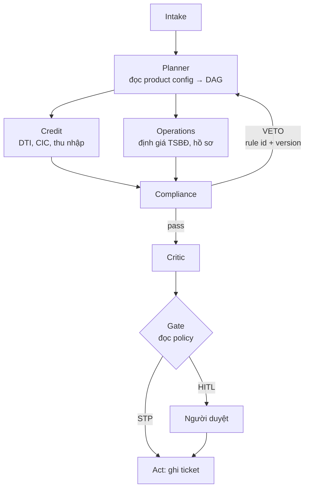

# SHB — Digital Expert Agents · Solution Design **v2 (bán lẻ)**

> **Bản này thay bản v1.** v1 đóng khung quanh **tín dụng doanh nghiệp 20 tỷ** và đã được xóa khỏi docs active. Mentor đã chỉ hướng **khách hàng cá nhân** → kịch bản đó không còn dùng.
> Nếu cần truy vết v1, dùng Git history; không build hoặc pitch từ bản v1.
> Đề bài nguyên văn: [`reference/problem-statement.txt`](./reference/problem-statement.txt) — **nguồn duy nhất** để trích đề.
> Ghi chú mentor: [`../multiagent-phe-duyet-khoan-vay-shb.md`](../multiagent-phe-duyet-khoan-vay-shb.md).

| | |
|---|---|
| Phiên bản | 2.0 |
| Ngày | 2026-07-17 |
| Trạng thái | 📌 Hướng đã chốt · ⚠️ 4 mục treo (§13) |
| Thay v1 ở | Kịch bản, §4, §12 · kiến trúc chi tiết xem các doc active |

---

## 1. Tóm tắt điều hành

Bốn quyết định, mọi thứ khác suy ra từ đây.

**1. Đối tượng: khách hàng cá nhân.** Mentor chỉ định. Kịch bản doanh nghiệp 20 tỷ của v1 bỏ.

**2. Bán *kiểm chứng được*, không bán *nhanh hơn*.** Trục tốc độ đã có người chiếm — sơ duyệt bán lẻ 5 phút là chuyện thị trường làm xong. Trục còn trống: **scorecard cho ra một con số, không cho ra một lý do.** Hỏi "vì sao cho người này vay" thì scorecard nói "723 điểm". Đó không phải câu trả lời trước thanh tra.

**3. Flow nằm ở config, không nằm ở agent.** Một graph. Sản phẩm vay khai bằng YAML. Hai sản phẩm = hai file, **không dòng code nào khác**. Đây là mentor nói ba lần ở ba trang khác nhau: *"không build agent fix cứng (BPM drag & drop)"*, *"Platform — flexible multiagent"*, *"show giai đoạn build"*.

**4. Veto là cạnh trong graph.** Không phải câu trong prompt. Prompt bảo "hãy từ chối nếu vi phạm" là **gợi ý** — model bỏ qua được. Một cạnh quay về Planner là **kiểm soát** — không bỏ qua được.

**Wow flow:**

> Khách xin vay mua nhà thế chấp. Planner đọc config → dựng DAG. Credit và Operations chạy song song. Compliance đợi định giá xong mới tính được LTV → soi mục đích vay → phát hiện dòng tiền thực chất là **tất toán khoản vay ở TCTD khác** → luật cấm → **chặn cứng** → Planner lập lại kế hoạch. Critic kiểm mọi con số về tới một tool call, mọi khẳng định về tới một điều khoản. Người duyệt. Ghi ticket thật.
>
> Rồi đổi **một file YAML** → sản phẩm vay thứ hai chạy trên cùng graph đó. Không build lại.

**Hai luật không được đổi lấy sự tiện tay:**

1. **LLM không bao giờ đẻ ra một con số.** DTI, LTV, hệ số rủi ro, dư nợ — tool tất định. LLM diễn giải và viết văn; không tính. Critic loại mọi con số không truy được về tool call.
2. **Ngưỡng luật định sống trong `policy/`, không sống trong prompt.** Model được hỏi một ngưỡng luật sẽ nhớ ngưỡng **cũ**. Policy là dữ liệu, có version, có ngày hiệu lực.

> **Luật 2 áp lên chính tài liệu này.** Mọi số hiệu điều khoản dưới đây đánh dấu `[CẦN TRA]` là do LLM viết ra từ trí nhớ. Không đưa lên slide trước khi một người mở văn bản. Xem §13.

---

## 2. Bài toán

### 2.1 Đề bài đòi gì

Trích từ `reference/problem-statement.txt` — không diễn giải lại:

- Agent **thực thi hành động trong hệ thống ngân hàng**, không chỉ trả về text.
- **Vượt qua RAG và chatbot truyền thống** (*"beyond traditional RAG and chatbot solutions"*).
- **MCP** — đề bài tự gợi ý.
- Deliverable có **đánh giá single-agent vs multi-agent**.
- Benefit #4: **nền móng cho tự động hoá quy trình ngân hàng đầu-cuối trong tương lai**.

Benefit #4 là chỗ §5 (flow-as-config) ăn điểm. Đề không đòi một app — đề đòi một **nền**.

### 2.2 Mentor chỉ gì

| Mentor nói | Ràng buộc sinh ra |
|---|---|
| *"Làm cho khách hàng cá nhân"* | Kịch bản DN của v1 chết |
| *"chọn 2 case: 1 đơn giản, 1 phức tạp hơn"* | Hai sản phẩm vay — §4.1 |
| *"không build agent fix cứng (BPM drag & drop)"* ~ n8n | Flow ở config — §5, §6.2 |
| *"2 con: 1 con để phản biện, 1 con để làm"* | Critic — §7.3 |
| *"define threshold → điều chỉnh theo khẩu vị rủi ro"* | Policy YAML — §7.2 |
| *"STP và human in the loop"* | Một cổng, hai lối ra — §7.4 |
| *"quản lý PnL… chứng minh break even point"* | §8 — v1 không có mục này |
| *"MCP phân role"* — cùng MCP, account ≠ → quyền ≠ | §6.6 |
| *"ethical AI / responsible AI / guard rail đạo đức"* | §7.6 |
| *"quản lý kỳ vọng, chỉ có 48h"* | §10 |

**ACAS: bỏ.** Có trong ghi chú mentor nhưng đội xác nhận không liên quan dự án này.

### 2.3 SHB đã có gì — và vì sao nó giết một nửa bài pitch mặc định

Rút gọn từ nghiên cứu ban đầu; bản đầy đủ đã được bỏ khỏi docs active để tránh kéo team về kịch bản cũ:

> **Trên 95% quy trình và vận hành của SHB đã số hoá. Trên 98% giao dịch khách cá nhân và doanh nghiệp đi hoàn toàn qua kênh số.**

**Bài toán giấy tờ ở SHB đã xong.** Mọi slide có chữ "số hoá quy trình", "bỏ giấy tờ", "hết email qua lại" — bỏ hết.

| Thứ | Trạng thái | Nghĩa gì với đội |
|---|---|---|
| **AI Chatbot** | ✅ Đã có | **Pitch chatbot là chết ngay.** Xác nhận: agent *làm*, không *trả lời* |
| **RPA — WinActor** | Đã thử nghiệm | *"Chúng tôi không thay WinActor. Chúng tôi cho nó biết phải làm gì."* RPA là tay, agent là đầu. |
| **Core banking → cloud** | Đang làm | Lý do tool bọc bằng MCP: core đang bị thay, cắm vào core cũ mới là sai |
| **Big Data / ML** | Đang làm | Đừng đấu. Đó là *phân tích*; sân mình là *điều phối + phán đoán* |
| **"5 FIRST"** — Data + AI First… | Khung chính thức | Map pitch vào ngôn ngữ của họ |

**Quy luật xuyên suốt:**

> **SHB đã số hoá mọi chỗ khách hàng chạm vào. Chưa số hoá chỗ nào chuyên gia suy nghĩ.**

Một quy trình 100% điện tử mà vẫn đợi chuyên viên đọc và phán đoán thì vẫn là quy trình mấy ngày. Số hoá chuyển giấy lên màn hình. Nó không chuyển được tri thức ra khỏi đầu người.

Con số >95% là **của chính SHB công bố**. Mình không cần chứng minh SHB chậm — chỉ chỉ ra chỗ chính họ chưa với tới.

### 2.4 ⚠️ Nguy hiểm mới của v2: bán lẻ là sân scorecard

Kịch bản bán lẻ đứng đúng giữa sân đã có scorecard/LOS. Câu *"cái này scorecard/LOS làm rồi"* sẽ tới trong 60 giây đầu. Phải có đáp án **trước khi viết dòng code nào**.

Ba đáp án, dùng cả ba:

1. **Đúng — và mình không đụng vào.** Hồ sơ chuẩn thì rule quyết, 0 đồng, không gọi LLM. §5 nguyên tắc 2 và §8 nói thẳng điều đó bằng con số. Agent chỉ tiêu tiền ở chỗ rule mù.
2. **Scorecard không viết được lý do.** Nó xuất một con số. §7.3 + §7.5 xuất một **chuỗi**: số ← tool call, khẳng định ← điều khoản, chặn ← rule id + version + ngày hiệu lực. Đó là thứ mang ra trước thanh tra được.
3. **Scorecard không đọc được thông tư mới.** Luật sửa thì scorecard phải retrain hoặc chờ vendor. Policy YAML sửa một dòng, có ngày hiệu lực. RAG đọc văn bản mới.

**⚠️ SHBFinance — tuyệt đối đừng trích.** Tra sẽ ra *"SHBFinance — vay duyệt tự động 5 phút"*. SHB đã chuyển nhượng 50% cho Krungsri (5/2023) và ra nghị quyết bán nốt 50% (11/2025). Nói câu đó trước giám khảo SHB là nói về công ty họ vừa bán đi. Nếu **giám khảo tự nêu**, trả lời bằng đáp án 2 ở trên — đừng so tốc độ.

---

## 3. Phạm vi

### 3.1 Trong phạm vi

- **Một graph** dùng chung cho mọi sản phẩm vay: `Planner`, `Credit`, `Compliance`, `Operations`, `Critic`.
- **Hai sản phẩm vay khai bằng config** — một STP, một HITL + veto (§4.1).
- Tầng tool bọc **MCP**: CIC mock, xác minh thu nhập mock, định giá TSBĐ mock, máy tính tất định (DTI/LTV), sàng lọc AML, tạo ticket.
- **MCP phân role** — cùng tool, account khác → quyền khác (§6.6). Demo **cơ chế**.
- **Policy-as-code** — ngưỡng luật + khẩu vị rủi ro trong YAML có version.
- **RAG** theo domain, trích dẫn tới điều/khoản.
- **Cổng STP/HITL** đọc policy (§7.4).
- Dashboard trace realtime **kèm chi phí từng node** (§8).
- Đánh giá single-agent vs multi-agent, 30 case.

### 3.2 Ngoài phạm vi — nói chủ động trên slide

Nêu ra sẽ được điểm; để giám khảo phát hiện sẽ mất điểm.

- **Tích hợp core banking thật / hệ thống nội bộ SHB.** Không có quyền truy cập, và core đang bị thay (§2.3).
- **OCR hồ sơ đầy đủ.** Demo: trích xuất tự động rồi để người xác nhận. Không hứa 100%.
- **Mô hình scorecard nội bộ của SHB.** Dùng công thức công khai; không claim là mô hình SHB.
- **Fine-tune.** Không cần, không đủ giờ.
- **Hệ RBAC cấp sản xuất.** Cấm là cấm **hệ thật**. **Cơ chế** MCP phân role thì demo — mentor coi đây là chuyện lõi (§6.6).
- **Sản phẩm vay thứ ba build sâu.** Nhưng *chứng minh nó rẻ* thì không ngoài phạm vi — đó là §5. Cấm **build**, không cấm **chứng minh**.

---

## 4. Nghiệp vụ

### 4.1 Hai sản phẩm — 📌 đã chốt

Mentor: *"mỗi sản phẩm vay của SHB có đầu vào khác nhau ⇒ chọn 2 case: 1 đơn giản và 1 phức tạp hơn"*.

| | **Case 1 — đơn giản** | **Case 2 — phức tạp** |
|---|---|---|
| Sản phẩm | Vay tín chấp qua lương | Vay mua nhà có thế chấp |
| Agent | `credit` | `credit`, `operations`, `compliance` |
| Đầu vào | Lương, CIC, dư nợ, kỳ hạn | + TSBĐ, định giá, mục đích vay, thu nhập nhiều nguồn |
| Số cứng | DTI | DTI, **LTV**, hệ số rủi ro |
| Lối ra | **STP** — tự duyệt trong ngưỡng | **HITL** — luôn qua người |
| Vai trò trong bài | Chứng minh ① STP + chứng minh flow-as-config | Chứng minh multi-agent + **nhánh veto** |

Case 1 tồn tại **không phải** để gây ấn tượng. Nó tồn tại để chứng minh hai điều: hồ sơ dễ thì hệ **không tiêu tiền** (§8), và sản phẩm thứ hai **chỉ là một file config** (§5).

### 4.2 Quy trình hiện tại (as-is) · ⚠️ `[CẦN TRA]`

> **Cảnh báo thật.** Quy trình bán lẻ mỏng hơn corporate lending và phần này là hình dạng chung suy ra, chưa có nguồn nội bộ SHB.
> **Nếu vay cá nhân thật ra chỉ có 2 vai thì lập luận "Compliance phủ quyết Credit" yếu đi đáng kể** — và nó là trung tâm cả bài. Đây là việc phải làm trước khi viết slide. Xem §13.

Hình dạng dự kiến — **đợi xác minh**:

1. Khách nộp hồ sơ (quầy hoặc app) → chuyên viên QHKH tiếp nhận, nhập hệ thống.
2. Scorecard chấm. Chuẩn + trong hạn mức chi nhánh → duyệt nhanh.
3. Có TSBĐ → thêm **định giá** (bộ phận định giá hoặc công ty thẩm định giá độc lập), công chứng, đăng ký giao dịch bảo đảm.
4. Vượt hạn mức chi nhánh → lên Hội sở.
5. Giải ngân → **kiểm soát sau vay**.

**Ba tuyến phòng thủ — mô hình bắt buộc của NHNN** `[CẦN TRA số hiệu]`. Đây là lập luận mạnh nhất và nó không phải lập luận kỹ thuật:

- Tuyến 1 = đơn vị kinh doanh (nhận rủi ro) → `Credit`
- Tuyến 2 = khối QLRR + tuân thủ + pháp chế, *"độc lập đánh giá và kiểm soát tính hiệu quả của tuyến 1"* → `Compliance` **có quyền phủ quyết**
- Tuyến 3 = kiểm toán nội bộ → tương ứng audit log (§7.5)

> *"Chúng tôi không thiết kế kiến trúc này. NHNN thiết kế nó. Chúng tôi chỉ viết nó thành code."*

Câu trả lời cho *"sao không dùng một agent"* vì thế **không còn là lập luận kỹ thuật — nó là lập luận pháp lý**. Một agent = một tuyến. Không ngân hàng Việt Nam nào được phép vận hành như vậy.

`[CẦN TRA]` Số hiệu văn bản quy định ba tuyến. Nghi là Thông tư 13/2018/TT-NHNN nhưng **không chắc** — đúng luật §7.2: mô tả cơ chế thì chắc, số hiệu thì phải tra. **Không nói số hiệu trên sân khấu nếu chưa ai mở luật.**

### 4.3 Quy trình mới (to-be)

Không thay người. Thay **thứ tự** và **chỗ tri thức nằm**.

| | As-is | To-be |
|---|---|---|
| Thứ tự | Tuần tự, hồ sơ nằm hàng đợi từng phòng | **Song song chỗ nào độc lập** — Credit ∥ Operations |
| Vi phạm luật | Phát hiện ở cuối chuỗi | Phát hiện **ngay khi đủ dữ kiện** → Compliance chặn sớm |
| Hồ sơ chuẩn | Vẫn đi hết chuỗi | **STP** — không người chạm vào |
| Lý do quyết định | Trong đầu chuyên viên | **Chuỗi kiểm chứng** — số ← tool, claim ← điều khoản |
| Thông tư mới | Đào tạo lại người | Sửa policy YAML + RAG đọc văn bản |

### 4.4 KPI — ⚠️ đội phải điền số thật

| Chỉ số | Đo bằng gì |
|---|---|
| Tỷ lệ STP | % hồ sơ không cần người chạm |
| Chi phí / hồ sơ | §8 — token thật, theo node |
| Tỷ lệ trích dẫn đúng | Critic |
| Bắt vi phạm sớm | Bao nhiêu bước trước khi chặn |
| Thời gian ra quyết định | **Chỉ dùng cho case 2.** Case 1 so tốc độ là tự thua (§2.4) |

### 4.5 Con người không bị thay thế

Case 2 luôn qua người. Agent dựng hồ sơ, tính số, trích luật, chỉ ra xung đột. **Người ký.** Đây vừa là chuyện đúng, vừa là chuyện phải nói — giám khảo ngân hàng nghe "AI tự duyệt khoản vay thế chấp" sẽ ngừng nghe phần còn lại.

---

## 5. Cách tiếp cận flow — bốn nguyên tắc

**Đây là mục lõi của v2.** Bốn nguyên tắc này quyết mọi thứ trong §6.

### Nguyên tắc 1 — Flow thuộc về config, không thuộc về agent

Graph cố định. Sản phẩm vay **khai báo**.

Nếu vẽ flow riêng cho vay tín chấp và flow riêng cho vay thế chấp thì sản phẩm thứ ba phải vẽ flow thứ ba. Mentor bác thẳng: *"không build agent fix cứng"*. Và đề bài Benefit #4 đòi **nền móng**, không đòi app.

Hệ quả cứng: **không có `if product == ...` ở bất kỳ đâu trong graph.** Thấy một cái là nguyên tắc đã vỡ.

### Nguyên tắc 2 — STP và HITL là một flow, một cổng

Không phải hai nhánh. Cùng đường đi, khác chỗ dừng. Cổng đọc **policy**, không đọc prompt.

Tách hai flow là chia đôi codebase ngay giờ thứ 6, và sản phẩm thứ ba sẽ cần flow thứ ba.

Hệ quả phụ, quan trọng: hồ sơ chuẩn **dừng ở rule, không gọi LLM**. Đó là đáp án §2.4 số 1 và là chỗ §8 break-even.

### Nguyên tắc 3 — Veto là cạnh trong graph, không phải câu trong prompt

Prompt viết *"hãy từ chối nếu vi phạm"* = **gợi ý**. Model bỏ qua được, và sẽ bỏ qua đúng lúc không nên.

Một **cạnh** từ `Compliance` quay về `Planner` = **kiểm soát**. Không bỏ qua được, vì nó không phải văn bản — nó là cấu trúc.

Đây là §4.2 tuyến 2 viết thành code.

### Nguyên tắc 4 — Fan-out phẳng thì không cần Planner

Chỗ này suýt thiết kế sai, ghi lại để không ai lặp.

Nếu ba agent chạy song song hết rồi gộp kết quả, **Planner chỉ là một vòng `for`** — và giám khảo thấy ngay. "Multi-agent" kiểu đó là một prompt chia ba.

Planner chỉ đáng tồn tại khi có **phụ thuộc thật**:

> `Compliance` cần LTV. LTV cần giá TSBĐ. Giá TSBĐ là output của `Operations`.
> ⇒ `Compliance` **phải đợi** `Operations`, nhưng **không cần đợi** `Credit`.

Đó là một **DAG**, không phải fan-out. Cạnh phụ thuộc đó là lý do Planner có mặt trong kiến trúc. Nếu bỏ Operations khỏi case, Planner mất chỗ đứng — nên case 2 **bắt buộc** có TSBĐ.

---

## 6. Kiến trúc

### 6.1 Graph



Cạnh `O --> CO` là nguyên tắc 4. Cạnh `CO --> P` là nguyên tắc 3.

Case 1 chạy **cùng graph này**, chỉ bật `Credit` — Planner đọc config thấy `agents: [credit]` thì DAG chỉ có một node.

### 6.2 Config — chỗ hai sản phẩm khác nhau

```yaml
# products/retail_unsecured_salary.yaml — case 1
agents: [credit]
tools:  [cic_lookup, salary_verify, dti_calculator]
policy: retail_unsecured.yaml
gate:
  stp_when: all_rules_pass AND amount <= stp_ceiling
  else: hitl
```

```yaml
# products/retail_mortgage.yaml — case 2
agents: [credit, operations, compliance]
depends:
  compliance: [operations]          # ← cạnh sinh ra DAG (nguyên tắc 4)
tools:  [cic_lookup, income_verify, dti_calculator,
         property_valuation, land_registry, ltv_calculator]
policy: retail_mortgage.yaml
gate:
  stp_when: never                   # thế chấp luôn qua người (§4.5)
```

Hai file. Một graph. Không dòng code mới. **Demo được trong 20 giây** — và đó là toàn bộ câu trả lời cho *"flexible platform / BPM drag & drop"*.

### 6.3 Agent

| Agent | Tuyến (§4.2) | Việc | Được phép đẻ ra số? |
|---|---|---|---|
| `Planner` | — | Đọc config → DAG. Nhận veto → replan | Không |
| `Credit` | 1 | Khả năng trả nợ, CIC, thu nhập | **Không** — gọi tool |
| `Operations` | 1 | Định giá TSBĐ, đủ/thiếu hồ sơ | **Không** — gọi tool |
| `Compliance` | **2** | Mục đích vay, trần, người liên quan, AML. **Quyền phủ quyết** | **Không** — đọc policy |
| `Critic` | — | Mọi số ← tool call? Mọi claim ← điều khoản? | Không |

### 6.4 Tool — bọc MCP

Đề bài tự gợi ý MCP. Lý do kỹ thuật thật (không phải chiều đề): **core banking của SHB đang được thay lên cloud** (§2.3). Tool bọc MCP nên khi core mới lên chỉ đổi endpoint, không viết lại agent. Tích hợp vào core cũ lúc này mới là quyết định sai.

Và `workflow.create_ticket` **hoàn toàn có thể là một bot WinActor** — agent quyết định, RPA thi hành.

### 6.5 RAG

Kho tri thức tách theo domain. Tìm kiếm lai BM25 + vector, rerank. **Trích dẫn tới điều/khoản**, không tới file.

> ⚠️ RAG **không** phải chỗ để ngưỡng luật. RAG trả về *văn bản*; policy YAML giữ *con số*. Hỏi RAG "trần bao nhiêu" là mời ảo giác vào đúng chỗ chí mạng.

### 6.6 MCP phân role — mentor coi là chuyện lõi

> *"Cùng 1 agent nhưng account ≠ nhau có thể được phân quyền ≠ nhau… cùng một MCP nhưng các role khác nhau được phân quyền khác nhau."*

Cùng một tool, cùng một agent, hai account → hai kết quả khác nhau. CV QHKH gọi `cic_lookup` thấy tóm tắt; cán bộ tuân thủ thấy đầy đủ. Không phải hai hệ thống — một hệ, quyền khác.

Demo **cơ chế** (§3.2): 2 account, 1 tool, kết quả khác. Rẻ, và gần như không đội nào có.

---

## 7. Kiểm soát

### 7.1 Ranh giới tất định

**LLM không bao giờ đẻ ra một con số.** DTI, LTV, hệ số rủi ro — tool tất định, mỗi tool trả về `inputs` + `formula` + `computed_at` để Critic truy ngược.

### 7.2 Policy-as-code

Ngưỡng nằm trong YAML có version + `effective_from`. Hai mức:

- `blocking` → Compliance chặn, sinh cạnh veto
- `warning` → hiện ra, không chặn

Mỗi rule mang `verified: true|false`. **`verified: false` = số này chưa ai mở luật xác nhận.**

> Mentor: *"define threshold → điều chỉnh theo khẩu vị rủi ro ngân hàng"*. YAML tách hai loại ngưỡng: **luật** (không thương lượng) và **khẩu vị** (ngân hàng chỉnh). `stp_ceiling` thuộc loại thứ hai.

### 7.3 Critic — mentor gọi là "con phản biện"

> *"2 con: 1 con để phản biện, 1 con để làm."*

Critic chặn: số không truy được về tool call · khẳng định pháp lý không có điều/khoản · kết luận mâu thuẫn với policy.

⚠️ Critic **gấp đôi chi phí**. Chạy Critic mọi lúc là lãng phí — nó cũng phải được cổng theo mức rủi ro hồ sơ (§8).

### 7.4 Cổng STP / HITL

Một cổng, đọc policy (nguyên tắc 2). Không phải hai flow.

| | STP | HITL |
|---|---|---|
| Khi nào | Mọi rule pass **và** ≤ `stp_ceiling` | Còn lại — và **luôn** với thế chấp |
| Ai chịu trách nhiệm | Ngưỡng do chủ compliance ký | Người duyệt ký |

### 7.5 Audit — đây là sản phẩm, không phải log

§1 quyết định 2: bán *kiểm chứng được*. Vậy audit log **là** cái mình bán.

Mỗi quyết định lưu bất biến: input · từng tool call kèm input/output/công thức · từng trích dẫn tới điều khoản · từng rule đã chạy kèm id + version + `effective_from` · ai duyệt, lúc nào.

Đây là thứ scorecard không xuất được. Đưa nó lên slide, đừng giấu ở tab dev.

### 7.6 Responsible AI

> *"guard rail: không chỉ liên quan đến kỹ thuật mà còn có trách nhiệm đạo đức"*

Bán lẻ + AI là chỗ nhạy nhất: đây là quyết định lên **một con người**, không lên một pháp nhân.

- **Từ chối phải nói được vì sao** — bằng ngôn ngữ bảo vệ được trước khách và trước thanh tra. Chuỗi §7.5 làm được điều này; điểm số thì không.
- **Không dùng thuộc tính nhạy cảm** làm đầu vào quyết định. Ghi rõ trong config; Critic kiểm.
- **Người ký, không phải máy** (§4.5).
- ⚠️ **Nguy hiểm đội phải tự canh:** hệ tìm ra *thêm* người đủ điều kiện vay nghe rất giống **nới chuẩn tín dụng**. Chỉ chống được bằng nhánh veto — nên nhánh veto càng phải ở trung tâm, không phải trang trí.

---

## 8. Chi phí & break-even

> Mentor: *"quản lý PnL (cắm LLM vào những điểm nào hợp lý) ⇒ có thể chứng minh break even point"*.

Đọc thẳng câu đó: đây là bài **định tuyến**, không phải bài kiến trúc.

### 8.1 Ba đường, ba giá

| Đường | Hồ sơ nào | Tốn gì |
|---|---|---|
| **Rule** | Chuẩn, trong ngưỡng | **0đ** — không gọi LLM |
| **Model rẻ** | Cần đọc/tổng hợp, rủi ro thấp | Thấp |
| **Hội đồng + Critic** | Thế chấp, chạm trần, mục đích mờ | Cao |

Planner chọn đường. **Critic chỉ bật ở đường 3.**

Đây cũng là đáp án §2.4 số 1: *"scorecard làm rồi"* → đúng, và hồ sơ đó đi đường 1, mình không tiêu một đồng nào.

### 8.2 Hiện chi phí lên dashboard

Chi phí thật, theo từng node, ngay trên trace. Mấy đội làm điều đó? Gần như không.

### 8.3 Break-even — ⚠️ đội điền số, tôi không bịa

Khung lập luận: chi phí token cho một hồ sơ **nhỏ hơn vài bậc** so với lãi ròng một khoản vay. Nên break-even không nằm ở tiết kiệm nhân sự — nó nằm ở **một khoản vay tăng thêm**.

**Số cần đội điền:** NIM thật của SHB · giá token theo model chốt (§13) · số hồ sơ/tháng · tỷ lệ đi mỗi đường.

> ⚠️ Đừng bịa số này. Giám khảo là dân ngân hàng — họ biết NIM của chính họ.

---

## 9. Đánh giá — single-agent vs multi-agent

Deliverable của đề. 30 case:

- **10** — một domain, dễ. *Kỳ vọng: multi-agent **không** hơn. Nói thẳng điều đó.* Nó chứng minh mình biết khi nào không cần mình.
- **15** — liên domain, cần phối hợp.
- **5** — bẫy tuân thủ. **Đây là chỗ single-agent gãy** — nó không có tuyến 2, nên nó không có ai phủ quyết nó.

Mỗi case: input · ground truth · trích dẫn bắt buộc · tool call bắt buộc.

Chỉ số: đúng/sai · trích dẫn đúng · bắt vi phạm · số truy được về tool · **chi phí** (§8) · độ trễ.

> Bộ case là **tài liệu**, không phải code. Soạn trước hợp lệ. Ưu tiên #1.

---

## 10. Kế hoạch 48 giờ

Mentor: *"phải quản lý được kỳ vọng, chỉ có 48h ⇒ chia thời gian thông minh"*.

| Giờ | Việc | Xong nghĩa là |
|---|---|---|
| 0–2 | Chốt model (§13). Contract `schemas.py`. Policy YAML khung | Cả đội chạy song song được |
| 2–10 | Graph + Planner + config loader. **Case 1 end-to-end** | Có thứ chạy được. Không đợi đẹp |
| 10–20 | Operations + Compliance + tool tất định. **Cạnh DAG** (`compliance ← operations`) | Nguyên tắc 4 thành thật |
| 20–28 | **Nhánh veto + replan** | ⚠️ **Đây là bài. Bảo vệ trên hết** |
| 28–34 | Critic + audit trail (§7.5) | Cái mình bán |
| 34–40 | Case 2 config → chạy trên cùng graph. **Không code mới** | Nguyên tắc 1 chứng minh được |
| 40–44 | Eval 30 case + chi phí lên dashboard | Deliverable §9 + §8 |
| 44–48 | Demo script, quay video backup, deploy | Không sửa code |

> **Chốt chặn giờ 36:** nhánh veto chưa chạy → **cắt case 1** và mọi thứ khác, dồn hết vào veto. Không có veto thì không có bài.

---

## 11. Rủi ro

| Rủi ro | Mức | Chống |
|---|---|---|
| *"Scorecard làm rồi"* | **Cao** | §2.4 ba đáp án. Tập trước |
| **Bán lẻ chỉ có 2 vai** → veto yếu | **Cao** | §13 — tra trước khi viết slide |
| Trích sai số hiệu điều khoản trên sân khấu | **Cao** | Mọi `[CẦN TRA]` phải xanh hoặc bị gỡ khỏi slide |
| *"Các anh dạy agent nới chuẩn cho vay"* | **Cao** | §7.6 — veto ở trung tâm |
| Multi-agent = fan-out, một prompt làm được | Cao | Nguyên tắc 4 — cạnh DAG thật |
| Bịa số NIM/break-even | Cao | §8.3 — để trống còn hơn bịa |
| LLM gọi API hỏng giữa demo | Trung bình | Fallback mọi external call. Video backup |
| Planner yếu, replan không nổi sau veto | Trung bình | §13 — chốt model giờ 0 |

---

## 12. Demo 5 phút

| Phút | Nội dung |
|---|---|
| 0:00 | *"SHB đã số hoá mọi chỗ khách hàng chạm vào. Chưa số hoá chỗ nào chuyên gia suy nghĩ."* — đứng trên số >95% **của chính SHB** |
| 0:30 | **Case 1.** Hồ sơ chuẩn → STP. **Chi phí: 0đ, không gọi LLM.** Chặn trước câu "scorecard làm rồi" |
| 1:00 | **Case 2.** Planner đọc config → DAG hiện lên. Credit ∥ Operations. Compliance **đợi** định giá |
| 2:00 | **VETO.** Mục đích vay vi phạm → chặn cứng, kèm **rule id + version + ngày hiệu lực** |
| 2:30 | **Replan.** Đây là bài. Đi chậm chỗ này |
| 3:15 | **Critic.** Mọi số ← tool call. Mọi claim ← điều khoản |
| 3:45 | Người duyệt → ghi ticket **thật** |
| 4:15 | **Đổi một file YAML** → sản phẩm khác chạy. Không code mới |
| 4:45 | Chi phí theo node + eval single vs multi |

Câu chốt: *"Chúng tôi không thiết kế kiến trúc này. NHNN thiết kế nó. Chúng tôi chỉ viết nó thành code."*

---

## 13. ⚠️ Treo — không ai được bịa

| # | Việc | Ai | Vì sao chặn |
|---|---|---|---|
| 1 | **Nội dung + số hiệu điều khoản cấm cho vay** (nhu cầu vốn không được cho vay). Nghi TT39/2016 Đ.8, **đã bị TT06/2023 sửa** | Chủ compliance | **Đây là nhánh veto.** Sai số điều = hỏng phút 2:00. Tôi viết từ trí nhớ → **không dùng được**. Luật §1.2 áp lên chính tôi |
| 2 | **Số hiệu văn bản NHNN quy định ba tuyến** — nghi TT13/2018, không chắc | Chủ compliance | §4.2 là lập luận mạnh nhất. Nói sai số hiệu là mất cả lập luận |
| 3 | **Vay cá nhân thật có mấy vai?** | Ai hỏi được người trong ngành | Nếu chỉ 2 vai → Compliance-veto-Credit yếu → §4.2 và §12 phải viết lại |
| 4 | **Model** — `AGENTS.md` §3 khóa Gemini primary (`gemini-3.1-flash-lite`) + OpenAI fallback | Cả team | Giữ tier strong/mini theo `AGENT-SPEC.md`; số liệu vẫn từ tool, không từ model |
| 5 | `stp_ceiling`, NIM, giá token | Chủ compliance + đội | §8.3 — để trống còn hơn bịa |

**Quy tắc:** mọi `[CẦN TRA]` trong tài liệu này hoặc chuyển xanh, hoặc bị gỡ khỏi slide. Không có lối thứ ba.

---

## Ghi chú về tài liệu

- File v1 đã được xóa khỏi docs active. Nếu cần đối chiếu lịch sử, dùng Git history; không build hoặc pitch từ v1.
- Trích đề bài: **chỉ** từ `reference/problem-statement.txt`.
- Trích mentor: **chỉ** từ `../multiagent-phe-duyet-khoan-vay-shb.md`.
- Không nguồn nào là **quy trình nội bộ SHB** — đó là tài liệu mật. Nói *"quy trình chung của NHTM Việt Nam"*, đừng nói *"quy trình của SHB là thế này"*.

### Lịch sử

| Ver | Ngày | Đổi gì |
|---|---|---|
| 2.0 | 2026-07-17 | Tách khỏi v1. Bán lẻ thay doanh nghiệp (mentor). §5 flow-as-config = mục lõi mới. §8 chi phí/break-even mới. §7.6 responsible AI mới. §6.6 MCP phân role mới. ACAS bỏ |
