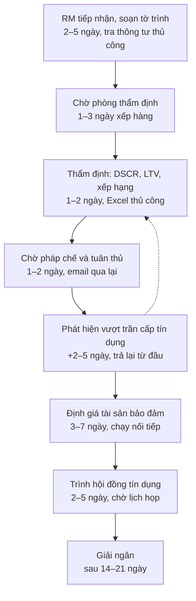
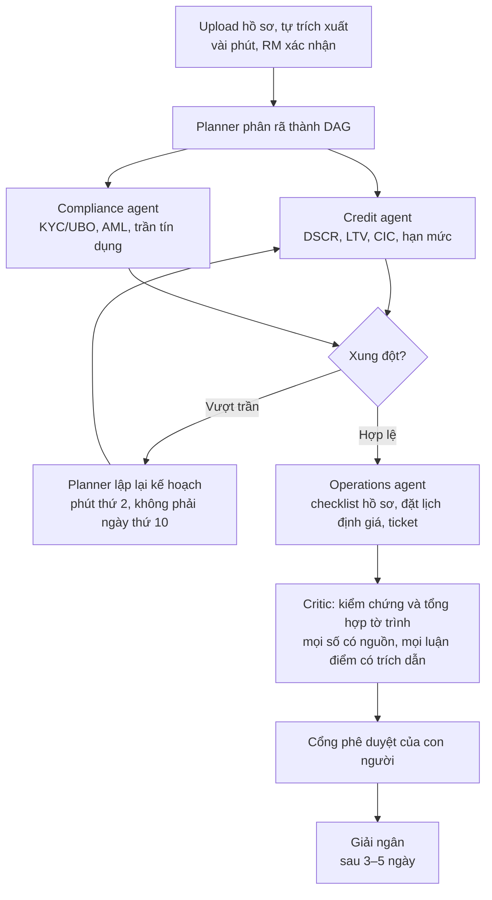
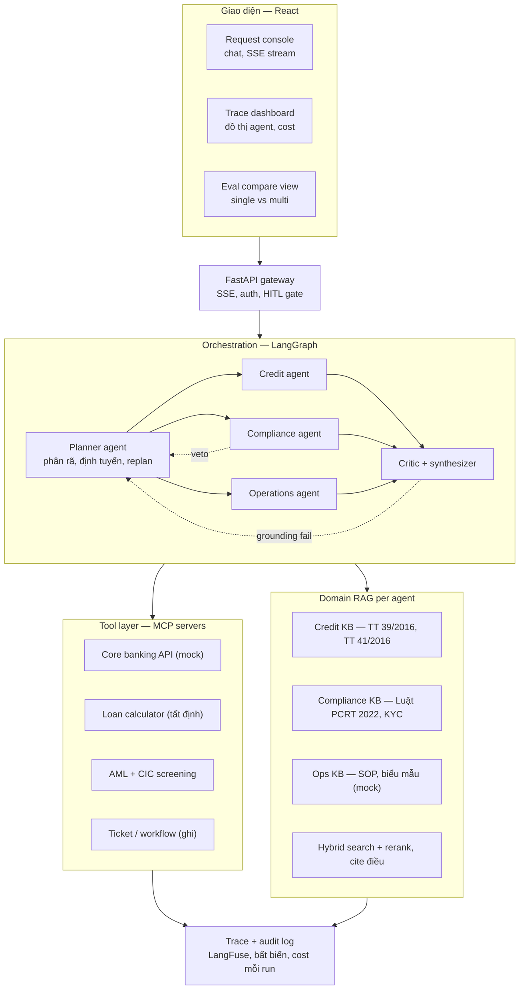
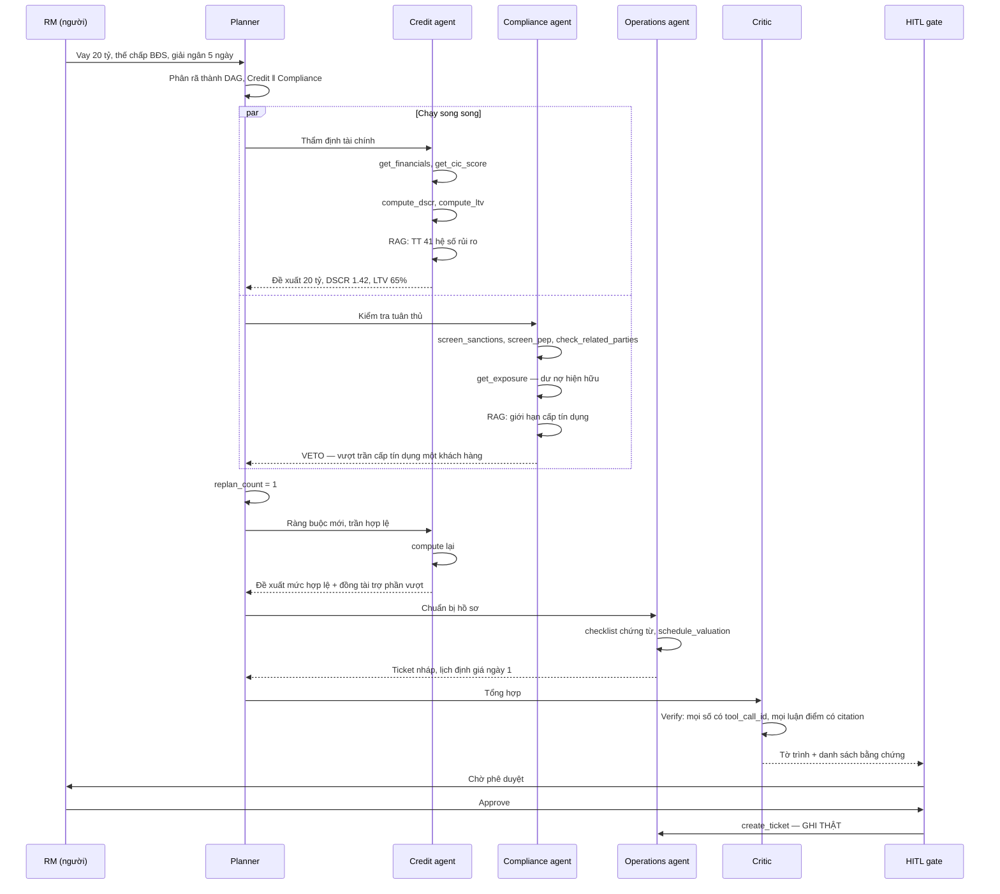

# Digital Expert Agents — Solution Design

**Đề bài:** Digital Expert Agents — A Team of AI Specialists for Banking Operations
**Đơn vị ra đề:** SHB Bank — Ngân hàng & Tài chính
**Sự kiện:** Hack CX Together 2026 (48 giờ)
**Tài liệu:** Thiết kế giải pháp + kế hoạch thực thi
**Đọc [`00-START-HERE.md`](./00-START-HERE.md) trước.** File này là chi tiết tra cứu, 1100+ dòng, không đọc một lần. Trang kia là kết luận: tập trung vào đâu, không làm gì, cờ đỏ nào đang treo.
**Phiên bản:** 1.4 — 2026-07-17
**Trạng thái:** Draft để team review, chưa chốt

---

## 1. Tóm tắt điều hành

Đề yêu cầu một hệ multi-agent trong đó mỗi agent là một chuyên gia số của một mảng nghiệp vụ ngân hàng (tín dụng, pháp chế/tuân thủ, sản phẩm, vận hành). Các agent phải tự lập kế hoạch, dùng công cụ, truy xuất tri thức nội bộ qua RAG, cộng tác với nhau, và **thực thi hành động trong hệ thống vận hành của SHB thay vì chỉ sinh ra văn bản trả lời**.

Câu cuối là toàn bộ trọng tâm của đề. Phần "Why This Problem Matters" nói: use case AI hiện nay — RAG, phát hiện bất thường — **vẫn đang dừng ở hỏi–đáp và phân tích**, trong khi bối cảnh công nghệ 2026 đã dịch sang agent biết lập kế hoạch, phối hợp, dùng công cụ và **hành động**. Đề nói về **cả ngành**, không chỉ đích danh SHB (§2.1). SHB muốn thấy AI **làm việc**, không phải AI **trả lời**.

Giải pháp đề xuất: một hệ 5 agent (`Planner`, `Credit`, `Compliance`, `Operations`, `Critic`) chạy trên LangGraph, gọi công cụ qua các MCP server, mỗi agent có kho tri thức RAG riêng được neo trên **văn bản pháp quy Việt Nam thật**, có cổng phê duyệt của con người trước mọi hành động ghi, và có bộ đánh giá định lượng so sánh single-agent với multi-agent.

Bốn quyết định thiết kế tạo ra khác biệt so với một demo multi-agent thông thường:

1. **Use case có xung đột thật.** Compliance agent có quyền phủ quyết đề xuất của Credit agent, buộc Planner lập lại kế hoạch. Nếu ba agent chỉ chạy song song rồi gộp kết quả, đó là fan-out — một single agent với một prompt dài làm được y hệt, và giám khảo sẽ hỏi đúng câu đó.
2. **Ranh giới cứng giữa LLM và số học.** Không một con số tài chính nào do LLM sinh ra. DSCR, LTV, hệ số rủi ro, lãi suất đều đi qua công cụ tất định. `Critic` từ chối mọi khẳng định không truy được về một lời gọi công cụ hoặc một điều khoản pháp quy cụ thể.
3. **Bộ đánh giá định lượng.** Đề yêu cầu rõ "a performance comparison between a single-agent chatbot [and multi-agent]". Phần lớn đội sẽ bỏ hạng mục này vì hết giờ. Đây là hạng mục dễ ăn điểm nhất trên mỗi giờ công bỏ ra.
4. **Tách tầng chuyên gia khỏi tầng quy trình.** Đề nói agent là chuyên gia của một *domain*, không phải của một *quy trình* — và đó là gợi ý quan trọng nhất trong cả đề. Domain thì ít (~5), quy trình thì hàng trăm, và quy trình chỉ là cách xếp domain lại. Xây năm chuyên gia một lần, mỗi quy trình sau đó là một file YAML. Đây là câu trả lời cho "ngân hàng tôi có hàng trăm quy trình, các bạn làm một cái thì được gì?" — và nó được trả lời bằng cách làm trên sân khấu, không bằng lời hứa. Chi tiết §3.3.

Kết quả kỳ vọng sau 48 giờ: một demo chạy live, một dashboard trace theo thời gian thực, một bảng số so sánh trên 30 case, và một hành động ghi thật vào cơ sở dữ liệu mà giám khảo tự bấm phê duyệt.

---

## 2. Đọc lại đề bài

### 2.1 Đề bài — trích nguyên văn

> Toàn bộ mục này trích từ `PROBLEM STATEMENT - SHB2.pdf`, extract bằng `pdftotext`. Bản text đầy đủ lưu tại `docs/reference/problem-statement.txt`. Không diễn giải, không thêm chữ — chỗ nào là suy đoán của đội đều đặt trong `[ngoặc vuông]`.

**Key Deliverables:**

1. A working demo with at least two or three specialized digital experts, such as Credit, Legal/Compliance, and Operations agents, collaborating on one complex request.
2. An orchestration mechanism in which a planner agent decomposes work and assigns tasks to specialist executor agents.
3. Practical tool use, allowing agents to call APIs, query data, or perform concrete actions rather than only return text.
4. A dashboard showing agent traces, task status, decisions, and collaboration flows.
5. A performance comparison between a single-agent chatbot `[câu bị cụt trong chính file PDF gốc — ô bảng tràn mất chữ. Suy đoán: "…and the multi-agent system". Hỏi BTC để chắc.]`

**Suggested Technologies:** Generative AI or LLM reasoning engine such as GPT-4 or Claude; agentic frameworks such as LangGraph, CrewAI, or AutoGen; tool use and function calling; domain-specific RAG for each agent; planner–executor orchestration and routing; memory and state management; **multi-agent communication protocols, including MCP where appropriate**; FastAPI backend; React-based orchestration interface.

**Benefits to the Bank:**

1. Extends GenAI from answering questions to performing work, increasing its operational value.
2. Enables one coordinated agent system to represent **multiple specialist departments** and accelerate **cross-functional requests**.
3. Reduces dependence on individual experts while **preserving domain-specific workflows and controls**.
4. Establishes a technical foundation for future **end-to-end banking process automation**.
5. Creates competitive advantage as the banking sector shifts from simple chatbots to action-oriented AI agents.

**Why This Problem Matters:**

> Current AI use cases such as RAG and anomaly detection often remain focused on question answering or analysis. By 2026, the technology landscape is increasingly oriented toward agentic AI systems that can plan, coordinate, use tools, and take actions. Hack CX Together 2026 therefore needs a challenge that combines foundation-model capabilities with a clear multi-agent architecture and explores practical SHB applications beyond traditional RAG and chatbot solutions.

**Đọc kỹ chỗ này:** đoạn trên nói về **bối cảnh ngành**, không chỉ đích danh AI của SHB. "RAG và anomaly detection" là ví dụ cho trạng thái chung của use case AI hiện nay. Đừng lên sân khấu nói "AI của SHB đang mắc kẹt ở hỏi–đáp" — đề không nói vậy, và SHB đã có AI Chatbot, eKYC, Big Data/ML chạy thật (§2.4). Nói đúng: *"Cả ngành đang mắc kẹt ở chỗ trả lời. Đề này hỏi chuyện làm."*

### 2.1b Cột Benefits là bản đồ chấm điểm — đọc nó như rubric

Đây là cột nhiều đội sẽ lướt qua. Nó nói thẳng SHB coi cái gì là giá trị:

| Benefit đề nêu | Trong doc này nằm ở đâu | Ghi chú |
|---|---|---|
| Từ *trả lời* sang *làm việc* | §7.4 cổng phê duyệt + công cụ ghi thật | Deliverable 3. Giám khảo tự bấm approve |
| Một hệ đại diện **nhiều phòng ban**, tăng tốc **request xuyên chức năng** | §4.1 use case có xung đột liên phòng ban | Đây là lý do case tín dụng thắng case LC |
| Giảm phụ thuộc chuyên gia **mà vẫn giữ controls** | §7.2 policy-as-code | Vế sau quan trọng hơn vế trước. "Giữ controls" = ràng buộc cứng nằm ngoài LLM |
| Nền móng cho **tự động hoá quy trình end-to-end trong tương lai** | §3.3 + §5.8 tách tầng chuyên gia/quy trình | **Đề tự nói ra chữ "process automation"** — luận điểm nền tảng của §3.3 không phải mình tự nghĩ, nó nằm trong Benefits |
| Lợi thế cạnh tranh khi ngành dịch từ chatbot sang agent hành động | Toàn bộ định vị | |

Hai dòng đáng chú ý nhất:

- **"multiple specialist departments" + "cross-functional requests"** — đề gọi tên chính xác thứ §4.1 chọn. Một case không xuyên phòng ban là một case trượt benefit này.
- **"end-to-end banking process automation"** — đề dùng chữ *process*, ở thì tương lai, như một *nền móng*. Nghĩa là kiến trúc tách tầng (§3.3) không phải scope creep — nó là thứ Benefits #4 đòi. Ghi chú này đổi §3.3 từ "ý hay của đội" thành "đáp đúng cột Benefits".

### 2.2 Mapping deliverable → chức năng → bằng chứng trên sân khấu

| # | Deliverable | Chức năng bắt buộc | Bằng chứng giám khảo nhìn thấy | Bẫy |
|---|---|---|---|---|
| 1 | 2–3 chuyên gia số cộng tác trên một request phức tạp | 3 agent chuyên môn, mỗi agent một KB riêng, và **một case có xung đột** | Compliance phủ quyết Credit ngay trên màn hình | Fan-out giả — ba agent chạy song song rồi gộp, không ai nói chuyện với ai |
| 2 | Planner phân rã và giao việc | Planner sinh ra **DAG có phụ thuộc**, không phải danh sách phẳng | Đồ thị task hiện live, thấy rõ nhánh song song và nhánh phụ thuộc | Planner tự do → lặp vô hạn, cháy token |
| 3 | Tool use thật, hành động cụ thể | Ít nhất một công cụ **ghi** trạng thái | Ticket được tạo thật, show bản ghi DB trước và sau | Tất cả công cụ đều read-only → vẫn là chatbot |
| 4 | Dashboard trace, task status, decision, collaboration flow | Đồ thị live + timeline + token/cost/latency từng node | Dashboard cập nhật theo thời gian thực trong lúc chạy | Log sau khi chạy xong không phải trace. Phải stream |
| 5 | So sánh single-agent vs multi-agent | Bộ đánh giá 25–30 case + bảng số | Một slide bảng số, có cả case multi-agent thua | Hầu hết đội bỏ vì hết giờ |

### 2.3 Câu hỏi đề không viết ra nhưng giám khảo chắc chắn hỏi

Giám khảo của một ngân hàng thương mại, không phải hội đồng nghiên cứu. Chuẩn bị sẵn câu trả lời:

| Câu hỏi | Câu trả lời ngắn |
|---|---|
| Multi-agent có thật sự hơn single agent không, hay chỉ phức tạp cho vui? | Có bảng số trên 30 case. Và chúng tôi nói cả chỗ multi-agent thua. |
| Nếu agent sai và phát sinh nợ xấu thì ai chịu trách nhiệm? | Agent không có quyền phê duyệt. Nó đề xuất và chuẩn bị hồ sơ. Quyết định cuối vẫn là con người, và luật bắt buộc như vậy. |
| Làm sao tin số agent đưa ra? | Không con số nào do LLM sinh. Tất cả đi qua công cụ tất định, và `Critic` từ chối nếu không truy được nguồn. |
| **Chúng tôi có RPA rồi, agent khác gì?** | RPA là **tay**, agent là **đầu**. RPA cần quy trình cố định mô tả đủ trước, gặp case lạ là gãy, thông tư mới thì người viết lại script. Chúng tôi không thay RPA — chúng tôi cho nó biết phải làm gì, và gọi nó như một tool. Chi tiết §2.4.2. |
| **Chúng tôi số hoá 95% quy trình rồi mà?** | Đúng, và đó là lý do chúng tôi không pitch số hoá. Các anh đã số hoá mọi chỗ khách hàng chạm vào. Chỗ chuyên gia suy nghĩ thì chưa. Một quy trình 100% điện tử vẫn đợi 3 ngày trong hàng đợi phòng thẩm định thì vẫn là 3 ngày. Chi tiết §2.4.1. |
| Ngân hàng tôi có hàng trăm quy trình, các bạn làm một cái thì giải quyết được gì? | Domain thì ít, process thì nhiều — và process chỉ là cách xếp domain lại. Năm chuyên gia phủ được cả sáu quy trình chậm nhất (§3.3.3). Quy trình tiếp theo tốn 12 dòng YAML, và chúng tôi làm điều đó trên sân khấu. |
| Tài liệu nội bộ SHB các bạn lấy ở đâu? | Không có, và chúng tôi không giả vờ có. Tri thức pháp quy dùng văn bản thật của NHNN. Phần nội bộ (SOP, biểu mẫu) là mock, và được đánh dấu rõ trong giao diện. |
| Core banking thật đâu cho agent gọi? | Mock. Nhưng tầng công cụ viết bằng MCP nên thay mock bằng API thật chỉ đổi endpoint, không viết lại agent. |

### 2.4 SHB đã có gì rồi — và vì sao nó giết một nửa bài pitch mặc định

Nguồn đầy đủ ở Phụ lục F. Đọc mục này trước khi viết slide đầu tiên.

#### Con số phải biết

> **Trên 95% quy trình và vận hành của SHB đã được số hoá. Trên 98% giao dịch của khách cá nhân và doanh nghiệp đi hoàn toàn qua kênh số.**

**Bài toán giấy tờ ở SHB đã xong.** Mọi slide có chữ "số hoá quy trình", "bỏ giấy tờ", "hết email qua lại" — bỏ hết. Đó là vấn đề họ giải xong trước khi mình tới.

Nhưng chỗ số hoá **không** với tới được chính là chỗ mình đứng:

> **SHB đã số hoá giao dịch. Chưa số hoá chuyên gia.**
>
> Một quy trình 100% điện tử mà vẫn đợi 3 ngày để một chuyên viên thẩm định đọc và phán đoán thì vẫn là quy trình 3 ngày. Số hoá chuyển giấy lên màn hình. Nó không chuyển được tri thức ra khỏi đầu người.

Đây là câu định vị của cả bài, và nó dựa trên **số do chính SHB công bố** — không phải giả định của đội. Dùng nó ở phút 0:00 (§11).

#### Danh mục hiện có

| Thứ | Trạng thái | Nghĩa gì với đội |
|---|---|---|
| Chiến lược **"Bank of the Future"** 2025–2028, đích ASEAN 2035 | Đang chạy | Ngôn ngữ của họ — dùng, đừng đặt khung mới |
| **"5 FIRST"**: **Data + AI First**, People, Cloud, Security, Mobile First | Khung chính thức | Map pitch vào "Data + AI First" |
| **AI Chatbot** | ✅ Đã có | **Pitch chatbot là chết ngay.** Xác nhận định vị: agent *làm*, không *trả lời* |
| **eKYC, QR Code** | ✅ Đã có | Không đụng |
| **SHB SAHA, SAHA Branch, Core Thẻ** | Đang triển khai | Không phải sân của mình |
| **Core Banking nâng cấp lên cloud** | Đang làm | Xem dưới — đổi hẳn một lập luận |
| **Temenos** (từ 2022, omnichannel) | Đã ký | Đối tác lõi |
| **Huawei** (chuyển đổi số) | Đã ký | Đối tác hạ tầng |
| **Big Data / ML**: dự báo, phân tích, cá nhân hoá | Đang làm | Trùng một phần — nhưng là *phân tích*, không phải *hành động* |
| **RPA — WinActor** (giải pháp Nhật) | Đã thử nghiệm | Xem §2.4.2. Câu "sao không dùng RPA?" sẽ tới |
| **Ngân hàng số DN**: sinh trắc học, ký số, **đề nghị giải ngân online** | ✅ Đã có | Cửa trước của quy trình tín dụng — đã số hoá |
| **Internet Banking DN**: **đăng ký phát hành LC**, tra cứu LC, tra cứu bảo lãnh, chuyển tiền quốc tế | ✅ Đã có | Cửa trước của quy trình LC — đã số hoá |

#### 2.4.1 Quy luật: cửa trước đã số hoá, buồng trong vẫn thủ công

Đây là phát hiện quan trọng nhất trong cả mục này. Nhìn hai quy trình mình quan tâm:

| Quy trình | Cửa trước (khách chạm vào) | Buồng trong (chuyên gia phán đoán) |
|---|---|---|
| **Tín dụng doanh nghiệp** | ✅ Đề nghị giải ngân online, ký số, sinh trắc học | ❌ Thẩm định, pháp chế, HĐTD — **thủ công** |
| **Trade finance / LC** | ✅ Đăng ký phát hành LC, tra cứu LC online | ❌ **Kiểm chứng từ** — thủ công |

Cùng một hình dạng, hai quy trình khác nhau, độc lập nhau. Đó không phải trùng hợp — đó là **quy luật của cả 10 năm chuyển đổi số ngành ngân hàng**: số hoá đi từ ngoài vào, dừng lại ngay trước chỗ cần phán đoán.

> **SHB đã số hoá mọi chỗ khách hàng chạm vào. Chưa số hoá chỗ nào chuyên gia suy nghĩ.**

Con số >95% ở trên và quy luật này khớp nhau: 95% là đếm quy trình đã lên hệ thống. Nhưng một quy trình "đã số hoá" vẫn đứng chờ ba ngày trong hàng đợi phòng thẩm định thì con số 95% không nói được gì về lead time.

**Đây là câu mở phút 0:00 (§11).** Nó đứng trên số của chính SHB, và mình không cần chứng minh SHB chậm — mình chỉ chỉ ra chỗ mà chính họ chưa với tới.

#### 2.4.2 RPA và WinActor — câu hỏi sẽ tới, và cách trả lời

SHB **đã thử nghiệm WinActor**, một nền tảng RPA của Nhật, để nối hệ thống nội bộ với hệ thống ngoài. Trong ngành, Tạp chí Ngân hàng (NHNN) còn có hẳn bài về **ứng dụng RPA trong nghiệp vụ tín dụng chứng từ** — tức là đúng quy trình #2 của mình.

Nên câu này chắc chắn tới: *"Chúng tôi có RPA rồi. Agent khác gì?"*

**Câu trả lời sai:** "Agent thông minh hơn RPA." Nghe như chê đồ họ đang dùng.

**Câu trả lời đúng — RPA và agent không phải đối thủ, chúng là hai tầng khác nhau:**

| | RPA (WinActor) | Digital Expert Agent |
|---|---|---|
| Làm gì | **Tay** — bấm màn hình, chuyển dữ liệu giữa hệ thống | **Đầu** — quyết định việc gì cần làm |
| Cần gì để chạy | Quy trình **cố định, mô tả đủ trước** | Chỉ cần mục tiêu và ràng buộc |
| Gặp case chưa từng script | **Gãy** | Suy luận, hoặc nói không biết |
| Thông tư mới ban hành | Người viết lại script | Đọc qua RAG |
| "Co., Ltd" vs "Company Limited" | Không phán đoán được | Phán đoán, kèm trích dẫn ISBP |
| Sai số | <1% trên thứ đã script | Không tất định — nên cần §7.2 policy-as-code |

**Câu chốt:** *"Chúng tôi không thay WinActor. Chúng tôi cho nó biết phải làm gì."*

Và nói được vì đúng về mặt kiến trúc: `workflow.create_ticket` trong tầng MCP (§5.4) **hoàn toàn có thể là một bot WinActor**. Agent quyết định, RPA thi hành. Tầng tool bọc bằng MCP nên cắm bot thật vào chỉ là đổi endpoint — y hệt lập luận core banking ở §2.4 hệ quả 1.

Đó là câu trả lời biến một mối đe doạ ("họ có RPA rồi") thành một điểm tích hợp ("chúng tôi dùng luôn RPA của các anh").

#### 2.4.3 ⚠️ SHBFinance — tuyệt đối đừng trích

Tra sẽ ra: **"SHBFinance — vay duyệt tự động chỉ trong 5 phút"**. Đừng đụng vào nó. Hai lý do, lý do nào cũng đủ:

1. **SHBFinance không còn là SHB.** SHB chuyển nhượng 50% cho Krungsri (thành viên tập đoàn MUFG Nhật) từ tháng 5/2023, và ngày 5/11/2025 ra nghị quyết bán nốt 50% còn lại. Nói "SHB đã duyệt tự động 5 phút" trước mặt giám khảo SHB là nói về công ty họ vừa bán đi.
2. **Khác hoàn toàn bài toán.** Tín dụng tiêu dùng 5 phút chạy bằng scorecard trên khoản vay nhỏ, một phòng quyết. Tín dụng doanh nghiệp 20 tỷ là bốn phòng ban, tài sản bảo đảm, trần luật định. Đưa hai cái cạnh nhau là tự lộ mình không phân biệt được.

Nếu giám khảo tự nêu SHBFinance ra, trả lời: *"Đó là scorecard cho khoản vay nhỏ, một phòng quyết. Bài của chúng tôi bắt đầu đúng ở chỗ scorecard hết tác dụng — khi cần bốn phòng ban đồng ý và có một trần luật định không được vượt."*

#### Ba hệ quả

**1. Lập luận MCP vừa từ giả thuyết thành thật.** SHB **đang thay core banking sang cloud**. Câu hỏi "sao không tích hợp core thật?" giờ có đáp án sắc: *"Vì core của các anh đang được thay. Tầng tool viết bằng MCP nên khi core mới lên, đổi endpoint — không viết lại agent."* Tích hợp vào core cũ lúc này mới là quyết định sai. Ghi chú này nâng §5.4 từ "giải thích vì sao mock" thành "giải thích vì sao mock là đúng".

**2. "AI Chatbot" đã nằm trong danh mục của họ.** Bằng chứng ngoài cho câu *"beyond traditional RAG and chatbot solutions"* trong Why This Problem Matters. Chỗ trống là tầng **hành động và phán đoán**.

**3. Đừng đấu với Big Data/ML của họ.** Họ có đội làm dự báo và cá nhân hoá rồi. Mình không hơn, và không cần. Sân của mình là **điều phối chuyên gia liên phòng ban** — mô hình ML không làm được, vì đó không phải bài dự báo mà là bài phối hợp.

#### Bối cảnh cuộc thi

SHB tài trợ **chính cuộc thi này** (Vietnam AI Innovation Challenge 2026), và trước đó **Future Banker 2025** — đội sinh viên vô địch làm về *dùng AI cá nhân hoá trải nghiệm SHB SmartBanking*.

Nghĩa là hướng "cá nhân hoá trải nghiệm khách hàng" **đã có người cắm cờ và thắng rồi**. Hướng "agent xử lý nghiệp vụ back-office" còn trống. Đề bài năm nay cũng nói đúng hướng đó.

`[Cần xác nhận]` Ông **Đỗ Quang Vinh** (Phó Chủ tịch) là người đang đẩy mảng công nghệ và trực tiếp giới thiệu giải pháp thanh toán tích hợp — **có khả năng** ngồi ghế giám khảo. Đây là suy đoán của đội, chưa xác nhận. Nếu đúng: ông ấy biết rõ con số >95% kia, và nhận ra ngay đội nào đang pitch một vấn đề đã giải xong.

---

## 3. Phạm vi

### 3.1 Trong phạm vi

- Ba agent chuyên môn: `Credit`, `Compliance`, `Operations`.
- Hai agent hạ tầng: `Planner` (phân rã, định tuyến, lập lại kế hoạch), `Critic` (kiểm chứng, tổng hợp).
- Tầng công cụ MCP: core banking mock, CIC mock, máy tính tín dụng tất định, sàng lọc AML, tạo ticket.
- RAG theo domain: ba kho tri thức tách biệt, tìm kiếm lai (BM25 + vector) + rerank, trích dẫn tới điều/khoản.
- Cổng phê duyệt của con người trước mọi hành động ghi.
- Dashboard trace theo thời gian thực.
- Bộ đánh giá single-agent vs multi-agent trên 30 case.
- Một use case xuyên phòng ban duy nhất, làm sâu.

### 3.2 Ngoài phạm vi — nói rõ trên slide

Nêu ra chủ động sẽ được điểm; để giám khảo phát hiện sẽ mất điểm.

- **Tích hợp core banking thật, T24/HL7/hệ thống nội bộ SHB.** Không khả thi trong 48 giờ và không có quyền truy cập.
- **OCR báo cáo tài chính đầy đủ.** Trong demo: trích xuất tự động rồi để RM xác nhận. Không hứa OCR 100%.
- **Mô hình xếp hạng tín dụng nội bộ của SHB.** Dùng công thức công khai theo Thông tư, không claim là mô hình SHB.
- **Đa use case build sâu.** Một case làm sâu thắng ba case làm nông. Nhưng *kiến trúc* để quy trình thứ hai rẻ thì không nằm ngoài phạm vi — xem §3.3. Cấm là cấm **build** quy trình thứ hai, không cấm **chứng minh** nó rẻ.
- **Fine-tune mô hình.** Không cần và không đủ thời gian.
- **Bảo mật cấp sản xuất, phân quyền theo vai trò đầy đủ.** Chỉ demo cơ chế, không phải hệ thật.

---

### 3.3 Bản đồ quy trình ngân hàng — vì sao một case, mà vẫn là nền tảng

Câu hỏi tự nhiên khi đọc §3.2: nếu ngân hàng có hàng trăm quy trình, làm một cái thì có ý nghĩa gì? Đây là câu CTO của SHB sẽ hỏi, nên trả lời trước.

#### 3.3.1 Quy trình nào thật sự chậm

Xếp theo (lead time × số lần bàn giao × mật độ tri thức):

Nguồn đầy đủ từng dòng ở **Phụ lục F**, kèm cảnh báo về độ tin cậy — đọc trước khi trích lên slide.

| # | Quy trình | Lead time | Vì sao chậm | Độ hợp AI | Nguồn |
|---|---|---|---|---|---|
| 1 | **Phê duyệt tín dụng doanh nghiệp** | **2–8 tuần**; BĐS thương mại 30–45 ngày; ngay cả lender gọn nhất cũng cần tối thiểu 2–3 tuần | RM → thẩm định → pháp chế → định giá → HĐTD; phần lớn là chờ | Cao | Ngành |
| 2 | **Trade finance — kiểm chứng từ LC** | UCP 600 cho ngân hàng tối đa **5 ngày làm việc** để kiểm | **65–80% bộ chứng từ bị từ chối ngay lần xuất trình đầu**; ICC báo 70–75% có lỗi | **Cao nhất** | ICC / ngành |
| 3 | **KYC/UBO doanh nghiệp cấu trúc phức tạp** | **95 ngày** trung bình toàn cầu cho một KYC review (2023) — **tăng từ 84 ngày (2022)**; 15–21 ngày cho KH chuẩn, tới 6 tuần cho cấu trúc nhiều UBO | Truy chuỗi sở hữu nhiều tầng, sanctions, PEP. **~51 giờ lao động thủ công** cho onboarding doanh nghiệp | Cao | Khảo sát (vendor) |
| 4 | **Tái cơ cấu nợ / xử lý NPL** | tháng | Credit + Pháp chế + Thu hồi + Định giá | Trung bình | ⚠️ **Ước lượng của đội — chưa có nguồn** |
| 5 | **Tái thẩm định hạn mức hàng năm** | **~8 giờ công/hồ sơ**, chi phí **>$1.000/khoản**; khối lượng rất lớn vì lặp hàng năm trên cả danh mục | Y hệt #1 nhưng lặp lại. **RM mất 50–60% thời gian cho việc hành chính** | Cao | Vendor |
| 6 | **Triển khai thông tư mới của NHNN** | **19% tổ chức mất tới 1 năm** để triển khai một thay đổi pháp quy | Cập nhật sản phẩm, biểu mẫu, hệ thống, đào tạo | Cao | Khảo sát 123 chuyên gia tuân thủ |
| 7 | **Báo cáo tuân thủ (CAR/TT41, báo cáo NHNN)** | theo chu kỳ | Data lineage | Trung bình | ⚠️ **Ước lượng của đội — chưa có nguồn** |

**Chậm nhất không phải hợp AI nhất.** Kiểm chứng từ LC là bài khớp quy tắc trên văn bản — hợp AI hơn thẩm định tín dụng. Nhưng chỉ tín dụng doanh nghiệp mới có **xung đột liên phòng ban**, tức là mới có nhánh veto, tức là mới chứng minh được multi-agent. Demo cần xung đột, nên #1 vẫn là case chính. #2 là quy trình để chứng minh mở rộng (§3.3.4).

**Ba con số đáng mang lên slide, và lý do:**

1. **KYC review: 95 ngày (2023), tăng từ 84 ngày (2022).** Đây là con số mạnh nhất trong cả bảng — không phải vì nó lớn, mà vì nó **đang xấu đi**. Mọi ngân hàng đều đã đổ tiền vào tự động hoá KYC suốt 10 năm, và nó vẫn chậm thêm 11 ngày trong một năm. Nghĩa là cách tiếp cận cũ đã hết dư địa.
2. **RM mất 50–60% thời gian cho việc hành chính.** Đây là bằng chứng ngoài đội cho luận điểm trung tâm của §4.2: cái chậm không phải do người dốt, mà do người giỏi bị chôn vào việc soạn thảo. Và nó là câu trả lời cho "AI có thay người không" — không, nó lấy lại 50% thời gian đang bị phí.
3. **19% tổ chức mất tới một năm để triển khai một thay đổi pháp quy.** Dùng ở phần mở rộng: quy trình #6 trong ma trận §3.3.3 dùng đúng bộ agent của quy trình #1.

**Con số KHÔNG nên mang lên slide:** "onboarding doanh nghiệp 90–120 ngày". Nguồn vendor, dải quá rộng, và gần như chắc chắn không đúng với NHTM Việt Nam. Xem cảnh báo Phụ lục F.

#### 3.3.2 Ngân hàng có bao nhiêu quy trình

[APQC Banking PCF](https://www.apqc.org/resource-library/resource-listing/apqc-process-classification-framework-pcf-banking-pcf-pdf-1) — chuẩn benchmark ngành — có **13 Level-1 category**, bóc dần xuống Level 5 (task). Tổng số tuỳ độ mịn của từng ngân hàng; bậc độ lớn là **hàng trăm quy trình ở L3/L4** cho một NHTM.

Cố phủ nhiều quy trình trong 48 giờ là chọn giữa 800 và 3. Cả hai đều thua.

#### 3.3.3 Chỗ khoá vấn đề: đề nói "domain", không nói "process"

Nguyên văn đề: *"each agent acts as a digital expert in a **specific banking domain**, such as credit, legal and compliance, products, or operations"*.

**Domain thì ít. Process thì nhiều. Và process chỉ là cách xếp domain lại.**

| Quy trình | Credit | Compliance | Product | Operations | Treasury |
|---|:--:|:--:|:--:|:--:|:--:|
| Phê duyệt tín dụng DN | ✓ | ✓ | | ✓ | ✓ |
| Kiểm chứng từ LC | | ✓ | ✓ | ✓ | |
| Onboarding / KYC-UBO | | ✓ | | ✓ | |
| Tái thẩm định hàng năm | ✓ | ✓ | | | |
| Tái cơ cấu nợ | ✓ | ✓ | | ✓ | |
| Triển khai thông tư mới | | ✓ | ✓ | ✓ | |

Sáu quy trình, vẫn đúng năm agent đó. **N quy trình cần ~5 chuyên gia, không cần 5N.**

Câu pitch rút ra:

> *"Chúng tôi không xây một quy trình. Chúng tôi xây năm chuyên gia. Quy trình chỉ là cách xếp họ lại — và nó là một file YAML."*

#### 3.3.4 Hệ quả kiến trúc: tách tầng chuyên gia khỏi tầng quy trình

Đây là quyết định kiến trúc quan trọng nhất của cả dự án, và nó phải đúng từ giờ thứ 0 — sửa sau thì phải viết lại Planner.

| Tầng | Đắt hay rẻ | Số lượng | Hình thức |
|---|---|---|---|
| **Chuyên gia** — agent + KB domain + tool + quyền veto | Đắt, xây một lần | ~5, ổn định | Code + KB |
| **Quy trình** — ai tham gia, thứ tự nào, gate ở đâu, veto ai giữ | Rẻ | Hàng trăm | **Config, không phải code** |

```yaml
# processes/lc_document_check.yaml
id: lc_document_check
trigger: "Bộ chứng từ xuất trình theo LC số ..."
experts: [product, compliance, operations]
parallel: [product, compliance]
veto_owner: compliance
human_gate: before_write
knowledge: [ucp600, isbp821]
```

`Planner` đọc file này. Không hardcode quy trình nào cả. Xem thêm §5.8.

#### 3.3.5 Rào chắn — bắt buộc, không phải thiện chí

Đây đúng là kiểu scope creep giết đội hackathon, nên rào bằng số giờ cụ thể chứ không bằng lời hứa:

> **Quy trình thứ hai được 0 giờ công trước giờ thứ 36.** Luồng tín dụng chưa khoá ở giờ 32 → cắt sạch quy trình thứ hai, chỉ để file YAML trên slide và nói bằng miệng. Không thương lượng.

Ghi vào `docs/TEAM_RULES.md` → *Decisions*. PM có quyền phủ quyết.

#### 3.3.6 Chỗ lập luận này có thể sai

Cược này **không còn là suy đoán của đội** sau khi đọc kỹ cột Benefits (§2.1b). Đề tự viết ra hai câu:

- *"Enables one coordinated agent system to represent **multiple specialist departments** and accelerate **cross-functional requests**"* → chọn case xuyên phòng ban là đáp đúng Benefit #2.
- *"Establishes a technical foundation for future **end-to-end banking process automation**"* → đề dùng chữ **process**, ở thì tương lai, gọi nó là **nền móng**. Tách tầng chuyên gia/quy trình chính là thứ Benefit #4 mô tả.

Nên §3.3 không phải sáng kiến thêm của đội — nó là đáp án cho một ô trong bảng đề.

**Vậy chỗ nào vẫn có thể sai?** Ở **liều lượng**, không ở hướng. Đề nói process automation là *"foundation for **future**"* — tức là SHB không đòi mình automation nhiều quy trình **trong 48 giờ**, họ đòi thấy **nền móng**. Nền móng thì chứng minh bằng kiến trúc + 60 giây trên sân khấu là đủ; không cần build sâu quy trình #2. Nếu đội đọc §3.3 rồi hào hứng làm hai quy trình thật, đội đã hiểu ngược Benefit #4 và tự giết mình bằng chính lập luận này.

Rủi ro còn lại: nếu BTC phát rubric mà rubric chấm nặng **chiều sâu nghiệp vụ tín dụng**, thì 4 giờ cho tầng quy trình là 4 giờ lẽ ra nên đào sâu RAG pháp quy và chất lượng tờ trình. **Có rubric thì đọc rubric — nó thắng suy luận từ Benefits.**

---

## 4. Nghiệp vụ

### 4.1 Use case demo &nbsp;·&nbsp; 📌 ĐÃ CHỐT 2026-07-17

> **"Công ty ABC đề nghị vay 20 tỷ đồng, thế chấp bất động sản, yêu cầu giải ngân trong 5 ngày."**

Chốt sau khi chấm 5 ứng viên theo 6 tiêu chí (`00-START-HERE.md`), log ở `TEAM_RULES.md` → *Decisions*. **Đừng mở lại tranh luận này** — đổi kịch bản ở giờ 0 tốn 0 đồng, đổi ở giờ 20 là mất cả bài.

**Chú ý cách đọc:** đề đã chọn *lĩnh vực* thay mình rồi — *"credit, legal and compliance, products, or operations"*. Mình không chọn lĩnh vực. Mình chọn **kịch bản bắt các lĩnh vực đó đâm vào nhau**. Chọn sai kịch bản thì bốn agent ngồi cạnh nhau mà không ai nói với ai, và đó là fan-out chứ không phải multi-agent.

Lý do chọn case này:

- **Bắt buộc phải xuyên phòng ban.** Một agent không thể vừa thẩm định tài chính vừa kiểm tra giới hạn pháp lý vừa vận hành hồ sơ.
- **Có ràng buộc cứng có thể vi phạm.** Giới hạn cấp tín dụng đối với một khách hàng là ràng buộc luật định, không phải sở thích. Vi phạm là vi phạm, không đàm phán được.
- **Xung đột dẫn tới lập lại kế hoạch.** Đây là khoảnh khắc duy nhất trong demo chứng minh multi-agent có giá trị.
- **Có hành động ghi tự nhiên.** Tạo hồ sơ, đặt lịch định giá tài sản bảo đảm, tạo ticket.

### 4.2 Quy trình hiện tại (as-is)



**Ba chỗ chảy máu:**

1. **Tuân thủ nằm cuối chuỗi.** Pháp chế chỉ nhìn hồ sơ sau khi thẩm định xong. Vượt trần bị phát hiện ở ngày thứ 8–10, khi mọi việc đã làm xong → làm lại từ đầu. Đây là lỗi kinh điển: kiểm tra ràng buộc cứng ở cuối quy trình thay vì đầu.
2. **Hàng đợi giữa các phòng.** Mỗi bàn giao là một hàng đợi riêng: chờ chuyên viên thẩm định rảnh, chờ pháp chế rảnh, chờ lịch họp hội đồng. Ba hàng đợi cộng lại 4–10 ngày mà không ai đang làm gì.
3. **Nối tiếp thứ vốn song song được.** Định giá tài sản bảo đảm (3–7 ngày) hoàn toàn có thể khởi động từ ngày 1, nhưng thực tế đợi có kết quả thẩm định sơ bộ mới đặt lịch.

Cộng thêm: tri thức nằm trong đầu chuyên gia (mỗi phòng một silo), bàn giao qua email làm mất ngữ cảnh, và không truy vết được vì sao ra quyết định đó.

**Nhận định trọng tâm cho toàn bộ bài pitch:**

> Thời gian làm việc thật (touch time) chỉ khoảng 12–16 giờ. Còn lại 14–21 ngày là **chờ và làm lại**. Không được pitch theo hướng "AI làm nhanh hơn người" — một chuyên viên thẩm định giỏi tính DSCR trong 20 phút, agent không nhanh hơn đáng kể. Phải pitch: **AI xoá hàng đợi và xoá vòng lặp làm lại**.

### 4.3 Quy trình mới (to-be)



**Ba thay đổi tương ứng với ba chỗ chảy máu:**

| Bệnh as-is | Thuốc to-be | Cơ chế kỹ thuật |
|---|---|---|
| Tuân thủ ở cuối → làm lại | **Dịch trái (shift-left)**: Credit và Compliance chạy song song từ phút 0 | `Planner` fork hai nhánh song song ngay bước đầu |
| Hàng đợi giữa phòng ban | Không còn bàn giao giữa người | Agent thay phần soạn thảo; người chỉ vào ở cổng cuối |
| Định giá chạy nối tiếp | `Operations` đặt lịch định giá từ ngày 1 | Task không phụ thuộc → planner cho chạy song song |
| Silo tri thức | Mỗi agent một KB riêng, trích dẫn điều/khoản | RAG theo domain |
| Không truy vết được | Trace + audit log bất biến | Mọi quyết định gắn tool call và citation |

### 4.4 KPI

| Chỉ số | As-is | To-be | Nguồn cải thiện |
|---|---|---|---|
| Lead time | 14–21 ngày | 3–5 ngày | Xoá hàng đợi + song song hoá |
| Touch time (người) | 12–16 giờ | 2–3 giờ | Người review thay vì soạn |
| Tỷ lệ thời gian chờ | ~70% | ~25% | Phần còn lại là định giá TSBĐ (bên thứ ba) |
| Vòng làm lại mỗi hồ sơ | ~1.8 | ~0.3 | Tuân thủ dịch trái |
| Thời điểm phát hiện vi phạm | Ngày 8–10 | Phút thứ 2 | Chạy song song |
| Tờ trình có trích dẫn nguồn | 0% | 100% | `Critic` bắt buộc |

> **Cảnh báo bắt buộc ghi trên slide:** toàn bộ số ở trên là **giả định của đội, không phải số đo từ SHB**. Giám khảo là người trong ngành, họ nhận ra số bịa ngay. Trung thực về nguồn số làm tăng độ tin cậy, và mở ra câu tiếp theo: cần một buổi làm việc với phòng thẩm định của SHB để chốt baseline thật.

### 4.5 Con người không bị thay thế

Vai trò đổi chứ không mất — phải nói rõ trong pitch:

- **Chuyên viên thẩm định:** từ *soạn tờ trình* → *phản biện tờ trình*. Một người xử lý được nhiều hồ sơ hơn.
- **Pháp chế:** từ *rà từng hồ sơ* → *duy trì policy-as-code* và xử lý ngoại lệ mà agent không dám quyết.
- **Hội đồng tín dụng:** không đổi gì. Quyết định cuối vẫn là con người.

Agent không có quyền phê duyệt. Nó đề xuất và chuẩn bị.

---

## 5. Kiến trúc

### 5.1 Tổng quan



### 5.2 Tầng điều phối

`LangGraph` state graph. Mỗi agent là một subgraph riêng, có system prompt riêng, KB riêng, và tập công cụ được phép gọi riêng (nguyên tắc đặc quyền tối thiểu — Credit agent không được gọi công cụ tạo ticket).

Trạng thái dùng chung:

```python
from typing import TypedDict, Annotated, Literal
from operator import add

class Task(TypedDict):
    task_id: str
    agent: Literal["credit", "compliance", "operations"]
    goal: str
    depends_on: list[str]
    status: Literal["pending", "running", "done", "failed", "blocked"]
    result: dict | None

class Finding(TypedDict):
    agent: str
    claim: str
    evidence_type: Literal["tool_call", "citation"]
    evidence_ref: str          # tool_call_id hoặc "TT39/2016 Điều 7 Khoản 2"
    confidence: float

class AgentState(TypedDict):
    request_id: str
    request: str
    plan: list[Task]
    findings: Annotated[list[Finding], add]
    conflicts: Annotated[list[dict], add]
    replan_count: int
    proposal: dict | None
    trace: Annotated[list[dict], add]
```

Điểm quan trọng trong thiết kế trên: **mọi `Finding` bắt buộc có `evidence_ref`**. Không có bằng chứng thì không được vào state. Đây là cơ chế chống ảo giác ở tầng dữ liệu, không phải ở tầng prompt.

Ràng buộc an toàn:

| Ràng buộc | Giá trị | Lý do |
|---|---|---|
| `max_replan` | 2 | Chặn vòng lặp Credit ↔ Compliance vô hạn |
| `max_steps` | 25 | Trần token cho mỗi request |
| `max_depth` | 3 | Agent không được đẻ agent không giới hạn |
| Timeout mỗi node | 60s | Node treo không làm treo cả demo |
| Fallback | mọi node | Node lỗi → trả finding `status=failed` kèm lý do, không crash graph |

### 5.3 Danh sách agent

| Agent | Model | Trách nhiệm | Công cụ được phép | KB |
|---|---|---|---|---|
| `Planner` | Model mạnh | Phân rã request thành DAG, định tuyến, nhận veto và lập lại kế hoạch | không có | không có |
| `Credit` | Model nhỏ/nhanh | Thẩm định tài chính, đề xuất hạn mức và lãi suất | core banking (đọc), CIC, loan calculator | Credit KB |
| `Compliance` | Model nhỏ/nhanh | KYC/UBO, sàng lọc AML, kiểm tra giới hạn luật định. **Có quyền phủ quyết** | AML screening, core banking (đọc) | Compliance KB |
| `Operations` | Model nhỏ/nhanh | Checklist chứng từ, đặt lịch định giá, tạo ticket | ticket/workflow (ghi), core banking (đọc) | Ops KB |
| `Critic` | Model mạnh | Kiểm chứng mọi finding có bằng chứng, tổng hợp tờ trình | không có | tất cả (chỉ đọc để verify) |

Phân bổ model theo vai trò: model mạnh cho `Planner` và `Critic` (nơi cần suy luận), model nhỏ cho specialist (nơi chủ yếu là gọi công cụ và tra cứu). Đây là đòn bẩy lớn nhất về độ trễ và chi phí.

Cấu hình agent bằng YAML để demo "thêm agent thứ tư trong 2 phút":

```yaml
# agents/product.yaml
id: product
display_name: Product agent
model: claude-haiku-4-5-20251001
system_prompt_file: prompts/product.md
knowledge_base: kb/product
allowed_tools:
  - core_banking.get_product_catalog
  - core_banking.get_customer_segment
can_veto: false
```

### 5.4 Tầng công cụ — MCP

Đề gợi ý rõ "multi-agent communication protocols, including MCP where appropriate". Xây tầng công cụ thành **MCP server thật**, không phải function calling chay. Lợi ích kể được trên sân khấu: công cụ này agent khác của SHB cắm vào dùng ngay, không viết lại.

| MCP server | Công cụ | Loại | Ghi chú |
|---|---|---|---|
| `core-banking` | `get_customer`, `get_financials`, `get_accounts`, `get_exposure` | đọc | Mock, dữ liệu seed cứng |
| `credit-bureau` | `get_cic_score`, `get_credit_history` | đọc | Mock |
| `loan-calculator` | `compute_dscr`, `compute_ltv`, `compute_risk_weight`, `amortize` | đọc, **tất định** | Không có LLM trong đường đi |
| `aml-screening` | `screen_sanctions`, `screen_pep`, `check_related_parties` | đọc | Danh sách mock |
| `workflow` | `create_ticket`, `schedule_valuation`, `attach_document` | **ghi** | Đi qua cổng HITL |

Ví dụ chữ ký công cụ tất định:

```python
@mcp.tool()
def compute_dscr(
    ebitda: float,
    existing_debt_service: float,
    proposed_annual_payment: float,
) -> dict:
    """Tính hệ số khả năng trả nợ. Không có LLM trong hàm này."""
    total_service = existing_debt_service + proposed_annual_payment
    if total_service <= 0:
        return {"error": "total_debt_service must be positive"}
    dscr = ebitda / total_service
    return {
        "dscr": round(dscr, 3),
        "inputs": {"ebitda": ebitda, "total_debt_service": total_service},
        "formula": "DSCR = EBITDA / (existing_debt_service + proposed_annual_payment)",
        "computed_at": utcnow_iso(),
    }
```

Trường `formula` và `inputs` không phải trang trí — chúng là bằng chứng mà `Critic` và audit log dùng để truy vết.

### 5.5 Tầng tri thức — RAG theo domain

**Vấn đề gốc:** không có tài liệu nội bộ SHB, và sẽ không có trong 48 giờ.

**Cách giải:** thay bằng văn bản pháp quy Việt Nam thật, công khai, có hiệu lực. Agent trích dẫn được "theo Điều X Thông tư 39/2016/TT-NHNN" thuyết phục hơn hẳn một đội bịa ra policy giả. Chỉ mock những gì thật sự nội bộ (SOP, biểu mẫu), và **đánh dấu rõ trên giao diện là mock**.

| KB | Nguồn | Ghi chú |
|---|---|---|
| Credit | Thông tư 39/2016/TT-NHNN (hoạt động cho vay); Thông tư 41/2016/TT-NHNN (tỷ lệ an toàn vốn) | Văn bản thật, công khai. Kiểm tra văn bản sửa đổi bổ sung còn hiệu lực |
| Compliance | Luật Phòng, chống rửa tiền 2022; Thông tư 09/2023/TT-NHNN; Luật Các tổ chức tín dụng 2024 | Văn bản thật |
| Operations | SOP nội bộ, biểu mẫu, checklist chứng từ | **Mock, đánh dấu rõ** |

Pipeline: chunk theo cấu trúc điều/khoản (không chunk theo số ký tự — mất đơn vị pháp lý), tìm kiếm lai BM25 + vector, rerank, trả về kèm định danh điều khoản.

```python
class Citation(TypedDict):
    doc_id: str        # "TT-39-2016-NHNN"
    article: str       # "Điều 7"
    clause: str | None # "Khoản 2"
    text: str
    score: float
```

> **Cảnh báo pháp lý — bắt buộc kiểm tra lại:** Luật Các tổ chức tín dụng 2024 thay đổi giới hạn cấp tín dụng đối với một khách hàng theo **lộ trình giảm dần theo năm**, không còn là một con số cố định 15% như luật cũ. Đội **phải tra lại con số có hiệu lực tại thời điểm thi** và hardcode vào policy-as-code. **Tuyệt đối không để LLM nhớ con số này** — nó sẽ nhớ con số cũ.

### 5.6 Bộ nhớ và trạng thái

- **Ngắn hạn:** state của LangGraph trong một request. Checkpointer để replay được khi demo hỏng.
- **Dài hạn:** hồ sơ khách hàng và các quyết định trước, lưu vector store. Trong hackathon: seed sẵn 2–3 khách hàng có lịch sử, đủ để demo agent nhớ được ngữ cảnh.
- **Không làm:** bộ nhớ tự học liên phiên. Rủi ro cao, giá trị demo thấp.

### 5.7 Quan sát

`LangFuse` hoặc OpenTelemetry → sự kiện đẩy qua SSE → React dashboard.

Mỗi node phát ra: `node_start`, `tool_call`, `tool_result`, `citation_retrieved`, `finding_emitted`, `conflict_raised`, `node_end` kèm `tokens_in`, `tokens_out`, `cost_usd`, `latency_ms`.

Dashboard phải cập nhật **trong lúc chạy**, không phải sau khi chạy xong. Log sau khi hoàn thành không phải trace, và giám khảo nhìn ra khác biệt ngay.

### 5.8 Tầng quy trình — process-as-config

Lý do tồn tại của tầng này ở §3.3. Đây là hình dạng cụ thể.

`Planner` không biết "thẩm định tín dụng" là gì. Nó nhận một `ProcessDefinition` và một request, rồi phân rã theo định nghĩa đó. Đổi quy trình = đổi file YAML, không đụng code.

```python
class ProcessDefinition(BaseModel):
    id: str
    trigger: str                    # mô tả tự nhiên, dùng để định tuyến request → process
    experts: list[str]              # agent id, phải tồn tại trong agents/
    parallel: list[str]             # nhóm chạy song song — đây là chỗ shift-left sinh ra
    veto_owner: str | None          # agent duy nhất được phủ quyết trong quy trình này
    human_gate: Literal["before_write", "before_propose", "none"]
    knowledge: list[str]            # KB id mà quy trình này mở cho agent đọc
    max_replan: int = 2
```

Ba ràng buộc để tầng này không thành lỗ hổng:

1. **`experts` phải khớp agent đã đăng ký.** Sai tên = fail lúc load, không phải lúc demo.
2. **`veto_owner` phải là agent có `can_veto: true`.** Quy trình không tự phong quyền phủ quyết cho ai.
3. **`knowledge` là danh sách cho phép, không phải danh sách gợi ý.** Agent trong quy trình LC không đọc được KB tín dụng. Least privilege ở tầng quy trình, không chỉ tầng tool.

Chi phí biên của quy trình thứ N: một file YAML, cộng KB nếu domain đó chưa có. Đó là con số cần nói với CTO — không phải "chúng tôi hỗ trợ nhiều quy trình", mà "quy trình tiếp theo tốn 12 dòng".

---

## 6. Luồng xử lý chi tiết



**Khoảnh khắc quan trọng nhất của cả demo là bước VETO → replan.** Nếu bỏ bước này, toàn bộ hệ thống chỉ là fan-out và bài thi mất lý do tồn tại.

---

## 7. Kiểm soát và chống ảo giác

Đây là phần ngân hàng quan tâm nhất, và là phần nhiều đội hackathon bỏ qua.

### 7.1 Ranh giới tất định

Quy tắc: **LLM không được sinh ra con số tài chính.**

| Việc | Ai làm |
|---|---|
| DSCR, LTV, hệ số rủi ro, lịch trả nợ, tổng dư nợ | Công cụ tất định |
| So sánh số với ngưỡng luật định | Policy-as-code |
| Diễn giải, tổng hợp, viết tờ trình | LLM |
| Quyết định phê duyệt | Con người |

### 7.2 Policy-as-code

Ràng buộc cứng nằm ngoài LLM, dạng dữ liệu, có ngày hiệu lực:

```yaml
# policy/credit_limits.yaml
- id: single_customer_limit
  legal_basis: "Luật Các TCTD 2024, Điều 136"
  metric: total_exposure_ratio_to_equity
  operator: "<="
  threshold: TRA_LAI_CON_SO_HIEU_LUC   # lộ trình giảm theo năm — phải verify
  effective_from: "2024-07-01"
  severity: blocking
  veto_agent: compliance
```

`severity: blocking` nghĩa là agent không có cách nào vượt qua bằng lý lẽ. Đây chính là câu trả lời cho "giảm phụ thuộc chuyên gia nhưng vẫn giữ được controls" trong phần Benefits của đề.

### 7.3 Cổng kiểm chứng của Critic

`Critic` chạy trước khi tổng hợp. Với mỗi `Finding`:

1. Có `evidence_ref` không? Không → reject.
2. `evidence_ref` là `tool_call` → tool_call_id đó có tồn tại trong trace không? Kết quả có khớp với claim không?
3. `evidence_ref` là `citation` → điều khoản đó có tồn tại trong KB không? Có nói đúng điều agent nói không?
4. Có số nào trong văn bản tổng hợp không truy được về `inputs` của một tool call không? Có → reject.

Finding bị reject không âm thầm biến mất — nó hiện trên dashboard dưới dạng `rejected_by_critic` kèm lý do. **Cho giám khảo thấy hệ thống tự bắt lỗi của chính nó là một điểm mạnh, không phải điểm yếu.**

### 7.4 Cổng phê duyệt của con người

Mọi công cụ ghi đều đi qua HITL gate. Giao diện hiện: hành động sắp thực hiện, tham số, agent nào yêu cầu, bằng chứng nào hậu thuẫn. Người bấm approve/reject.

Trong demo: **để giám khảo tự bấm nút approve**. Khoảnh khắc này đáng giá hơn ba slide kiến trúc.

### 7.5 Audit

Mọi run ghi log append-only: request, plan, mọi tool call kèm tham số và kết quả, mọi citation, mọi conflict, mọi lần replan, quyết định cuối, ai approve, lúc nào. Xuất được JSON.

Đây là thứ ngân hàng bắt buộc phải có trước khi nghĩ tới triển khai. Có sẵn = ghi điểm.

---

## 8. Đánh giá — single-agent vs multi-agent

**Deliverable số 5 của đề. Phần lớn đội sẽ bỏ. Đây là hạng mục có tỷ lệ điểm trên công cao nhất.**

### 8.1 Bộ case chuẩn

30 case, chia ba nhóm:

| Nhóm | Số case | Mục đích | Dự đoán kết quả |
|---|---|---|---|
| Đơn domain | 10 | "Điều kiện vay tín chấp là gì?" | Single agent **thắng** — nhanh hơn, rẻ hơn |
| Xuyên domain | 15 | Case chính, cần Credit + Compliance | Multi-agent **thắng** rõ ở độ chính xác |
| Có bẫy tuân thủ | 5 | Cố tình vượt trần, khách hàng trong danh sách PEP | Multi-agent thắng tuyệt đối — single agent bỏ sót |

Mỗi case có ground truth soạn tay: kết luận đúng, các điều khoản phải trích dẫn, các công cụ phải gọi.

### 8.2 Chỉ số

| Chỉ số | Đo thế nào |
|---|---|
| Task success rate | Kết luận khớp ground truth |
| Citation accuracy | Điều khoản trích dẫn đúng và có thật (bắt cả ảo giác trích dẫn) |
| Tool-call correctness | Gọi đúng công cụ, đúng tham số |
| Compliance recall | Trong 5 case bẫy: có bắt được vi phạm không (**chỉ số quan trọng nhất với ngân hàng**) |
| Latency p50 / p95 | Giây |
| Cost / request | USD |
| Hallucinated numbers | Số không truy được về tool call |

### 8.3 Mẫu bảng kết quả

```
| Nhóm case          | n  | Cấu hình     | Success | Citation acc | Compliance recall | p50 (s) | Cost ($) |
|--------------------|----|--------------|---------|--------------|-------------------|---------|----------|
| Đơn domain         | 10 | Single agent |         |              | n/a               |         |          |
| Đơn domain         | 10 | Multi-agent  |         |              | n/a               |         |          |
| Xuyên domain       | 15 | Single agent |         |              |                   |         |          |
| Xuyên domain       | 15 | Multi-agent  |         |              |                   |         |          |
| Bẫy tuân thủ       |  5 | Single agent |         |              |                   |         |          |
| Bẫy tuân thủ       |  5 | Multi-agent  |         |              |                   |         |          |
```

### 8.4 Cách trình bày

**Báo cáo trung thực, kể cả chỗ thua.** Kết luận mong đợi có dạng:

> "Trên câu hỏi đơn domain, multi-agent chậm hơn 3.4 lần và đắt hơn 4.1 lần mà không chính xác hơn — nên định tuyến thẳng về single agent. Giá trị của multi-agent nằm ở nhóm xuyên domain và đặc biệt ở nhóm bẫy tuân thủ, nơi single agent bỏ sót 4/5 vi phạm còn multi-agent bắt 5/5. Kiến trúc đúng không phải multi-agent cho mọi thứ, mà là **định tuyến theo độ phức tạp của request** — và Planner của chúng tôi đã làm điều đó."

Kết luận này biến một điểm yếu (multi-agent chậm và đắt) thành một quyết định kiến trúc có cơ sở. Đây là thứ phân biệt một đội kỹ sư với một đội demo.

---

## 9. Kế hoạch 48 giờ

Nhân sự: 5 người — 2 backend/agent, 1 RAG + dữ liệu, 1 frontend, 1 PM kiêm eval kiêm pitch.

| Giờ | Việc | Ai | Điều kiện qua cửa |
|---|---|---|---|
| 0–4 | Chốt use case, dựng mock data, khung repo, **chốt API contract** | cả đội | Contract đóng băng — frontend không phải chờ backend |
| 4–10 | Ingest 3 KB, hybrid search + rerank, định dạng trích dẫn | RAG | Hỏi "điều kiện vay" → trả đúng điều khoản |
| 4–10 | Tầng công cụ MCP + core banking mock | BE1 | Gọi được bằng curl |
| 10–16 | **Baseline single-agent làm trước** | BE2 | Baseline chạy được |
| 10–18 | Khung trace dashboard, SSE | FE | Vẽ được đồ thị từ sự kiện giả |
| 16–26 | Planner + 3 specialist + LangGraph graph | BE1+BE2 | Happy path thông |
| 26–30 | **Nhánh xung đột và replan** | BE2 | Compliance veto → Credit hạ hạn mức |
| 26–32 | Dashboard nối trace thật, giao diện HITL gate | FE | Bấm approve → ticket ghi vào DB |
| 30–36 | Critic + grounding check | BE1 | Số không có tool call → bị reject |
| 32–38 | **Chạy eval 30 case, ra bảng số** | PM | Có bảng số thật |
| 36–40 | Quy trình #2 (LC) — **chỉ khi luồng chính đã khoá ở giờ 32** | BE1 | YAML + KB UCP 600 nhỏ chạy được. Không đạt → cắt, không tiếc |
| 38–42 | Guardrail, che PII, đánh bóng | cả đội | — |
| **42** | **ĐÓNG BĂNG CODE** | — | Sau giờ này chỉ sửa bug chặn demo |
| 42–46 | Tập demo ≥5 lần, **quay video dự phòng** | cả đội | Có video = ngủ được |
| 46–48 | Slide pitch, dự phòng | PM | — |

**Bốn quy tắc không được phá:**

1. **Baseline single-agent làm ở giờ 10, không phải giờ 40.** Nó vừa là phương án dự phòng nếu multi-agent không kịp, vừa là dữ liệu so sánh cho deliverable số 5. Đây là quyết định lập lịch quan trọng nhất trong cả bảng.
2. **Đóng băng code ở giờ 42.** Đội nào code tới giờ 47 sẽ demo hỏng. Không có ngoại lệ.
3. **Video dự phòng là bắt buộc.** Không phải tuỳ chọn.
4. **Quy trình #2 được 0 giờ trước giờ 36** (§3.3.5). Kiến trúc tách tầng làm từ giờ 0; còn *build* quy trình LC thì chỉ được đụng vào khi luồng tín dụng đã khoá. Đây là chỗ scope creep sẽ tấn công, và nó ngụy trang thành "chỉ thêm một file YAML thôi mà".

---

## 10. Rủi ro

| Rủi ro | Khả năng | Tác động | Giảm thiểu |
|---|---|---|---|
| Multi-agent quá chậm (>60s), demo lê thê | Cao | Cao | Song song hoá, cache tool result, model nhỏ cho specialist, giới hạn max_steps |
| Demo hỏng live | Trung bình | Rất cao | Đóng băng giờ 42, seed data cứng, video dự phòng, checkpointer để replay |
| Hết giờ trước khi làm eval | Cao | Cao | Baseline làm ở giờ 10; eval là block riêng của PM, không phụ thuộc backend xong |
| Planner lặp vô hạn | Trung bình | Trung bình | `max_replan=2`, `max_steps=25`, timeout mỗi node |
| Số pháp lý sai (trần cấp tín dụng) | Trung bình | **Rất cao** | Hardcode vào policy-as-code, một người verify riêng, không để LLM nhớ |
| Rate limit API LLM giữa demo | Trung bình | Cao | 2 API key, fallback provider, cache aggressive |
| Bị chê "chỉ là wrapper" | Trung bình | Cao | Nhánh xung đột + eval + policy-as-code là ba câu trả lời |
| Scope creep sang use case thứ hai | Cao | Cao | PM có quyền phủ quyết. Một case làm sâu thắng ba case làm nông |

---

## 11. Kịch bản demo 5 phút

| Phút | Nội dung | Vì sao |
|---|---|---|
| 0:00–0:30 | Nêu vấn đề: 14–21 ngày, 70% là chờ và làm lại | Đóng đinh insight ngay, không lan man |
| 0:30–1:00 | Nhập request 20 tỷ, dashboard bật lên | Cho thấy trace live |
| 1:00–2:00 | Planner phân rã, Credit ‖ Compliance chạy song song | Deliverable 1, 2 |
| 2:00–2:45 | **Compliance VETO → Planner replan → Credit hạ hạn mức** | **Đỉnh của demo.** Dừng lại, chỉ tay vào màn hình |
| 2:45–3:15 | Critic reject một finding không có bằng chứng | Cho thấy hệ tự bắt lỗi mình |
| 3:15–3:45 | **Mời giám khảo bấm approve → ticket ghi thật, show DB trước/sau** | Deliverable 3. "Không chỉ trả lời — nó làm việc" |
| 3:45–4:30 | Bảng eval, kể cả chỗ multi-agent thua, kết luận định tuyến theo độ phức tạp | Deliverable 5. Chỗ ăn điểm lớn nhất |
| 4:30–5:00 | **Thêm quy trình thứ hai (kiểm chứng từ LC) bằng một file YAML, chạy lại — cùng bộ agent** | Deliverable "mở rộng". Trả lời trước khi bị hỏi. Mở bằng: *"70–75% bộ chứng từ LC bị từ chối ngay lần xuất trình đầu, ngân hàng có 5 ngày để kiểm. Chúng tôi không thêm agent nào — chỉ thêm 12 dòng."* |

Câu chốt: *"Chúng tôi không xây một chatbot biết nhiều hơn. Chúng tôi xây một quy trình biết tự chặn mình lại trước khi làm sai."*

---

## 12. Tự đối chiếu tiêu chí

| Deliverable đề yêu cầu | Trạng thái | Bằng chứng |
|---|---|---|
| 2–3 chuyên gia số cộng tác | ✅ | 3 specialist + case có xung đột thật |
| Planner phân rã và giao việc | ✅ | DAG có phụ thuộc, có replan |
| Tool use thật, hành động cụ thể | ✅ | MCP server, có công cụ ghi, giám khảo tự approve |
| Dashboard trace, status, decision, flow | ✅ | React + SSE, live, có cost mỗi node |
| So sánh single vs multi | ✅ | 30 case, 7 chỉ số, kết luận trung thực |
| MCP (đề gợi ý) | ✅ | Toàn bộ tầng công cụ |
| FastAPI + React (đề gợi ý) | ✅ | Đúng stack đề gợi ý |
| Memory và state management | ✅ | LangGraph state + checkpointer + vector memory |

---

## Phụ lục A — Tech stack

| Tầng | Lựa chọn | Lý do |
|---|---|---|
| Orchestration | LangGraph | Đề gợi ý; state graph tường minh; parallel branch và checkpointer sẵn có |
| LLM | Claude (Opus cho Planner/Critic, Haiku cho specialist) | Đề gợi ý Claude; phân bổ theo vai trò để giảm độ trễ và chi phí |
| Tool protocol | MCP (Python SDK) | Đề gợi ý; tái sử dụng được cho agent khác |
| Backend | FastAPI + SSE | Đề gợi ý |
| Frontend | React + React Flow (đồ thị agent) | Đề gợi ý |
| Vector store | Qdrant hoặc pgvector | Chạy local, không phụ thuộc mạng khi demo |
| Search | BM25 (rank_bm25) + dense + reranker | Văn bản pháp quy cần khớp từ khoá chính xác, dense một mình không đủ |
| Trace | LangFuse (self-host) | Cắm vào LangGraph nhanh, có sẵn cost tracking |
| DB | Postgres | Ticket, audit log |

Nguyên tắc: **mọi thứ chạy được local**. Wifi hội trường sẽ tệ.

## Phụ lục B — Văn bản pháp quy

| Văn bản | Dùng cho | Ghi chú |
|---|---|---|
| Thông tư 39/2016/TT-NHNN | Điều kiện vay, phương án sử dụng vốn | Kiểm tra văn bản sửa đổi còn hiệu lực |
| Thông tư 41/2016/TT-NHNN | Hệ số rủi ro, tỷ lệ an toàn vốn | |
| Luật Các tổ chức tín dụng 2024 | Giới hạn cấp tín dụng | **Lộ trình giảm theo năm — phải tra số hiệu lực tại thời điểm thi** |
| Luật Phòng, chống rửa tiền 2022 | Nghĩa vụ nhận biết khách hàng, báo cáo giao dịch đáng ngờ | |
| Thông tư 09/2023/TT-NHNN | Hướng dẫn AML | |
| UCP 600 (ICC) + ISBP 821 | KB cho quy trình #2 — kiểm chứng từ LC (§3.3.4) | Chỉ ingest **nếu** qua được cửa giờ 36. UCP 600 chỉ 39 điều — ingest nhanh, là lý do LC được chọn làm quy trình #2 thay vì tái cơ cấu nợ |

**Một người trong đội chịu trách nhiệm verify toàn bộ con số pháp lý.** Sai một con số trước mặt giám khảo ngân hàng là mất toàn bộ độ tin cậy, kể cả khi hệ thống chạy hoàn hảo.

## Phụ lục C — Dữ liệu mock

| Bộ | Nội dung | Ghi chú |
|---|---|---|
| Khách hàng | 5 doanh nghiệp: 1 sạch, 1 vượt trần, 1 có bên liên quan, 1 trúng PEP, 1 CIC xấu | Đủ để chạy cả 3 nhóm eval |
| Báo cáo tài chính | 3 năm mỗi doanh nghiệp | Số phải nhất quán — giám khảo sẽ nhẩm |
| Dư nợ hiện hữu | Có chủ đích đặt sát trần | Để kích hoạt veto |
| Danh sách sanctions/PEP | Mock, ~200 dòng | |
| TSBĐ | Bất động sản có định giá | Để tính LTV |

Số phải **nhất quán qua tất cả các bộ**. Giám khảo ngân hàng nhẩm được DSCR trong đầu.

## Phụ lục D — Cấu trúc repo

```
.
├── agents/                 # YAML config mỗi agent
├── prompts/                # System prompt tách riêng khỏi code
├── policy/                 # Policy-as-code, ràng buộc cứng
├── graph/
│   ├── state.py            # AgentState
│   ├── planner.py
│   ├── specialists.py
│   ├── critic.py
│   └── build.py            # Lắp graph
├── mcp_servers/
│   ├── core_banking/
│   ├── credit_bureau/
│   ├── loan_calculator/
│   ├── aml_screening/
│   └── workflow/
├── kb/
│   ├── credit/
│   ├── compliance/
│   └── operations/
├── eval/
│   ├── cases.yaml          # 30 case + ground truth
│   ├── runner.py
│   └── report.py
├── api/                    # FastAPI + SSE
├── web/                    # React dashboard
└── seed/                   # Mock data
```

## Phụ lục E — Schema đầu ra của Planner

```json
{
  "request_id": "req_001",
  "reasoning": "Yêu cầu vượt ngưỡng cần thẩm định tín dụng và kiểm tra giới hạn luật định. Hai việc này độc lập, cho chạy song song. Vận hành phụ thuộc kết quả của cả hai.",
  "tasks": [
    {
      "task_id": "t1",
      "agent": "credit",
      "goal": "Thẩm định năng lực tài chính, đề xuất hạn mức và lãi suất",
      "depends_on": [],
      "inputs": {"customer_id": "C-ABC", "amount": 20000000000}
    },
    {
      "task_id": "t2",
      "agent": "compliance",
      "goal": "Kiểm tra KYC/UBO, sàng lọc AML, kiểm tra giới hạn cấp tín dụng",
      "depends_on": [],
      "inputs": {"customer_id": "C-ABC", "amount": 20000000000}
    },
    {
      "task_id": "t3",
      "agent": "operations",
      "goal": "Lập checklist chứng từ, đặt lịch định giá TSBĐ, tạo ticket nháp",
      "depends_on": ["t1", "t2"],
      "inputs": {"customer_id": "C-ABC"}
    }
  ]
}
```

`depends_on` rỗng ở `t1` và `t2` chính là chỗ sinh ra song song. `reasoning` được hiển thị trên dashboard — giám khảo đọc được vì sao Planner quyết định như vậy.

---

## Phụ lục F — Nguồn tham khảo

Mọi số liệu ngành trích trong tài liệu này truy được về một nguồn dưới đây. Số nào **không** có nguồn ở đây là **giả định của đội** và phải gắn nhãn như vậy trên slide (xem §4.4).

### ⚠️ Đọc hai cảnh báo này trước khi dùng bất kỳ số nào

**1. Phần lớn nguồn là vendor đang bán giải pháp cho chính vấn đề đó.**

Encompass, nCino, Abrigo, Covaleyo, Fenergo, id-pal — họ sống bằng việc bán phần mềm KYC/loan-review. Số đau của họ **có động cơ để lớn**. Không có nghĩa là sai, có nghĩa là **cận trên**. Trong bảng dưới, cột "Loại nguồn" nói rõ cái nào trung lập, cái nào vendor.

Xếp theo độ tin cậy: **ICC / APQC / FDIC** (tổ chức chuẩn, trung lập) > **McKinsey / OpsDog** (tư vấn & benchmark, bán dịch vụ nhưng có phương pháp) > **vendor** (bán đúng thuốc cho đúng bệnh họ mô tả).

**2. Toàn bộ số là của Mỹ, Anh, EU và toàn cầu — không phải Việt Nam.**

Không có nguồn nào trong đây đo NHTM Việt Nam. Quy trình tín dụng doanh nghiệp ở SHB có thể nhanh hơn (ít tầng phê duyệt hơn) hoặc chậm hơn (nhiều thủ tục giấy hơn) so với các số này. **Dùng chúng làm bằng chứng "vấn đề này có thật và phổ biến toàn ngành", không dùng làm "đây là số của SHB".**

Cách nói đúng trên sân khấu: *"Khảo sát toàn cầu cho thấy KYC review mất 95 ngày và đang tăng. Chúng tôi không có số của SHB — đó là câu hỏi đầu tiên chúng tôi muốn hỏi phòng thẩm định."* Cách nói sai: *"SHB đang mất 95 ngày."*

### Phân loại quy trình ngân hàng (§3.3.2)

| Khẳng định | Loại nguồn | Nguồn |
|---|---|---|
| Banking PCF có 13 Level-1 category, bóc xuống Level 5 (task) | Trung lập | [APQC Process Classification Framework — Banking PCF](https://www.apqc.org/resource-library/resource-listing/apqc-process-classification-framework-pcf-banking-pcf-pdf-1) |
| Cấu trúc và ý nghĩa các cấp của PCF | Trung lập | [Understanding the PCF Elements — APQC](https://www.apqc.org/sites/default/files/files/PCF%20Collateral/Understanding%20the%20PCF%20Elements%20-%20FINAL.pdf) |

> "Hàng trăm quy trình L3/L4 cho một NHTM" là **suy luận bậc độ lớn từ cấu trúc PCF, không phải số công bố**. APQC không công bố một con số tổng duy nhất — nó phụ thuộc độ mịn từng ngân hàng chọn. Bị hỏi thì trả lời đúng câu này.

### #1 — Phê duyệt tín dụng doanh nghiệp (§3.3.1, §4.2)

| Khẳng định | Loại nguồn | Nguồn |
|---|---|---|
| Cycle time 2–8 tuần từ nộp hồ sơ đến giải ngân | Benchmark | [Commercial Loan Application Cycle Time Benchmarks — OpsDog](https://opsdog.com/products/cycle-time-commercial-loan-application-processing) |
| BĐS thương mại 30–45 ngày; xây dựng 60 ngày+ | Ngành | [Mission Valley Capital](https://www.missionvalleycapital.com/commercial-loan-approval-time/) |
| Ngay cả lender gọn nhất cần tối thiểu 2–3 tuần | Ngành | [Citizens National Bank](https://www.cnbohio.com/how-long-will-it-take-to-find-out-if-im-approved-for-a-commercial-loan/) |

> Con số **14–21 ngày** trong §4.2 và toàn bộ bảng KPI §4.4 là **giả định của đội cho bối cảnh Việt Nam**, nằm trong dải 2–8 tuần của ngành nhưng **không rút ra từ nguồn nào**. Giữ nhãn đó.

### #2 — Trade finance / LC (§3.3.1, §11)

| Khẳng định | Loại nguồn | Nguồn |
|---|---|---|
| 65–80% bộ chứng từ bị từ chối ngay lần xuất trình đầu | Ngành | [Discrepancy rates under UCP 600 — Trade Finance Training](https://www.tradefinance.training/blog/articles/discrepancy-rates-under-ucp-600/) |
| ICC báo 70–75% lần xuất trình đầu có lỗi | Ngành / ICC | [Handling document discrepancies — Trade Finance Global](https://www.tradefinanceglobal.com/letters-of-credit/handling-document-discrepancies/) |
| UCP 600 cho ngân hàng tối đa 5 ngày làm việc để kiểm | Chuẩn ICC | [UCP 600 guide — Trade Finance Global](https://www.tradefinanceglobal.com/letters-of-credit/ucp-600/) |
| Bản sửa UCP năm 2007 không kéo được tỷ lệ discrepancy xuống | Ngành | [Discrepancy Rates Under UCP 600 — doccredit.world](https://www.doccredit.world/discrepancy-rates-under-ucp-600/) |

> Nguồn chênh nhau: 65–80% / 60–75% / 70–75% tuỳ vùng và khảo sát. **Slide dùng "khoảng 70%", nói rõ là ước lượng ngành, đừng chọn số cao nhất.** Giám khảo trade finance của SHB biết dải này; chọn số đẹp nhất là cách nhanh nhất mất tín nhiệm.
>
> Chi tiết đáng dùng: sửa UCP năm 2007 **không** làm giảm tỷ lệ discrepancy. Nghĩa là viết lại quy tắc cho rõ hơn đã thất bại — vấn đề nằm ở **khâu kiểm**, không nằm ở quy tắc. Đó chính là chỗ agent vào.

### #3 — KYC / onboarding doanh nghiệp (§3.3.1)

| Khẳng định | Loại nguồn | Nguồn |
|---|---|---|
| Toàn cầu 95 ngày cho một KYC review (2023), tăng từ 84 ngày (2022) | **Vendor** | [KYC Reviews Cost $2,500+ Per Commercial Client — Corporate Compliance Insights](https://www.corporatecomplianceinsights.com/kyc-review-cost-survey-2023/) |
| 15–21 ngày cho KH chuẩn, tới 6 tuần cho cấu trúc nhiều UBO | **Vendor** | [Encompass](https://www.encompasscorporation.com/blog/reduce-end-to-end-onboarding-processing-times-by-32/) |
| Onboarding doanh nghiệp 90–120 ngày, ~51 giờ lao động thủ công | **Vendor** | [nCino](https://www.ncino.com/blog/how-to-transform-commercial-onboarding-from-a-cost-center-to-your-competitive-advantage) |
| 70% ngân hàng mất khách vì onboarding chậm (2025), từ 67% (2024) và 48% (2023) | **Vendor** | [Fintech Global](https://fintech.global/2025/10/08/70-of-banks-lose-clients-due-to-slow-onboarding/) |
| Onboarding doanh nghiệp là lợi thế cạnh tranh bị bỏ quên | Tư vấn | [Winning corporate clients with great onboarding — McKinsey](https://www.mckinsey.com/industries/financial-services/our-insights/winning-corporate-clients-with-great-onboarding) |

> **Toàn bộ nhóm này là vendor.** Dùng được vì **hướng** nhất quán qua nhiều nguồn độc lập (KYC đang chậm thêm, không nhanh lên), nhưng đừng trích con số tuyệt đối như sự thật.
>
> Số đáng dùng nhất: **95 ngày, tăng từ 84**. Không phải vì lớn mà vì **đang xấu đi** — sau 10 năm cả ngành đổ tiền vào tự động hoá KYC. Đó là bằng chứng cách cũ hết dư địa. Số nên **bỏ**: "90–120 ngày" — dải quá rộng, vendor, gần như chắc chắn sai với Việt Nam.

### #5 — Tái thẩm định hạn mức hàng năm (§3.3.1)

| Khẳng định | Loại nguồn | Nguồn |
|---|---|---|
| RM mất 50–60% thời gian cho việc hành chính, ít tác động tới khách hàng hay doanh thu | **Vendor** | [How banks can transform credit reviews in the back book — Codat](https://codat.io/resources/how-banks-can-transform-credit-reviews-in-the-back-book/) |
| Một review chuẩn tốn ~8 giờ công (credit + loan admin + management), chi phí >$1.000/khoản | **Vendor** | [Optimizing The Credit Review Process — SouthState Correspondent](https://southstatecorrespondent.com/banker-to-banker/how-to-better-optimize-the-credit-review-process/) |
| Cách tiếp cận loan review theo rủi ro, phân tầng | **Vendor** | [A risk-based, time-saving approach to annual loan review — Abrigo](https://www.abrigo.com/blog/risk-based-time-saving-approach-to-annual-loan-review/) |
| Loan review là cấu phần bắt buộc của quản trị rủi ro danh mục | Cơ quan quản lý | [FDIC RMS Manual — Loans, Section 3.2](https://www.fdic.gov/regulations/safety/manual/section3-2.pdf) |

> **"RM mất 50–60% thời gian cho việc hành chính" là con số quan trọng thứ hai trong cả tài liệu** (sau 95-ngày-đang-tăng). Nó là bằng chứng **ngoài đội** cho luận điểm trung tâm §4.2 — chậm không phải vì người dốt, mà vì người giỏi bị chôn vào việc soạn thảo. Và nó trả lời thẳng câu "AI có thay người không": không, nó trả lại 50% thời gian đang bị phí.
>
> Vẫn là nguồn vendor. Nói "một khảo sát ngành cho thấy", không nói "50% là sự thật".

### #6 — Triển khai thay đổi pháp quy (§3.3.1)

| Khẳng định | Loại nguồn | Nguồn |
|---|---|---|
| 19% tổ chức mất tới 1 năm để triển khai một thay đổi pháp quy (khảo sát 123 chuyên gia tuân thủ, Bắc Mỹ + châu Âu) | Vendor GRC | [Top 5 Steps to Stay Ahead of Regulatory Change — MetricStream](https://www.metricstream.com/insights/five-steps-regulatory-change.htm) |
| Ngân hàng lớn dành 5–10% chi phí vận hành cho tuân thủ | Vendor GRC | [Visbanking](https://visbanking.com/bank-regulatory-compliance-navigating-the-complex-maze) |
| Quy trình phê duyệt thủ công làm chậm việc triển khai thay đổi pháp quy | Vendor GRC | [Adopting a Proactive Approach to Regulatory Change Management — Flagright](https://www.flagright.com/post/adopting-a-proactive-approach-to-regulatory-change-management) |

> n=123, Bắc Mỹ + châu Âu. Mẫu nhỏ, vendor GRC. Dùng để minh hoạ quy trình #6 trong ma trận §3.3.3 là có thật và đắt, **không** dùng để suy ra bất cứ điều gì về NHNN hay SHB.

### #4 và #7 — chưa có nguồn

**Tái cơ cấu nợ / NPL** và **báo cáo tuân thủ** hiện là **ước lượng của đội, không có nguồn nào**. Đã đánh dấu ⚠️ trong bảng §3.3.1.

Hai quy trình này không nằm trong đường demo nên không đáng bỏ giờ đi tra. Nhưng **nếu bị hỏi thì trả lời "chúng tôi chưa tra"** — đừng bịa. Một "chúng tôi chưa biết" thành thật giữa một bài pitch đầy số có nguồn làm tăng độ tin, không giảm.

### SHB — trạng thái hiện tại (§2.4)

| Khẳng định | Loại nguồn | Nguồn |
|---|---|---|
| >95% quy trình số hoá; >98% giao dịch qua kênh số; chiến lược "Bank of the Future"; core banking lên cloud | SHB công bố | [SHB công bố nhận diện thương hiệu mới, tăng tốc chiến lược "Future Bank"](https://www.vietnam.vn/en/shb-cong-bo-nhan-dien-thuong-hieu-moi-tang-toc-chien-luoc-future-bank) |
| "5 FIRST" (Data + AI First…); SHB SAHA, SAHA Branch, Core Thẻ; AI Chatbot, eKYC, QR | SHB công bố | [Lấy công nghệ là động lực bứt phá — Thị trường Tài chính Tiền tệ](https://thitruongtaichinhtiente.vn/lay-cong-nghe-la-dong-luc-but-pha-shb-chuyen-doi-manh-me-phat-trien-ben-vung-trong-ky-nguyen-moi-67164.html) |
| Lợi nhuận trước thuế 2025: 15.028 tỷ, +30% | Báo chí | [Nhân Dân](https://nhandan.vn/shb-vuot-ke-hoach-lai-truoc-thue-hon-15000-ty-dong-ben-vung-tang-toc-buoc-vao-ky-nguyen-moi-post940181.html) |
| Chọn Temenos cho omnichannel (2022) | Vendor | [Temenos](https://www.temenos.com/news/2022/05/12/shb-selects-temenos-to-deliver-seamless-omnichannel-banking/) |
| Hợp tác Huawei cho chuyển đổi số | Báo ngành | [Retail Banker International](https://www.retailbankerinternational.com/news/shb-huawei-digital-banking/) |
| SHB đồng hành Vietnam AI Innovation Challenge 2026 | Báo chí | [VietnamNet](https://vietnamnet.vn/shb-dong-hanh-vietnam-ai-innovation-challenge-2026-boi-dap-nguon-nhan-luc-ai-2536337.html) |
| Future Banker 2025: đội vô địch làm AI cá nhân hoá SHB SmartBanking | Báo chí | [Giáo dục Việt Nam](https://giaoduc.net.vn/dung-ai-ca-nhan-hoa-trai-nghiem-cung-shb-smartbanking-nhom-sv-vo-dich-future-banker-2025-post256789.gd) |
| Ngân hàng số DN: sinh trắc học, ký số, **đề nghị giải ngân online** | Báo chí | [Kiến Thức](https://kienthuc.net.vn/tu-sinh-trac-hoc-den-giai-ngan-online-shb-gia-tang-tien-ich-so-danh-cho-khach-hang-doanh-nghiep-post1622039.html) · [Việt Báo](https://vietbao.vn/shb-bo-sung-loat-tinh-nang-moi-tren-ngan-hang-so-danh-cho-doanh-nghiep-597246.html) |
| Internet Banking DN có **đăng ký phát hành LC**, tra cứu LC, tra cứu bảo lãnh | SHB công bố | [HDSD Internet Banking KHDN (PDF)](https://www.shb.com.vn/wp-content/uploads/2020/05/SHB_-HDSD-INTERNET-BANKING-D%C3%80NH-CHO-KHDN.pdf) · [Thư tín dụng nhập khẩu](https://www.shb.com.vn/thu-tin-dung-nhap-khau/) |
| SHB thử nghiệm RPA **WinActor** | Vendor RPA | [WinActor Việt Nam](https://winactor.vn/rpa-cong-cu-dac-luc-trong-linh-vuc-tai-chinh-ngan-hang/) |
| RPA ứng dụng trong nghiệp vụ tín dụng chứng từ (LC) tại ngân hàng | **Cơ quan quản lý** | [Tạp chí Ngân hàng — NHNN](https://tapchinganhang.gov.vn/ung-dung-cong-nghe-tu-dong-hoa-quy-trinh-bang-robot-trong-nghiep-vu-tin-dung-chung-tu-tai-ngan-hang-16775.html) |
| SHB chuyển nhượng 50% SHBFinance cho Krungsri (5/2023); nghị quyết bán nốt 50% (5/11/2025) | SHB công bố | [SHB](https://www.shb.com.vn/krungsri-muon-mua-truoc-han-50-von-dieu-le-con-lai-cua-shbfinance/) · [Báo Chính phủ](https://baochinhphu.vn/shbfinance-chinh-thuc-tro-thanh-thanh-vien-cua-tap-doan-krungsri-thai-lan-102230602212605463.htm) |
| SHBFinance "vay duyệt tự động 5 phút" | ⚠️ **KHÔNG DÙNG** | Xem §2.4.3 — công ty SHB đã/đang bán, và là tín dụng tiêu dùng scorecard, khác bài |

> **Nguồn WinActor là vendor RPA tự nói về khách hàng của họ** — mức xác tín thấp nhất trong bảng. Trước khi lên sân khấu nói "SHB có WinActor", nên hỏi BTC hoặc để dạng an toàn: *"nếu SHB đang dùng RPA…"*. Lập luận tầng-tay-tầng-đầu (§2.4.2) không phụ thuộc việc SHB có dùng WinActor hay không — nó đúng với mọi RPA.
>
> Ngược lại, bài Tạp chí Ngân hàng về RPA cho tín dụng chứng từ là **nguồn của NHNN** — xác tín cao nhất, và nó xác nhận LC là bài đáng tự động hoá trong bối cảnh Việt Nam.

> Đây là **số SHB tự công bố trong bối cảnh truyền thông thương hiệu** — tức là đã chọn góc đẹp nhất. ">95% quy trình số hoá" gần như chắc chắn đếm theo định nghĩa rộng nhất có lợi cho họ.
>
> **Nhưng chiều thiên lệch lại giúp mình.** Họ có động cơ khoe *đã số hoá xong*; mình lấy chính con số đó để nói *số hoá không giải được bài chuyên gia*. Trích số của chính họ, theo hướng họ tự hào, rồi chỉ ra chỗ nó chưa với tới — thuyết phục hơn nhiều so với việc mình tự đi chứng minh SHB đang chậm.

### Văn bản pháp quy

Xem Phụ lục B. Khác biệt quan trọng: nguồn ở Phụ lục F là **số liệu ngành để pitch**; Phụ lục B là **văn bản luật mà agent trích dẫn trong sản phẩm**. Nhầm hai loại này là nhầm giữa "slide nói gì" và "hệ thống trả lời gì". Agent không bao giờ được trích dẫn một blog vendor như cơ sở pháp lý.

### Đề bài

`docs/reference/problem-statement.txt` — bản extract nguyên văn từ PDF của BTC. **Đây là nguồn duy nhất cho mọi câu trích đề trong tài liệu này.** Nếu §2.1 và file đó lệch nhau, file đó đúng.

---

## Ghi chú về tài liệu này

- Toàn bộ số liệu KPI ở mục 4.4 là **giả định của đội**, chưa được SHB xác nhận. Phải ghi rõ điều này trên slide.
- Các con số pháp lý (đặc biệt giới hạn cấp tín dụng) **phải được verify lại** trước ngày thi. Xem cảnh báo ở mục 5.5 và Phụ lục B.
- Số liệu ngành (§3.3) có nguồn ở Phụ lục F. Số nào không có nguồn ở đó là giả định — gắn nhãn đúng như vậy.
- Tài liệu chưa chốt. Cần đội review và phản biện, đặc biệt mục 3.2/3.3 (phạm vi) và mục 9 (kế hoạch 48 giờ).

### Lịch sử sửa đổi

| Bản | Ngày | Thay đổi |
|---|---|---|
| 1.0 | 2026-07-17 | Bản đầu — kiến trúc, as-is/to-be, eval, kế hoạch 48h |
| 1.1 | 2026-07-17 | Thêm §3.3 (bản đồ quy trình ngân hàng, tách tầng chuyên gia/quy trình) + §5.8 (process-as-config) + Phụ lục F (nguồn). Sửa §3.2: cấm *build* quy trình #2, không cấm kiến trúc cho nó. Demo phút 4:30 đổi từ "thêm agent thứ tư" sang "thêm quy trình thứ hai" — cùng bộ agent, lập luận mạnh hơn. Thêm quy tắc #4 vào §9 (rào 0 giờ trước giờ 36). |
| 1.2 | 2026-07-17 | Phụ lục F mở rộng: nguồn cho **từng** quy trình trong §3.3.1, phân loại độ tin cậy (trung lập / tư vấn / vendor), và hai cảnh báo bắt buộc đọc — phần lớn nguồn là vendor bán đúng thuốc cho bệnh họ mô tả, và **không nguồn nào đo ngân hàng Việt Nam**. §3.3.1 thêm cột nguồn + số thật thay ước lượng ở 4/7 dòng. #4 (NPL) và #7 (báo cáo tuân thủ) đánh dấu thẳng là chưa có nguồn. |
| 1.4 | 2026-07-17 | **§2.4 mở rộng sau vòng tra thứ hai về SHB.** Phát hiện chính — §2.4.1 quy luật *"cửa trước đã số hoá, buồng trong vẫn thủ công"*: cả tín dụng (đề nghị giải ngân online ✅ / thẩm định ❌) lẫn LC (đăng ký phát hành LC online ✅ / kiểm chứng từ ❌) cùng một hình dạng — số hoá dừng ngay trước chỗ cần phán đoán. §2.4.2 câu trả lời cho "chúng tôi có RPA rồi": SHB đã thử WinActor; RPA là tay, agent là đầu, và `workflow.*` trong tầng MCP có thể chính là bot RPA → biến đe doạ thành điểm tích hợp. §2.4.3 cờ đỏ: **không được trích SHBFinance** ("duyệt tự động 5 phút") — SHB đã bán 50% cho Krungsri 5/2023, nghị quyết bán nốt 11/2025, và đó là scorecard tiêu dùng, khác bài. §2.3 thêm 2 câu hỏi giám khảo kèm đáp án. Phụ lục F thêm 7 nguồn, gắn cảnh báo nguồn WinActor là vendor tự nói về khách. |
| 1.3 | 2026-07-17 | **Đối chiếu lại toàn bộ §2 với PDF đề bài thật** (extract `pdftotext`, lưu ở `docs/reference/problem-statement.txt`). Key Deliverables và Suggested Technologies: trùng khít, không sửa. Bổ sung hai cột trước đó bỏ sót — **Benefits to the Bank** (5 mục) và **Why This Problem Matters** (nguyên văn) — cộng §2.1b đọc cột Benefits như rubric. Sửa §1: đề nói về bối cảnh **ngành**, không nói "AI của SHB" mắc kẹt — đừng lên sân khấu nói câu đó. Ghi rõ Deliverable #5 **cụt trong PDF gốc**, không phải lỗi extract. §3.3.6 viết lại: lập luận tách tầng quy trình được Benefit #4 ("end-to-end banking process automation") chống lưng, nên rủi ro nằm ở **liều lượng** chứ không ở hướng. Thêm **§2.4 — SHB đã có gì rồi**: >95% quy trình đã số hoá và >98% giao dịch đã qua kênh số, nên mọi pitch kiểu "chúng tôi số hoá quy trình" là pitch cho bài đã giải xong; định vị lại thành *"SHB đã số hoá giao dịch, chưa số hoá chuyên gia"*. Core banking đang lên cloud → lập luận MCP (§5.4) từ giả thuyết thành thật. Nguồn SHB thêm vào Phụ lục F. |
