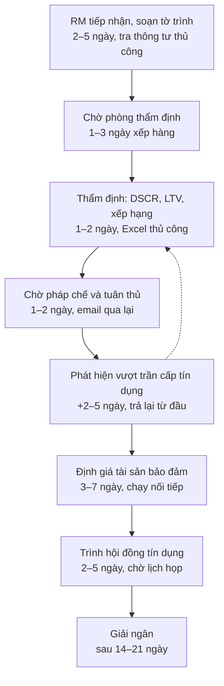
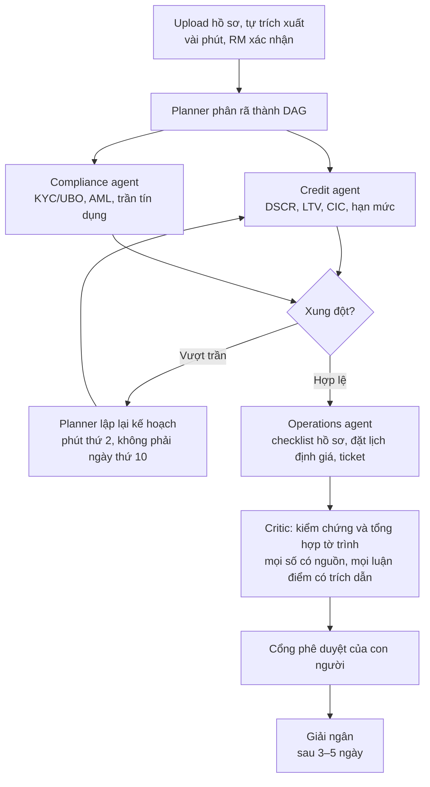
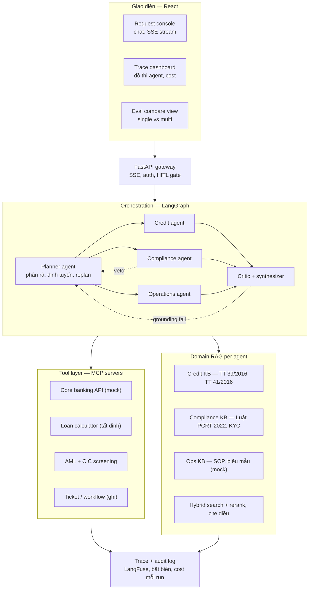
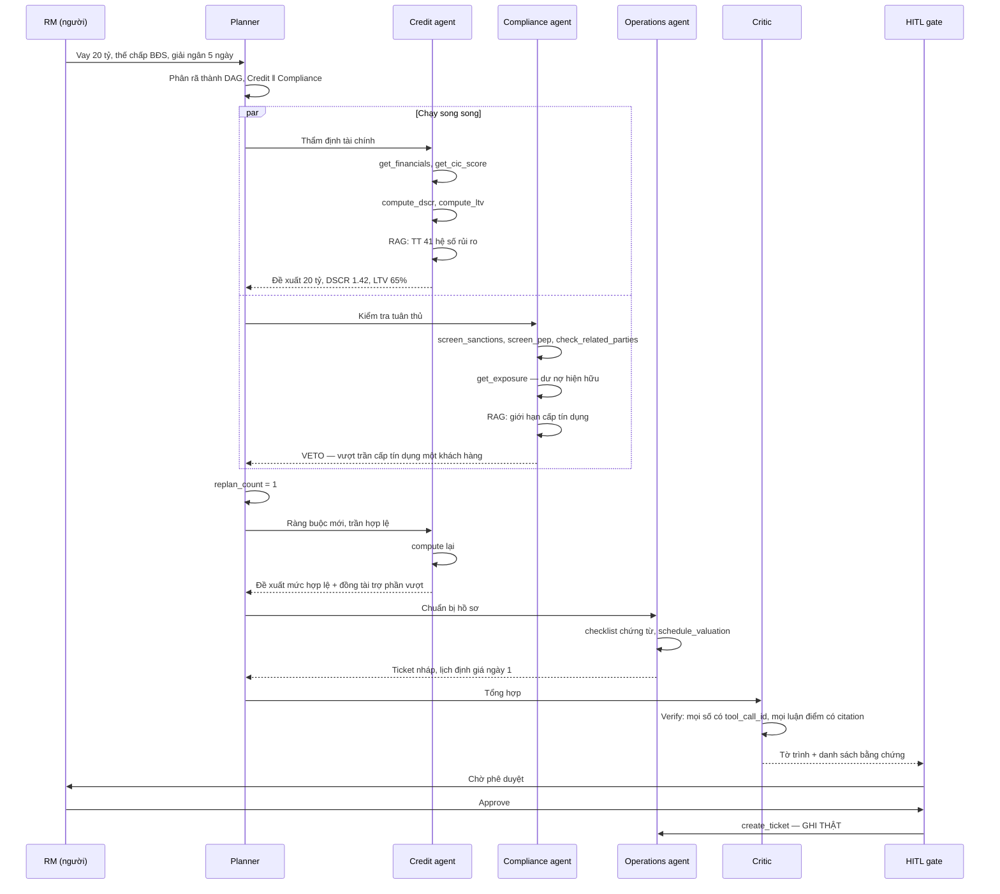

# Digital Expert Agents — Solution Design

**Đề bài:** Digital Expert Agents — A Team of AI Specialists for Banking Operations
**Đơn vị ra đề:** SHB Bank — Ngân hàng & Tài chính
**Sự kiện:** Hack CX Together 2026 (48 giờ)
**Tài liệu:** Thiết kế giải pháp + kế hoạch thực thi
**Phiên bản:** 1.0 — 2026-07-17
**Trạng thái:** Draft để team review, chưa chốt

---

## 1. Tóm tắt điều hành

Đề yêu cầu một hệ multi-agent trong đó mỗi agent là một chuyên gia số của một mảng nghiệp vụ ngân hàng (tín dụng, pháp chế/tuân thủ, sản phẩm, vận hành). Các agent phải tự lập kế hoạch, dùng công cụ, truy xuất tri thức nội bộ qua RAG, cộng tác với nhau, và **thực thi hành động trong hệ thống vận hành của SHB thay vì chỉ sinh ra văn bản trả lời**.

Câu cuối là toàn bộ trọng tâm của đề. Phần "Why This Problem Matters" nói thẳng: các use case AI hiện tại của SHB đang dừng ở hỏi–đáp và phân tích; SHB muốn thấy AI **làm việc**, không phải AI **trả lời**.

Giải pháp đề xuất: một hệ 5 agent (`Planner`, `Credit`, `Compliance`, `Operations`, `Critic`) chạy trên LangGraph, gọi công cụ qua các MCP server, mỗi agent có kho tri thức RAG riêng được neo trên **văn bản pháp quy Việt Nam thật**, có cổng phê duyệt của con người trước mọi hành động ghi, và có bộ đánh giá định lượng so sánh single-agent với multi-agent.

Ba quyết định thiết kế tạo ra khác biệt so với một demo multi-agent thông thường:

1. **Use case có xung đột thật.** Compliance agent có quyền phủ quyết đề xuất của Credit agent, buộc Planner lập lại kế hoạch. Nếu ba agent chỉ chạy song song rồi gộp kết quả, đó là fan-out — một single agent với một prompt dài làm được y hệt, và giám khảo sẽ hỏi đúng câu đó.
2. **Ranh giới cứng giữa LLM và số học.** Không một con số tài chính nào do LLM sinh ra. DSCR, LTV, hệ số rủi ro, lãi suất đều đi qua công cụ tất định. `Critic` từ chối mọi khẳng định không truy được về một lời gọi công cụ hoặc một điều khoản pháp quy cụ thể.
3. **Bộ đánh giá định lượng.** Đề yêu cầu rõ "a performance comparison between a single-agent chatbot [and multi-agent]". Phần lớn đội sẽ bỏ hạng mục này vì hết giờ. Đây là hạng mục dễ ăn điểm nhất trên mỗi giờ công bỏ ra.

Kết quả kỳ vọng sau 48 giờ: một demo chạy live, một dashboard trace theo thời gian thực, một bảng số so sánh trên 30 case, và một hành động ghi thật vào cơ sở dữ liệu mà giám khảo tự bấm phê duyệt.

---

## 2. Đọc lại đề bài

### 2.1 Deliverable đề yêu cầu

Trích nguyên văn từ đề (mục Key Deliverables):

1. A working demo with at least two or three specialized digital experts, such as Credit, Legal/Compliance, and Operations agents, collaborating on one complex request.
2. An orchestration mechanism in which a planner agent decomposes work and assigns tasks to specialist executor agents.
3. Practical tool use, allowing agents to call APIs, query data, or perform concrete actions rather than only return text.
4. A dashboard showing agent traces, task status, decisions, and collaboration flows.
5. A performance comparison between a single-agent chatbot [và hệ multi-agent].

Công nghệ đề gợi ý: LLM reasoning engine (GPT-4 hoặc Claude); agentic framework (LangGraph, CrewAI, AutoGen); tool use và function calling; RAG theo domain cho từng agent; orchestration planner–executor và routing; memory và state management; giao thức truyền thông multi-agent bao gồm **MCP** khi phù hợp; backend FastAPI; giao diện orchestration bằng React.

### 2.2 Mapping deliverable → chức năng → bằng chứng trên sân khấu

| # | Deliverable | Chức năng bắt buộc | Bằng chứng giám khảo nhìn thấy | Bẫy |
|---|---|---|---|---|
| 1 | 2–3 chuyên gia số cộng tác trên một request phức tạp | 3 agent chuyên môn, mỗi agent một KB riêng, và **một case có xung đột** | Compliance phủ quyết Credit ngay trên màn hình | Fan-out giả — ba agent chạy song song rồi gộp, không ai nói chuyện với ai |
| 2 | Planner phân rã và giao việc | Planner sinh ra **DAG có phụ thuộc**, không phải danh sách phẳng | Đồ thị task hiện live, thấy rõ nhánh song song và nhánh phụ thuộc | Planner tự do → lặp vô hạn, cháy token |
| 3 | Tool use thật, hành động cụ thể | Ít nhất một công cụ **ghi** trạng thái | Ticket được tạo thật, show bản ghi DB trước và sau | Tất cả công cụ đều read-only → vẫn là chatbot |
| 4 | Dashboard trace, task status, decision, collaboration flow | Đồ thị live + timeline + token/cost/latency từng node | Dashboard cập nhật theo thời gian thực trong lúc chạy | Log sau khi chạy xong không phải trace. Phải stream |
| 5 | So sánh single-agent vs multi-agent | Bộ đánh giá 25–30 case + bảng số | Một slide bảng số, có cả case multi-agent thua | Hầu hết đội bỏ vì hết giờ |

### 2.3 Câu hỏi đề không viết ra nhưng giám khảo chắc chắn hỏi

Giám khảo của một ngân hàng thương mại, không phải hội đồng nghiên cứu. Chuẩn bị sẵn câu trả lời:

| Câu hỏi | Câu trả lời ngắn |
|---|---|
| Multi-agent có thật sự hơn single agent không, hay chỉ phức tạp cho vui? | Có bảng số trên 30 case. Và chúng tôi nói cả chỗ multi-agent thua. |
| Nếu agent sai và phát sinh nợ xấu thì ai chịu trách nhiệm? | Agent không có quyền phê duyệt. Nó đề xuất và chuẩn bị hồ sơ. Quyết định cuối vẫn là con người, và luật bắt buộc như vậy. |
| Làm sao tin số agent đưa ra? | Không con số nào do LLM sinh. Tất cả đi qua công cụ tất định, và `Critic` từ chối nếu không truy được nguồn. |
| Mở rộng sang nghiệp vụ khác thế nào? | Cấu hình bằng YAML. Thêm agent thứ tư ngay trên sân khấu trong 2 phút. |
| Tài liệu nội bộ SHB các bạn lấy ở đâu? | Không có, và chúng tôi không giả vờ có. Tri thức pháp quy dùng văn bản thật của NHNN. Phần nội bộ (SOP, biểu mẫu) là mock, và được đánh dấu rõ trong giao diện. |
| Core banking thật đâu cho agent gọi? | Mock. Nhưng tầng công cụ viết bằng MCP nên thay mock bằng API thật chỉ đổi endpoint, không viết lại agent. |

---

## 3. Phạm vi

### 3.1 Trong phạm vi

- Ba agent chuyên môn: `Credit`, `Compliance`, `Operations`.
- Hai agent hạ tầng: `Planner` (phân rã, định tuyến, lập lại kế hoạch), `Critic` (kiểm chứng, tổng hợp).
- Tầng công cụ MCP: core banking mock, CIC mock, máy tính tín dụng tất định, sàng lọc AML, tạo ticket.
- RAG theo domain: ba kho tri thức tách biệt, tìm kiếm lai (BM25 + vector) + rerank, trích dẫn tới điều/khoản.
- Cổng phê duyệt của con người trước mọi hành động ghi.
- Dashboard trace theo thời gian thực.
- Bộ đánh giá single-agent vs multi-agent trên 30 case.
- Một use case xuyên phòng ban duy nhất, làm sâu.

### 3.2 Ngoài phạm vi — nói rõ trên slide

Nêu ra chủ động sẽ được điểm; để giám khảo phát hiện sẽ mất điểm.

- **Tích hợp core banking thật, T24/HL7/hệ thống nội bộ SHB.** Không khả thi trong 48 giờ và không có quyền truy cập.
- **OCR báo cáo tài chính đầy đủ.** Trong demo: trích xuất tự động rồi để RM xác nhận. Không hứa OCR 100%.
- **Mô hình xếp hạng tín dụng nội bộ của SHB.** Dùng công thức công khai theo Thông tư, không claim là mô hình SHB.
- **Đa use case.** Một case làm sâu thắng ba case làm nông.
- **Fine-tune mô hình.** Không cần và không đủ thời gian.
- **Bảo mật cấp sản xuất, phân quyền theo vai trò đầy đủ.** Chỉ demo cơ chế, không phải hệ thật.

---

## 4. Nghiệp vụ

### 4.1 Use case demo

> **"Công ty ABC đề nghị vay 20 tỷ đồng, thế chấp bất động sản, yêu cầu giải ngân trong 5 ngày."**

Lý do chọn case này:

- **Bắt buộc phải xuyên phòng ban.** Một agent không thể vừa thẩm định tài chính vừa kiểm tra giới hạn pháp lý vừa vận hành hồ sơ.
- **Có ràng buộc cứng có thể vi phạm.** Giới hạn cấp tín dụng đối với một khách hàng là ràng buộc luật định, không phải sở thích. Vi phạm là vi phạm, không đàm phán được.
- **Xung đột dẫn tới lập lại kế hoạch.** Đây là khoảnh khắc duy nhất trong demo chứng minh multi-agent có giá trị.
- **Có hành động ghi tự nhiên.** Tạo hồ sơ, đặt lịch định giá tài sản bảo đảm, tạo ticket.

### 4.2 Quy trình hiện tại (as-is)



**Ba chỗ chảy máu:**

1. **Tuân thủ nằm cuối chuỗi.** Pháp chế chỉ nhìn hồ sơ sau khi thẩm định xong. Vượt trần bị phát hiện ở ngày thứ 8–10, khi mọi việc đã làm xong → làm lại từ đầu. Đây là lỗi kinh điển: kiểm tra ràng buộc cứng ở cuối quy trình thay vì đầu.
2. **Hàng đợi giữa các phòng.** Mỗi bàn giao là một hàng đợi riêng: chờ chuyên viên thẩm định rảnh, chờ pháp chế rảnh, chờ lịch họp hội đồng. Ba hàng đợi cộng lại 4–10 ngày mà không ai đang làm gì.
3. **Nối tiếp thứ vốn song song được.** Định giá tài sản bảo đảm (3–7 ngày) hoàn toàn có thể khởi động từ ngày 1, nhưng thực tế đợi có kết quả thẩm định sơ bộ mới đặt lịch.

Cộng thêm: tri thức nằm trong đầu chuyên gia (mỗi phòng một silo), bàn giao qua email làm mất ngữ cảnh, và không truy vết được vì sao ra quyết định đó.

**Nhận định trọng tâm cho toàn bộ bài pitch:**

> Thời gian làm việc thật (touch time) chỉ khoảng 12–16 giờ. Còn lại 14–21 ngày là **chờ và làm lại**. Không được pitch theo hướng "AI làm nhanh hơn người" — một chuyên viên thẩm định giỏi tính DSCR trong 20 phút, agent không nhanh hơn đáng kể. Phải pitch: **AI xoá hàng đợi và xoá vòng lặp làm lại**.

### 4.3 Quy trình mới (to-be)



**Ba thay đổi tương ứng với ba chỗ chảy máu:**

| Bệnh as-is | Thuốc to-be | Cơ chế kỹ thuật |
|---|---|---|
| Tuân thủ ở cuối → làm lại | **Dịch trái (shift-left)**: Credit và Compliance chạy song song từ phút 0 | `Planner` fork hai nhánh song song ngay bước đầu |
| Hàng đợi giữa phòng ban | Không còn bàn giao giữa người | Agent thay phần soạn thảo; người chỉ vào ở cổng cuối |
| Định giá chạy nối tiếp | `Operations` đặt lịch định giá từ ngày 1 | Task không phụ thuộc → planner cho chạy song song |
| Silo tri thức | Mỗi agent một KB riêng, trích dẫn điều/khoản | RAG theo domain |
| Không truy vết được | Trace + audit log bất biến | Mọi quyết định gắn tool call và citation |

### 4.4 KPI

| Chỉ số | As-is | To-be | Nguồn cải thiện |
|---|---|---|---|
| Lead time | 14–21 ngày | 3–5 ngày | Xoá hàng đợi + song song hoá |
| Touch time (người) | 12–16 giờ | 2–3 giờ | Người review thay vì soạn |
| Tỷ lệ thời gian chờ | ~70% | ~25% | Phần còn lại là định giá TSBĐ (bên thứ ba) |
| Vòng làm lại mỗi hồ sơ | ~1.8 | ~0.3 | Tuân thủ dịch trái |
| Thời điểm phát hiện vi phạm | Ngày 8–10 | Phút thứ 2 | Chạy song song |
| Tờ trình có trích dẫn nguồn | 0% | 100% | `Critic` bắt buộc |

> **Cảnh báo bắt buộc ghi trên slide:** toàn bộ số ở trên là **giả định của đội, không phải số đo từ SHB**. Giám khảo là người trong ngành, họ nhận ra số bịa ngay. Trung thực về nguồn số làm tăng độ tin cậy, và mở ra câu tiếp theo: cần một buổi làm việc với phòng thẩm định của SHB để chốt baseline thật.

### 4.5 Con người không bị thay thế

Vai trò đổi chứ không mất — phải nói rõ trong pitch:

- **Chuyên viên thẩm định:** từ *soạn tờ trình* → *phản biện tờ trình*. Một người xử lý được nhiều hồ sơ hơn.
- **Pháp chế:** từ *rà từng hồ sơ* → *duy trì policy-as-code* và xử lý ngoại lệ mà agent không dám quyết.
- **Hội đồng tín dụng:** không đổi gì. Quyết định cuối vẫn là con người.

Agent không có quyền phê duyệt. Nó đề xuất và chuẩn bị.

---

## 5. Kiến trúc

### 5.1 Tổng quan



### 5.2 Tầng điều phối

`LangGraph` state graph. Mỗi agent là một subgraph riêng, có system prompt riêng, KB riêng, và tập công cụ được phép gọi riêng (nguyên tắc đặc quyền tối thiểu — Credit agent không được gọi công cụ tạo ticket).

Trạng thái dùng chung:

```python
from typing import TypedDict, Annotated, Literal
from operator import add

class Task(TypedDict):
    task_id: str
    agent: Literal["credit", "compliance", "operations"]
    goal: str
    depends_on: list[str]
    status: Literal["pending", "running", "done", "failed", "blocked"]
    result: dict | None

class Finding(TypedDict):
    agent: str
    claim: str
    evidence_type: Literal["tool_call", "citation"]
    evidence_ref: str          # tool_call_id hoặc "TT39/2016 Điều 7 Khoản 2"
    confidence: float

class AgentState(TypedDict):
    request_id: str
    request: str
    plan: list[Task]
    findings: Annotated[list[Finding], add]
    conflicts: Annotated[list[dict], add]
    replan_count: int
    proposal: dict | None
    trace: Annotated[list[dict], add]
```

Điểm quan trọng trong thiết kế trên: **mọi `Finding` bắt buộc có `evidence_ref`**. Không có bằng chứng thì không được vào state. Đây là cơ chế chống ảo giác ở tầng dữ liệu, không phải ở tầng prompt.

Ràng buộc an toàn:

| Ràng buộc | Giá trị | Lý do |
|---|---|---|
| `max_replan` | 2 | Chặn vòng lặp Credit ↔ Compliance vô hạn |
| `max_steps` | 25 | Trần token cho mỗi request |
| `max_depth` | 3 | Agent không được đẻ agent không giới hạn |
| Timeout mỗi node | 60s | Node treo không làm treo cả demo |
| Fallback | mọi node | Node lỗi → trả finding `status=failed` kèm lý do, không crash graph |

### 5.3 Danh sách agent

| Agent | Model | Trách nhiệm | Công cụ được phép | KB |
|---|---|---|---|---|
| `Planner` | Model mạnh | Phân rã request thành DAG, định tuyến, nhận veto và lập lại kế hoạch | không có | không có |
| `Credit` | Model nhỏ/nhanh | Thẩm định tài chính, đề xuất hạn mức và lãi suất | core banking (đọc), CIC, loan calculator | Credit KB |
| `Compliance` | Model nhỏ/nhanh | KYC/UBO, sàng lọc AML, kiểm tra giới hạn luật định. **Có quyền phủ quyết** | AML screening, core banking (đọc) | Compliance KB |
| `Operations` | Model nhỏ/nhanh | Checklist chứng từ, đặt lịch định giá, tạo ticket | ticket/workflow (ghi), core banking (đọc) | Ops KB |
| `Critic` | Model mạnh | Kiểm chứng mọi finding có bằng chứng, tổng hợp tờ trình | không có | tất cả (chỉ đọc để verify) |

Phân bổ model theo vai trò: model mạnh cho `Planner` và `Critic` (nơi cần suy luận), model nhỏ cho specialist (nơi chủ yếu là gọi công cụ và tra cứu). Đây là đòn bẩy lớn nhất về độ trễ và chi phí.

Cấu hình agent bằng YAML để demo "thêm agent thứ tư trong 2 phút":

```yaml
# agents/product.yaml
id: product
display_name: Product agent
model: claude-haiku-4-5-20251001
system_prompt_file: prompts/product.md
knowledge_base: kb/product
allowed_tools:
  - core_banking.get_product_catalog
  - core_banking.get_customer_segment
can_veto: false
```

### 5.4 Tầng công cụ — MCP

Đề gợi ý rõ "multi-agent communication protocols, including MCP where appropriate". Xây tầng công cụ thành **MCP server thật**, không phải function calling chay. Lợi ích kể được trên sân khấu: công cụ này agent khác của SHB cắm vào dùng ngay, không viết lại.

| MCP server | Công cụ | Loại | Ghi chú |
|---|---|---|---|
| `core-banking` | `get_customer`, `get_financials`, `get_accounts`, `get_exposure` | đọc | Mock, dữ liệu seed cứng |
| `credit-bureau` | `get_cic_score`, `get_credit_history` | đọc | Mock |
| `loan-calculator` | `compute_dscr`, `compute_ltv`, `compute_risk_weight`, `amortize` | đọc, **tất định** | Không có LLM trong đường đi |
| `aml-screening` | `screen_sanctions`, `screen_pep`, `check_related_parties` | đọc | Danh sách mock |
| `workflow` | `create_ticket`, `schedule_valuation`, `attach_document` | **ghi** | Đi qua cổng HITL |

Ví dụ chữ ký công cụ tất định:

```python
@mcp.tool()
def compute_dscr(
    ebitda: float,
    existing_debt_service: float,
    proposed_annual_payment: float,
) -> dict:
    """Tính hệ số khả năng trả nợ. Không có LLM trong hàm này."""
    total_service = existing_debt_service + proposed_annual_payment
    if total_service <= 0:
        return {"error": "total_debt_service must be positive"}
    dscr = ebitda / total_service
    return {
        "dscr": round(dscr, 3),
        "inputs": {"ebitda": ebitda, "total_debt_service": total_service},
        "formula": "DSCR = EBITDA / (existing_debt_service + proposed_annual_payment)",
        "computed_at": utcnow_iso(),
    }
```

Trường `formula` và `inputs` không phải trang trí — chúng là bằng chứng mà `Critic` và audit log dùng để truy vết.

### 5.5 Tầng tri thức — RAG theo domain

**Vấn đề gốc:** không có tài liệu nội bộ SHB, và sẽ không có trong 48 giờ.

**Cách giải:** thay bằng văn bản pháp quy Việt Nam thật, công khai, có hiệu lực. Agent trích dẫn được "theo Điều X Thông tư 39/2016/TT-NHNN" thuyết phục hơn hẳn một đội bịa ra policy giả. Chỉ mock những gì thật sự nội bộ (SOP, biểu mẫu), và **đánh dấu rõ trên giao diện là mock**.

| KB | Nguồn | Ghi chú |
|---|---|---|
| Credit | Thông tư 39/2016/TT-NHNN (hoạt động cho vay); Thông tư 41/2016/TT-NHNN (tỷ lệ an toàn vốn) | Văn bản thật, công khai. Kiểm tra văn bản sửa đổi bổ sung còn hiệu lực |
| Compliance | Luật Phòng, chống rửa tiền 2022; Thông tư 09/2023/TT-NHNN; Luật Các tổ chức tín dụng 2024 | Văn bản thật |
| Operations | SOP nội bộ, biểu mẫu, checklist chứng từ | **Mock, đánh dấu rõ** |

Pipeline: chunk theo cấu trúc điều/khoản (không chunk theo số ký tự — mất đơn vị pháp lý), tìm kiếm lai BM25 + vector, rerank, trả về kèm định danh điều khoản.

```python
class Citation(TypedDict):
    doc_id: str        # "TT-39-2016-NHNN"
    article: str       # "Điều 7"
    clause: str | None # "Khoản 2"
    text: str
    score: float
```

> **Cảnh báo pháp lý — bắt buộc kiểm tra lại:** Luật Các tổ chức tín dụng 2024 thay đổi giới hạn cấp tín dụng đối với một khách hàng theo **lộ trình giảm dần theo năm**, không còn là một con số cố định 15% như luật cũ. Đội **phải tra lại con số có hiệu lực tại thời điểm thi** và hardcode vào policy-as-code. **Tuyệt đối không để LLM nhớ con số này** — nó sẽ nhớ con số cũ.

### 5.6 Bộ nhớ và trạng thái

- **Ngắn hạn:** state của LangGraph trong một request. Checkpointer để replay được khi demo hỏng.
- **Dài hạn:** hồ sơ khách hàng và các quyết định trước, lưu vector store. Trong hackathon: seed sẵn 2–3 khách hàng có lịch sử, đủ để demo agent nhớ được ngữ cảnh.
- **Không làm:** bộ nhớ tự học liên phiên. Rủi ro cao, giá trị demo thấp.

### 5.7 Quan sát

`LangFuse` hoặc OpenTelemetry → sự kiện đẩy qua SSE → React dashboard.

Mỗi node phát ra: `node_start`, `tool_call`, `tool_result`, `citation_retrieved`, `finding_emitted`, `conflict_raised`, `node_end` kèm `tokens_in`, `tokens_out`, `cost_usd`, `latency_ms`.

Dashboard phải cập nhật **trong lúc chạy**, không phải sau khi chạy xong. Log sau khi hoàn thành không phải trace, và giám khảo nhìn ra khác biệt ngay.

---

## 6. Luồng xử lý chi tiết



**Khoảnh khắc quan trọng nhất của cả demo là bước VETO → replan.** Nếu bỏ bước này, toàn bộ hệ thống chỉ là fan-out và bài thi mất lý do tồn tại.

---

## 7. Kiểm soát và chống ảo giác

Đây là phần ngân hàng quan tâm nhất, và là phần nhiều đội hackathon bỏ qua.

### 7.1 Ranh giới tất định

Quy tắc: **LLM không được sinh ra con số tài chính.**

| Việc | Ai làm |
|---|---|
| DSCR, LTV, hệ số rủi ro, lịch trả nợ, tổng dư nợ | Công cụ tất định |
| So sánh số với ngưỡng luật định | Policy-as-code |
| Diễn giải, tổng hợp, viết tờ trình | LLM |
| Quyết định phê duyệt | Con người |

### 7.2 Policy-as-code

Ràng buộc cứng nằm ngoài LLM, dạng dữ liệu, có ngày hiệu lực:

```yaml
# policy/credit_limits.yaml
- id: single_customer_limit
  legal_basis: "Luật Các TCTD 2024, Điều 136"
  metric: total_exposure_ratio_to_equity
  operator: "<="
  threshold: TRA_LAI_CON_SO_HIEU_LUC   # lộ trình giảm theo năm — phải verify
  effective_from: "2024-07-01"
  severity: blocking
  veto_agent: compliance
```

`severity: blocking` nghĩa là agent không có cách nào vượt qua bằng lý lẽ. Đây chính là câu trả lời cho "giảm phụ thuộc chuyên gia nhưng vẫn giữ được controls" trong phần Benefits của đề.

### 7.3 Cổng kiểm chứng của Critic

`Critic` chạy trước khi tổng hợp. Với mỗi `Finding`:

1. Có `evidence_ref` không? Không → reject.
2. `evidence_ref` là `tool_call` → tool_call_id đó có tồn tại trong trace không? Kết quả có khớp với claim không?
3. `evidence_ref` là `citation` → điều khoản đó có tồn tại trong KB không? Có nói đúng điều agent nói không?
4. Có số nào trong văn bản tổng hợp không truy được về `inputs` của một tool call không? Có → reject.

Finding bị reject không âm thầm biến mất — nó hiện trên dashboard dưới dạng `rejected_by_critic` kèm lý do. **Cho giám khảo thấy hệ thống tự bắt lỗi của chính nó là một điểm mạnh, không phải điểm yếu.**

### 7.4 Cổng phê duyệt của con người

Mọi công cụ ghi đều đi qua HITL gate. Giao diện hiện: hành động sắp thực hiện, tham số, agent nào yêu cầu, bằng chứng nào hậu thuẫn. Người bấm approve/reject.

Trong demo: **để giám khảo tự bấm nút approve**. Khoảnh khắc này đáng giá hơn ba slide kiến trúc.

### 7.5 Audit

Mọi run ghi log append-only: request, plan, mọi tool call kèm tham số và kết quả, mọi citation, mọi conflict, mọi lần replan, quyết định cuối, ai approve, lúc nào. Xuất được JSON.

Đây là thứ ngân hàng bắt buộc phải có trước khi nghĩ tới triển khai. Có sẵn = ghi điểm.

---

## 8. Đánh giá — single-agent vs multi-agent

**Deliverable số 5 của đề. Phần lớn đội sẽ bỏ. Đây là hạng mục có tỷ lệ điểm trên công cao nhất.**

### 8.1 Bộ case chuẩn

30 case, chia ba nhóm:

| Nhóm | Số case | Mục đích | Dự đoán kết quả |
|---|---|---|---|
| Đơn domain | 10 | "Điều kiện vay tín chấp là gì?" | Single agent **thắng** — nhanh hơn, rẻ hơn |
| Xuyên domain | 15 | Case chính, cần Credit + Compliance | Multi-agent **thắng** rõ ở độ chính xác |
| Có bẫy tuân thủ | 5 | Cố tình vượt trần, khách hàng trong danh sách PEP | Multi-agent thắng tuyệt đối — single agent bỏ sót |

Mỗi case có ground truth soạn tay: kết luận đúng, các điều khoản phải trích dẫn, các công cụ phải gọi.

### 8.2 Chỉ số

| Chỉ số | Đo thế nào |
|---|---|
| Task success rate | Kết luận khớp ground truth |
| Citation accuracy | Điều khoản trích dẫn đúng và có thật (bắt cả ảo giác trích dẫn) |
| Tool-call correctness | Gọi đúng công cụ, đúng tham số |
| Compliance recall | Trong 5 case bẫy: có bắt được vi phạm không (**chỉ số quan trọng nhất với ngân hàng**) |
| Latency p50 / p95 | Giây |
| Cost / request | USD |
| Hallucinated numbers | Số không truy được về tool call |

### 8.3 Mẫu bảng kết quả

```
| Nhóm case          | n  | Cấu hình     | Success | Citation acc | Compliance recall | p50 (s) | Cost ($) |
|--------------------|----|--------------|---------|--------------|-------------------|---------|----------|
| Đơn domain         | 10 | Single agent |         |              | n/a               |         |          |
| Đơn domain         | 10 | Multi-agent  |         |              | n/a               |         |          |
| Xuyên domain       | 15 | Single agent |         |              |                   |         |          |
| Xuyên domain       | 15 | Multi-agent  |         |              |                   |         |          |
| Bẫy tuân thủ       |  5 | Single agent |         |              |                   |         |          |
| Bẫy tuân thủ       |  5 | Multi-agent  |         |              |                   |         |          |
```

### 8.4 Cách trình bày

**Báo cáo trung thực, kể cả chỗ thua.** Kết luận mong đợi có dạng:

> "Trên câu hỏi đơn domain, multi-agent chậm hơn 3.4 lần và đắt hơn 4.1 lần mà không chính xác hơn — nên định tuyến thẳng về single agent. Giá trị của multi-agent nằm ở nhóm xuyên domain và đặc biệt ở nhóm bẫy tuân thủ, nơi single agent bỏ sót 4/5 vi phạm còn multi-agent bắt 5/5. Kiến trúc đúng không phải multi-agent cho mọi thứ, mà là **định tuyến theo độ phức tạp của request** — và Planner của chúng tôi đã làm điều đó."

Kết luận này biến một điểm yếu (multi-agent chậm và đắt) thành một quyết định kiến trúc có cơ sở. Đây là thứ phân biệt một đội kỹ sư với một đội demo.

---

## 9. Kế hoạch 48 giờ

Nhân sự: 5 người — 2 backend/agent, 1 RAG + dữ liệu, 1 frontend, 1 PM kiêm eval kiêm pitch.

| Giờ | Việc | Ai | Điều kiện qua cửa |
|---|---|---|---|
| 0–4 | Chốt use case, dựng mock data, khung repo, **chốt API contract** | cả đội | Contract đóng băng — frontend không phải chờ backend |
| 4–10 | Ingest 3 KB, hybrid search + rerank, định dạng trích dẫn | RAG | Hỏi "điều kiện vay" → trả đúng điều khoản |
| 4–10 | Tầng công cụ MCP + core banking mock | BE1 | Gọi được bằng curl |
| 10–16 | **Baseline single-agent làm trước** | BE2 | Baseline chạy được |
| 10–18 | Khung trace dashboard, SSE | FE | Vẽ được đồ thị từ sự kiện giả |
| 16–26 | Planner + 3 specialist + LangGraph graph | BE1+BE2 | Happy path thông |
| 26–30 | **Nhánh xung đột và replan** | BE2 | Compliance veto → Credit hạ hạn mức |
| 26–32 | Dashboard nối trace thật, giao diện HITL gate | FE | Bấm approve → ticket ghi vào DB |
| 30–36 | Critic + grounding check | BE1 | Số không có tool call → bị reject |
| 32–38 | **Chạy eval 30 case, ra bảng số** | PM | Có bảng số thật |
| 38–42 | Guardrail, che PII, đánh bóng | cả đội | — |
| **42** | **ĐÓNG BĂNG CODE** | — | Sau giờ này chỉ sửa bug chặn demo |
| 42–46 | Tập demo ≥5 lần, **quay video dự phòng** | cả đội | Có video = ngủ được |
| 46–48 | Slide pitch, dự phòng | PM | — |

**Ba quy tắc không được phá:**

1. **Baseline single-agent làm ở giờ 10, không phải giờ 40.** Nó vừa là phương án dự phòng nếu multi-agent không kịp, vừa là dữ liệu so sánh cho deliverable số 5. Đây là quyết định lập lịch quan trọng nhất trong cả bảng.
2. **Đóng băng code ở giờ 42.** Đội nào code tới giờ 47 sẽ demo hỏng. Không có ngoại lệ.
3. **Video dự phòng là bắt buộc.** Không phải tuỳ chọn.

---

## 10. Rủi ro

| Rủi ro | Khả năng | Tác động | Giảm thiểu |
|---|---|---|---|
| Multi-agent quá chậm (>60s), demo lê thê | Cao | Cao | Song song hoá, cache tool result, model nhỏ cho specialist, giới hạn max_steps |
| Demo hỏng live | Trung bình | Rất cao | Đóng băng giờ 42, seed data cứng, video dự phòng, checkpointer để replay |
| Hết giờ trước khi làm eval | Cao | Cao | Baseline làm ở giờ 10; eval là block riêng của PM, không phụ thuộc backend xong |
| Planner lặp vô hạn | Trung bình | Trung bình | `max_replan=2`, `max_steps=25`, timeout mỗi node |
| Số pháp lý sai (trần cấp tín dụng) | Trung bình | **Rất cao** | Hardcode vào policy-as-code, một người verify riêng, không để LLM nhớ |
| Rate limit API LLM giữa demo | Trung bình | Cao | 2 API key, fallback provider, cache aggressive |
| Bị chê "chỉ là wrapper" | Trung bình | Cao | Nhánh xung đột + eval + policy-as-code là ba câu trả lời |
| Scope creep sang use case thứ hai | Cao | Cao | PM có quyền phủ quyết. Một case làm sâu thắng ba case làm nông |

---

## 11. Kịch bản demo 5 phút

| Phút | Nội dung | Vì sao |
|---|---|---|
| 0:00–0:30 | Nêu vấn đề: 14–21 ngày, 70% là chờ và làm lại | Đóng đinh insight ngay, không lan man |
| 0:30–1:00 | Nhập request 20 tỷ, dashboard bật lên | Cho thấy trace live |
| 1:00–2:00 | Planner phân rã, Credit ‖ Compliance chạy song song | Deliverable 1, 2 |
| 2:00–2:45 | **Compliance VETO → Planner replan → Credit hạ hạn mức** | **Đỉnh của demo.** Dừng lại, chỉ tay vào màn hình |
| 2:45–3:15 | Critic reject một finding không có bằng chứng | Cho thấy hệ tự bắt lỗi mình |
| 3:15–3:45 | **Mời giám khảo bấm approve → ticket ghi thật, show DB trước/sau** | Deliverable 3. "Không chỉ trả lời — nó làm việc" |
| 3:45–4:30 | Bảng eval, kể cả chỗ multi-agent thua, kết luận định tuyến theo độ phức tạp | Deliverable 5. Chỗ ăn điểm lớn nhất |
| 4:30–5:00 | Thêm agent thứ tư bằng một file YAML, chạy lại | Trả lời "mở rộng thế nào" trước khi bị hỏi |

Câu chốt: *"Chúng tôi không xây một chatbot biết nhiều hơn. Chúng tôi xây một quy trình biết tự chặn mình lại trước khi làm sai."*

---

## 12. Tự đối chiếu tiêu chí

| Deliverable đề yêu cầu | Trạng thái | Bằng chứng |
|---|---|---|
| 2–3 chuyên gia số cộng tác | ✅ | 3 specialist + case có xung đột thật |
| Planner phân rã và giao việc | ✅ | DAG có phụ thuộc, có replan |
| Tool use thật, hành động cụ thể | ✅ | MCP server, có công cụ ghi, giám khảo tự approve |
| Dashboard trace, status, decision, flow | ✅ | React + SSE, live, có cost mỗi node |
| So sánh single vs multi | ✅ | 30 case, 7 chỉ số, kết luận trung thực |
| MCP (đề gợi ý) | ✅ | Toàn bộ tầng công cụ |
| FastAPI + React (đề gợi ý) | ✅ | Đúng stack đề gợi ý |
| Memory và state management | ✅ | LangGraph state + checkpointer + vector memory |

---

## Phụ lục A — Tech stack

| Tầng | Lựa chọn | Lý do |
|---|---|---|
| Orchestration | LangGraph | Đề gợi ý; state graph tường minh; parallel branch và checkpointer sẵn có |
| LLM | Claude (Opus cho Planner/Critic, Haiku cho specialist) | Đề gợi ý Claude; phân bổ theo vai trò để giảm độ trễ và chi phí |
| Tool protocol | MCP (Python SDK) | Đề gợi ý; tái sử dụng được cho agent khác |
| Backend | FastAPI + SSE | Đề gợi ý |
| Frontend | React + React Flow (đồ thị agent) | Đề gợi ý |
| Vector store | Qdrant hoặc pgvector | Chạy local, không phụ thuộc mạng khi demo |
| Search | BM25 (rank_bm25) + dense + reranker | Văn bản pháp quy cần khớp từ khoá chính xác, dense một mình không đủ |
| Trace | LangFuse (self-host) | Cắm vào LangGraph nhanh, có sẵn cost tracking |
| DB | Postgres | Ticket, audit log |

Nguyên tắc: **mọi thứ chạy được local**. Wifi hội trường sẽ tệ.

## Phụ lục B — Văn bản pháp quy

| Văn bản | Dùng cho | Ghi chú |
|---|---|---|
| Thông tư 39/2016/TT-NHNN | Điều kiện vay, phương án sử dụng vốn | Kiểm tra văn bản sửa đổi còn hiệu lực |
| Thông tư 41/2016/TT-NHNN | Hệ số rủi ro, tỷ lệ an toàn vốn | |
| Luật Các tổ chức tín dụng 2024 | Giới hạn cấp tín dụng | **Lộ trình giảm theo năm — phải tra số hiệu lực tại thời điểm thi** |
| Luật Phòng, chống rửa tiền 2022 | Nghĩa vụ nhận biết khách hàng, báo cáo giao dịch đáng ngờ | |
| Thông tư 09/2023/TT-NHNN | Hướng dẫn AML | |

**Một người trong đội chịu trách nhiệm verify toàn bộ con số pháp lý.** Sai một con số trước mặt giám khảo ngân hàng là mất toàn bộ độ tin cậy, kể cả khi hệ thống chạy hoàn hảo.

## Phụ lục C — Dữ liệu mock

| Bộ | Nội dung | Ghi chú |
|---|---|---|
| Khách hàng | 5 doanh nghiệp: 1 sạch, 1 vượt trần, 1 có bên liên quan, 1 trúng PEP, 1 CIC xấu | Đủ để chạy cả 3 nhóm eval |
| Báo cáo tài chính | 3 năm mỗi doanh nghiệp | Số phải nhất quán — giám khảo sẽ nhẩm |
| Dư nợ hiện hữu | Có chủ đích đặt sát trần | Để kích hoạt veto |
| Danh sách sanctions/PEP | Mock, ~200 dòng | |
| TSBĐ | Bất động sản có định giá | Để tính LTV |

Số phải **nhất quán qua tất cả các bộ**. Giám khảo ngân hàng nhẩm được DSCR trong đầu.

## Phụ lục D — Cấu trúc repo

```
.
├── agents/                 # YAML config mỗi agent
├── prompts/                # System prompt tách riêng khỏi code
├── policy/                 # Policy-as-code, ràng buộc cứng
├── graph/
│   ├── state.py            # AgentState
│   ├── planner.py
│   ├── specialists.py
│   ├── critic.py
│   └── build.py            # Lắp graph
├── mcp_servers/
│   ├── core_banking/
│   ├── credit_bureau/
│   ├── loan_calculator/
│   ├── aml_screening/
│   └── workflow/
├── kb/
│   ├── credit/
│   ├── compliance/
│   └── operations/
├── eval/
│   ├── cases.yaml          # 30 case + ground truth
│   ├── runner.py
│   └── report.py
├── api/                    # FastAPI + SSE
├── web/                    # React dashboard
└── seed/                   # Mock data
```

## Phụ lục E — Schema đầu ra của Planner

```json
{
  "request_id": "req_001",
  "reasoning": "Yêu cầu vượt ngưỡng cần thẩm định tín dụng và kiểm tra giới hạn luật định. Hai việc này độc lập, cho chạy song song. Vận hành phụ thuộc kết quả của cả hai.",
  "tasks": [
    {
      "task_id": "t1",
      "agent": "credit",
      "goal": "Thẩm định năng lực tài chính, đề xuất hạn mức và lãi suất",
      "depends_on": [],
      "inputs": {"customer_id": "C-ABC", "amount": 20000000000}
    },
    {
      "task_id": "t2",
      "agent": "compliance",
      "goal": "Kiểm tra KYC/UBO, sàng lọc AML, kiểm tra giới hạn cấp tín dụng",
      "depends_on": [],
      "inputs": {"customer_id": "C-ABC", "amount": 20000000000}
    },
    {
      "task_id": "t3",
      "agent": "operations",
      "goal": "Lập checklist chứng từ, đặt lịch định giá TSBĐ, tạo ticket nháp",
      "depends_on": ["t1", "t2"],
      "inputs": {"customer_id": "C-ABC"}
    }
  ]
}
```

`depends_on` rỗng ở `t1` và `t2` chính là chỗ sinh ra song song. `reasoning` được hiển thị trên dashboard — giám khảo đọc được vì sao Planner quyết định như vậy.

---

## Ghi chú về tài liệu này

- Toàn bộ số liệu KPI ở mục 4.4 là **giả định của đội**, chưa được SHB xác nhận. Phải ghi rõ điều này trên slide.
- Các con số pháp lý (đặc biệt giới hạn cấp tín dụng) **phải được verify lại** trước ngày thi. Xem cảnh báo ở mục 5.5 và Phụ lục B.
- Tài liệu chưa chốt. Cần đội review và phản biện, đặc biệt mục 3.2 (ngoài phạm vi) và mục 9 (kế hoạch 48 giờ).
