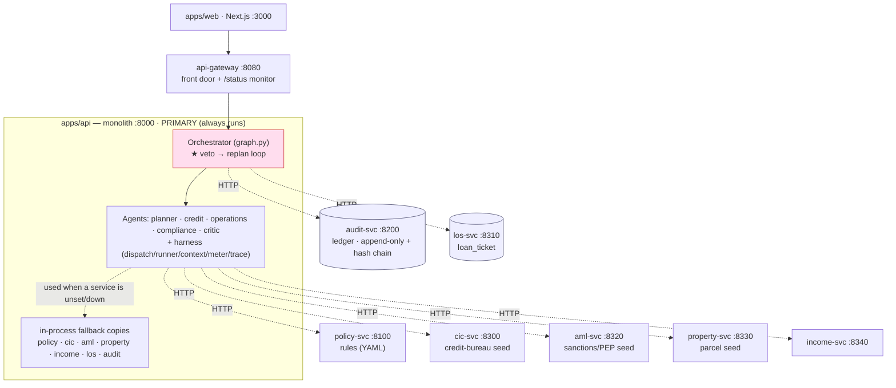

# System architecture (current)

> Accurate as of the current split (Phases 1–4). The monolith is **primary** and runs
> the whole flow; services are extracted seams it calls over HTTP, with an in-process
> fallback per seam. See `MICROSERVICES-STATUS.md` for run commands.

## Diagram

**Legend:** solid arrow = always in-process · dashed arrow = HTTP call **when the
service's env var is set**; if unset or the call fails, the agent uses the in-process
fallback copy. So the picture degrades gracefully from "all services" down to "monolith
alone" with no code change.

## Who calls whom

| Caller (in monolith) | Seam file | Service | Env var |
| -------------------- | --------- | ------- | ------- |
| Compliance | `policy/client.py` | policy-svc | `POLICY_SVC_URL` |
| Credit | `tools/cic.py` | cic-svc | `CIC_SVC_URL` |
| Credit | `tools/income.py` | income-svc | `INCOME_SVC_URL` |
| Compliance | `tools/aml.py` | aml-svc | `AML_SVC_URL` |
| Operations | `tools/property.py` | property-svc | `PROPERTY_SVC_URL` |
| Orchestrator | `agents/audit_client.py` | audit-svc | `AUDIT_SVC_URL` |
| Orchestrator | `tools/workflow.py` | los-svc | `LOS_SVC_URL` |

## One request, end to end

1. `apps/web` → `api-gateway` → monolith `POST /assess`.
2. Orchestrator plans a DAG; **Credit** (calls cic-svc, income-svc) and **Operations**
   (calls property-svc) run in parallel.
3. **Compliance** calls policy-svc (veto?) + aml-svc.
4. Veto → orchestrator replans and re-runs, up to the cap → escalate to human.
5. Orchestrator writes the ticket to **los-svc** and appends the decision to
   **audit-svc** (best-effort).
6. Response returns `run_trace` + `trace[]` + `compliance` + `ticket` + `audit`.

## Current vs target

- **Now (Phases 1–4):** monolith is primary. policy/audit/cic/los/aml/property/income
  are real services; the agent workers (credit/operations/compliance/critic) and the
  veto loop still live **inside** the monolith.
- **Target (Phases 5–6):** agent workers become services too and the orchestrator calls
  everything over HTTP. Only **then** do the monolith's in-process copies become a pure
  degraded-mode fallback. Not started — high risk to the veto loop (`AGENTS.md`:43).

## Two things named "services" — don't confuse
- **`services/`** (repo root) = the extracted microservices above.
- **`apps/api/src/services/`** = an internal Python module inside the monolith. Not a
  microservice.
